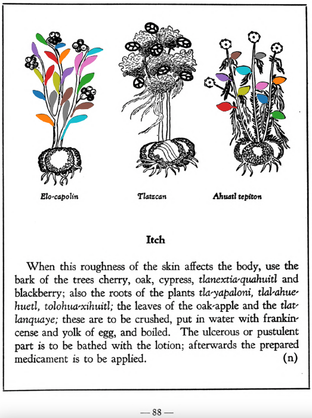

=== "English :flag_us:"
    **Itch.** When this roughness of the skin affects the body, use the bark of the trees cherry, oak, cypress, tlanextia-quahuitl and blackberry; also the roots of the plants [tla-yapaloni](Tla-yapaloni.md), [tlal-ahuehuetl](Tlal-ahuehuetl.md), [tolohua-xihuitl](Tolohua xihuitl.md); the leaves of the oak-apple and the [tlatlanquaye](Tlatlanquaye.md); these are to be crushed, put in water with frankincense and yolk of egg, and boiled. The ulcerous or pustulent part is to be bathed with the lotion; afterwards the prepared medicament is to be applied.  
    [https://archive.org/details/aztec-herbal-of-1552/page/88](https://archive.org/details/aztec-herbal-of-1552/page/88)  

=== "Español :flag_mx:"
    **Sarna.** Cuando esta aspereza de la piel afecta el cuerpo, se usa la corteza de los árboles cerezo, roble, ciprés, tlanextia-quahuitl y zarzamora; también las raíces de las plantas [tla-yapaloni](Tla-yapaloni.md), [tlal-ahuehuetl](Tlal-ahuehuetl.md), [tolohua-xihuitl](Tolohua xihuitl.md); las hojas del agallón del roble y del [tlatlanquaye](Tlatlanquaye.md); todo esto se machaca, se pone en agua con copal y yema de huevo, y se hierve. La parte ulcerada o con pústulas se baña con esta loción; luego se aplica el medicamento preparado.  

  
Leaf traces by: Lachlann Simms, Acadia University, Canada  