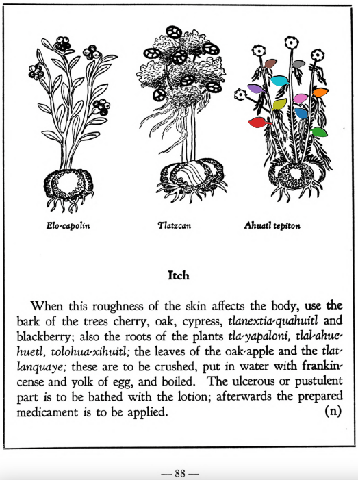

**Itch.** When this roughness of the skin affects the body, use the bark of the trees cherry, oak, cypress, tlanextia-quahuitl andblackberry; also the roots of the plants [tla-yapaloni](Tla-yapaloni.md), [tlal-ahuehuetl](Tlal-ahuehuetl.md), [tolohua-xihuitl](Tolohua xihuitl.md); the leaves of the oak-apple and the [tlatlanquaye](Tlatlanquaye.md); these are to be crushed, put in water with frankincense and yolk of egg, and boiled. The ulcerous or pustulent part is to be bathed with the lotion; afterwards the prepared medicament is to be applied.  
[https://archive.org/details/aztec-herbal-of-1552/page/88](https://archive.org/details/aztec-herbal-of-1552/page/88)  

  
Leaf traces by: Zoë Migicovsky, Acadia University, Canada  