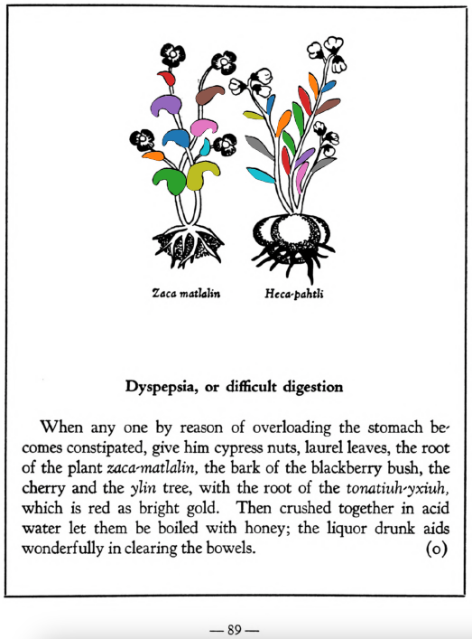

**Dyspepsia, or difficult digestion.** When any one by reason of overloading the stomach becomes constipated, give him cypress nuts, laurel leaves, the root of the plant [zaca-matlalin](Zaca-matlalin.md), the bark of the blackberry bush, the cherry and the [ylin](Ylin.md) tree, with the root of the [tonatiuh-yxiuh](Tonatiuh yxiuh v1.md), which is red as bright gold. Then crushed together in acid water let them be boiled with honey; the liquor drunk aids wonderfully in clearing the bowels.  
[https://archive.org/details/aztec-herbal-of-1552/page/89](https://archive.org/details/aztec-herbal-of-1552/page/89)  

  
Leaf traces by: Zoë Migicovsky, Acadia University, Canada  