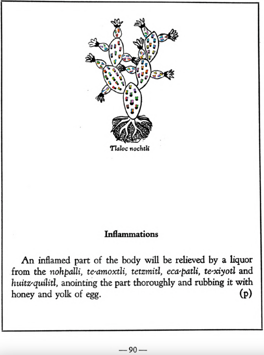

**Inflammations.** An inflamed part of the body will be relieved by a liquor from the [nohpalli](Nopalli.md), [te-amoxtli](Te-amoxtli.md), [tetzmitl](Tetzmitl.md), [eca-patli](Eca-patli.md), [te-xiyotl](Te-xiyotl.md) and [huitz-quilitl](Huitz-quilitl.md), anointing the part thoroughly and rubbing it with honey and yolk of egg.  
[https://archive.org/details/aztec-herbal-of-1552/page/90](https://archive.org/details/aztec-herbal-of-1552/page/90)  

  
Leaf traces by: Zoë Migicovsky, Acadia University, Canada  