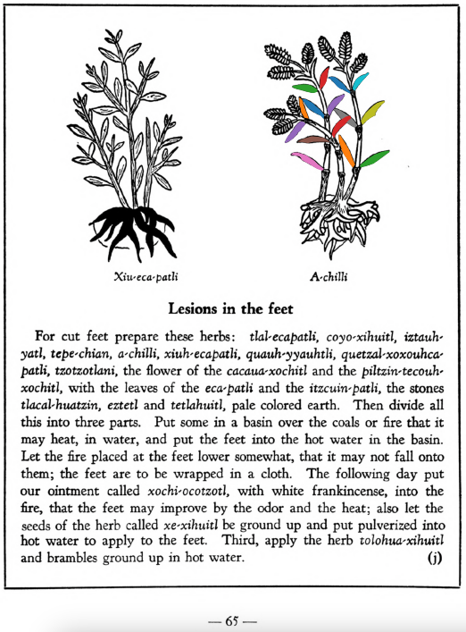

**Morphemes:**

- Atl/water
- Chilli/chile

## Subchapter 8j  

=== "English :flag_us:"
    **Lesions in the feet.** For cut feet prepare these herbs: [tlal-ecapatli](Tlal-ecapatli.md), [coyo-xihuitl](Coyo-xihuitl.md), [iztauh-yatl](Iztauyattl.md), [tepe-chian](Tepe-chian.md), [a-chilli](A-chilli.md), [xiuh-ecapatli](Eca-patli.md), [quauh-yyauhtli](Quauh-yyauhtli.md), [quetzal-xoxouhca-patli](Quetzal-xoxouca-patli.md), [tzotzotlani](Quetzal-xoxouhca-patli tzotzotlani.md), the flower of the [cacau-xochitl](Cacaua-xochitl.md) and the [piltzin-tecouh-xochitl](Piltzinte-couh-xochitl.md), with the leaves of the [eca-patli](Eca-patli.md) and the [itzcuin-patli](Itzquin-patli.md), the stones [tlacal-huatzin](tlacal-huatzin.md), [eztetl](eztetl.md) and [tetlahuitl](tetlahuitl v2.md), pale colored earth. Then divide all this into three parts. Put some in a basin over the coals or fire that it may heat, in water, and put the feet into the hot water in the basin. Let the fire placed at the feet lower somewhat, that it may not fall onto them; the feet are to be wrapped in a cloth. The following day put our ointment called xochi-ocotzotl, with white frankincense, into the fire, that the feet may improve by the odor and the heat; also let the seeds of the herb called [xe-xihuitl](Xe-xihuitl.md) be ground up and put pulverized into hot water to apply to the feet. Third, apply the herb [tolohua-xihuitl](Tolohua xihuitl.md) and brambles ground up in hot water.  
    [https://archive.org/details/aztec-herbal-of-1552/page/65](https://archive.org/details/aztec-herbal-of-1552/page/65)  

=== "Español :flag_mx:"
    **Lesiones en los pies.** Para pies cortados prepara estas hierbas: [tlal-ecapatli](Tlal-ecapatli.md), [coyo-xihuitl](Coyo-xihuitl.md), [iztauh-yatl](Iztauyattl.md), [tepe-chian](Tepe-chian.md), [a-chilli](A-chilli.md), [xiuh-ecapatli](Eca-patli.md), [quauh-yyauhtli](Quauh-yyauhtli.md), [quetzal-xoxouhca-patli](Quetzal-xoxouca-patli.md), [tzotzotlani](Quetzal-xoxouhca-patli tzotzotlani.md), la flor de [cacau-xochitl](Cacaua-xochitl.md) y el [piltzin-tecouh-xochitl](Piltzinte-couh-xochitl.md), con las hojas de [eca-patli](Eca-patli.md) e [itzcuin-patli](Itzquin-patli.md), las piedras [tlacal-huatzin](tlacal-huatzin.md), [eztetl](eztetl.md) y [tetlahuitl](tetlahuitl v2.md), tierra de color pálido. Luego divide todo esto en tres partes. Una parte se pone en una vasija sobre las brasas o el fuego para calentarla en agua, y se meten los pies en esa agua caliente. El fuego bajo los pies debe bajarse un poco para que no los queme; los pies se envuelven en un paño. Al día siguiente se pone nuestro ungüento llamado xochi-ocotzotl con incienso blanco en el fuego, para que los pies mejoren con el olor y el calor; también se muelen las semillas de la hierba llamada [xe-xihuitl](Xe-xihuitl.md) y se agregan pulverizadas en agua caliente para aplicarlas en los pies. En tercer lugar, se aplican la hierba [tolohua-xihuitl](Tolohua xihuitl.md) y zarzas molidas en agua caliente.  

  
Leaf traces by: Mariana Jaired Ruíz Amaro, Laboratory of Agrigenomic Sciences, ENES Unidad León, México  
