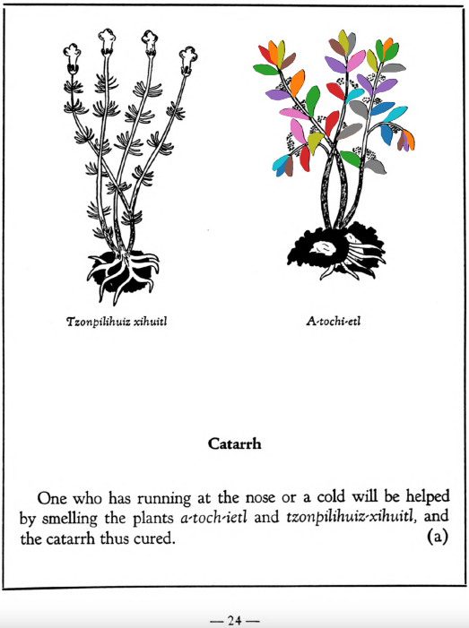

**Morphemes:**

- Atl/water

## Subchapter 4a  

=== "English :flag_us:"
    **Catarrh.** One who has running at the nose or a cold will be helped by smelling the plants [a-toch-ietl](A-toch-ietl.md) and [tzonpilihuiz-xihuitl](Tzon-pilihuiz-xihuitl.md), and the catarrh thus cured.  
    [https://archive.org/details/aztec-herbal-of-1552/page/24](https://archive.org/details/aztec-herbal-of-1552/page/24)  

=== "Español :flag_mx:"
    **Catarro.** Quien sufre de secreción nasal o resfriado se beneficiará oliendo las plantas [a-toch-ietl](A-toch-ietl.md) y [tzonpilihuiz-xihuitl](Tzon-pilihuiz-xihuitl.md), y así se cura el catarro.  

  
Leaf traces by: Daniel H. Chitwood, Michigan State University, USA  
