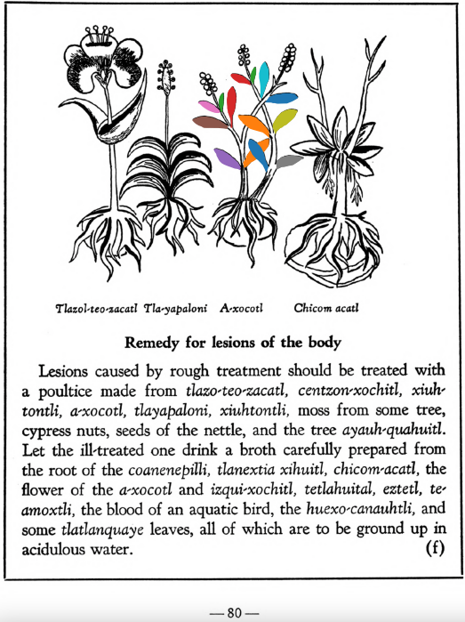

**Morphemes:**

- Atl/water
- Xocotl/sour fruit

## Subchapter 8l  

=== "English :flag_us:"
    **The trees and flowers for relieving the fatigue of those administering the government, and discharging public offices.** The bark of the tree [quetzal-ylin](Quetzal-ylin.md), the flowers [elo-xochitl](Elo-xochitl.md) and [izqui-xochitl](Izqui-xochitl.md), the almond with its fruit, which is the [tlapal-cacahuatl](Tlapol-cacahuatl.md), the flowers [cacalo-xochitl](Cacalo-xochitl.md), [huacal-xochitl](Huacal-xochitl.md), [meca-xochitl](Meca-xochitl.md), [huey-nacaztli](Huey-nacaztli.md), and all fine smelling summer flowers; leaves of the trees [a-ylin](A-illin.md), [oyametl](Oyametl.md), [ocotl](Ocotl.md), [a-xocotl](A-xocotl.md), [eca-patli](Eca-patli.md), [tlaco-izqui-xochitl](Tlaco-izqui-xochitl.md), [quauh-yyauhtli](Quauh-yyauhtli.md), [tomazquitl](Tomaz-quitl.md), [ahuatl](Ahuatl.md), [tepe-ylin](Tepe-ylin.md), [ayauh-quahuitl](Ayauh-quahuitl.md), and te-papaquilti quahuitl, flower bearing plants with their shrubbery, which you gather before the wind rises; these are expressed one by one in clear spring water, into new vessels or vases. This then stays for a day and a night, when the [huitz-quahuitl](Huitz-quahuitl.md) wood, with a red juice, is added as coloring. Also the blood of wild animals, namely the red ocelot, [cuetlachtli](cuetlachtli.md), [miztli](miztli.md), [ocotochtli](ocotochtli.md), white ocelot, [tlaco-ocelotl](tlaco-ocelotl.md), is sought for. With this and the above liquors the body is well anointed. Second, the precious stones [quetzal-iztli](quetzal-iztli.md), [eztetl](eztetl.md), [tlacal-huatzin](tlacal-huatzin.md), [tetlahuitl](tetlahuitl v2.md), red earth and the small stones in the stomachs of the birds [huexo-canauhtli](huexo-canauhtli.md), [hauctli](huactli.md) and [apopotli](apopotli.md) are cast into water in which they stay for a night in order that the healthful juice may be drawn out, with which the body is to be frequently bathed. Third, the brain and gall of these animals, the red ocelot, white ocelot, [cuetlachtli](cuetlachtli.md), [miztli](miztli.md), [ocotochtli](ocotochtli.md), [coyotl](coyotl.md), also the brain, gall and bladder of the white epatl, ground up; with these the body is moistened. These medicaments healthily give gladiatorial strength to the body, drive fatigue far off, and also cast out timidity and strengthen the human heart. As for the rest, let whoever wishes to follow through this reinvigoration of the body, eat other things also, but as of chief value the flesh of the white rabbit or white fox, either baked or boiled.  
    [https://archive.org/details/aztec-herbal-of-1552/page/70](https://archive.org/details/aztec-herbal-of-1552/page/70)  

=== "Español :flag_mx:"
    **Los árboles y flores para aliviar el cansancio de quienes gobiernan y desempeñan cargos públicos.** La corteza del árbol [quetzal-ylin](Quetzal-ylin.md), las flores [elo-xochitl](Elo-xochitl.md) e [izqui-xochitl](Izqui-xochitl.md), la almendra con su fruto llamado [tlapal-cacahuatl](Tlapol-cacahuatl.md), las flores [cacalo-xochitl](Cacalo-xochitl.md), [huacal-xochitl](Huacal-xochitl.md), [meca-xochitl](Meca-xochitl.md), [huey-nacaztli](Huey-nacaztli.md), y todas las flores veraniegas de buen aroma; hojas de los árboles [a-ylin](A-illin.md), [oyametl](Oyametl.md), [ocotl](Ocotl.md), [a-xocotl](A-xocotl.md), [eca-patli](Eca-patli.md), [tlaco-izqui-xochitl](Tlaco-izqui-xochitl.md), [quauh-yyauhtli](Quauh-yyauhtli.md), [tomazquitl](Tomaz-quitl.md), [ahuatl](Ahuatl.md), [tepe-ylin](Tepe-ylin.md), [ayauh-quahuitl](Ayauh-quahuitl.md) y te-papaquilti quahuitl, plantas con flores y su follaje, que se recogen antes de que sople el viento; todo esto se exprime uno por uno en agua clara de manantial, en recipientes nuevos. Esto se deja reposar un día y una noche, luego se añade la madera [huitz-quahuitl](Huitz-quahuitl.md) con jugo rojo como colorante. También se busca la sangre de animales salvajes: el ocelote rojo, [cuetlachtli](cuetlachtli.md), [miztli](miztli.md), [ocotochtli](ocotochtli.md), ocelote blanco, [tlaco-ocelotl](tlaco-ocelotl.md). Con esto y los licores anteriores se unta bien el cuerpo. En segundo lugar, se echan en agua las piedras preciosas [quetzal-iztli](quetzal-iztli.md), [eztetl](eztetl.md), [tlacal-huatzin](tlacal-huatzin.md), [tetlahuitl](tetlahuitl v2.md), tierra roja y las piedras pequeñas halladas en los estómagos de las aves [huexo-canauhtli](huexo-canauhtli.md), [hauctli](huactli.md) y [apopotli](apopotli.md), y se dejan allí una noche para que suelten su jugo saludable, con el cual debe bañarse frecuentemente el cuerpo. En tercer lugar, se trituran el cerebro y la bilis de estos animales: ocelote rojo, ocelote blanco, [cuetlachtli](cuetlachtli.md), [miztli](miztli.md), [ocotochtli](ocotochtli.md), [coyotl](coyotl.md), así como el cerebro, la bilis y la vejiga del epatl blanco; con esto se humedece el cuerpo. Estos remedios dan saludablemente fuerza gladiatoria al cuerpo, alejan el cansancio, expulsan la timidez y fortalecen el corazón humano. Además, quien desee seguir este fortalecimiento del cuerpo puede comer otras cosas también, pero como lo más valioso se considera la carne de conejo blanco o zorro blanco, ya sea asada o hervida.  

## Subchapter 9f  

=== "English :flag_us:"
    **Remedy for lesions of the body.** Lesions caused by rough treatment should be treated with a poultice made from [tlazo-teo-zacatl](Tlazol-teo-zacatl.md), [centzon-xochitl](Centzon-xochitl.md), [xiuh-tontli](Xiuhtontli.md), [a-xocotl](A-xocotl.md), [tlayapaloni](Tla-yapaloni.md), [xiuhtontli](Xiuhtontli.md), moss from some tree, cypress nuts, seeds of the nettle, and the tree [ayauh-quahuitl](Ayauh-quahuitl.md). Let the ill-treated one drink a broth carefully prepared from the root of the [coanenepilli](Coanenepilli.md), tlanextia xihuitl, [chicom-catl](Chicom-acatl.md), the flower of the [a-xocotl](A-xocotl.md) and [izqui-xochitl](Izqui-xochitl.md), [tetlahuital](tetlahuitl v2.md), [eztetl](eztetl.md), [te-amoxtli](Te-amoxtli.md), the blood of an aquatic bird, the [huexo-canauhtli](huexo-canauhtli.md), and some [tlatlanquaye](Tlatlanquaye.md) leaves, all of which are to be ground up in acidulous water.  
    [https://archive.org/details/aztec-herbal-of-1552/page/80](https://archive.org/details/aztec-herbal-of-1552/page/80)  

=== "Español :flag_mx:"
    **Remedio para lesiones del cuerpo.** Las lesiones causadas por trato rudo deben tratarse con una cataplasma hecha de [tlazo-teo-zacatl](Tlazol-teo-zacatl.md), [centzon-xochitl](Centzon-xochitl.md), [xiuh-tontli](Xiuhtontli.md), [a-xocotl](A-xocotl.md), [tlayapaloni](Tla-yapaloni.md), [xiuhtontli](Xiuhtontli.md), musgo de algún árbol, nueces de ciprés, semillas de ortiga y el árbol [ayauh-quahuitl](Ayauh-quahuitl.md). El maltratado debe beber un caldo preparado cuidadosamente de la raíz del [coanenepilli](Coanenepilli.md), tlanextia xihuitl, [chicom-catl](Chicom-acatl.md), la flor del [a-xocotl](A-xocotl.md) y del [izqui-xochitl](Izqui-xochitl.md), [tetlahuital](tetlahuitl v2.md), [eztetl](eztetl.md), [te-amoxtli](Te-amoxtli.md), la sangre de un ave acuática, el [huexo-canauhtli](huexo-canauhtli.md), y algunas hojas de [tlatlanquaye](Tlatlanquaye.md), todo molido en agua acidulada.  

## Subchapter 10k  

=== "English :flag_us:"
    **The traveler’s protection.** The dried flowers [meca-xochitl](Meca-xochitl.md), [tlil-xochitl](Tlil-xochitl.md), [huey-nacaztli](Huey-nacaztli.md), the bark of the trees [copal-xocotl](Copal-xocotl.md) and [atoya-xocotl](Atoya-xocotl.md), the leaves of the [a-xocotl](A-xocotl.md) tree, white incense, the salve xochi-ocotzotl and [yollo-xochitl](Yollo-xochitl.md), thus crushed and pulverized; then crushed placed within the cavity of the well-known and most fragrant [huacal-xochitl](Huacal-xochitl.md) flower, that they may receive the very redolent odor of this flower, and breathe it out. Then take at the end the highly praised flower [yollo-xochitl](Yollo-xochitl.md), which you must nicely hollow out and therein cover up the health bearing fine powder, suspending the capsule from the neck.  
    [https://archive.org/details/aztec-herbal-of-1552/page/104](https://archive.org/details/aztec-herbal-of-1552/page/104)  

=== "Español :flag_mx:"
    **Protección del viajero.** Las flores secas [meca-xochitl](Meca-xochitl.md), [tlil-xochitl](Tlil-xochitl.md), [huey-nacaztli](Huey-nacaztli.md), la corteza de los árboles [copal-xocotl](Copal-xocotl.md) y [atoya-xocotl](Atoya-xocotl.md), las hojas del árbol [a-xocotl](A-xocotl.md), incienso blanco, el ungüento xochi-ocotzotl y [yollo-xochitl](Yollo-xochitl.md), todo esto triturado y pulverizado; luego se coloca dentro de la cavidad de la muy conocida y fragante flor [huacal-xochitl](Huacal-xochitl.md), para que absorban su olor intensamente perfumado y lo exhalen. Después se toma, al final, la muy apreciada flor [yollo-xochitl](Yollo-xochitl.md), que se debe ahuecar con cuidado y allí se encierra el fino polvo saludable, suspendiendo la cápsula del cuello.  

  
Leaf traces by: Lachlann Simms, Acadia University, Canada  
