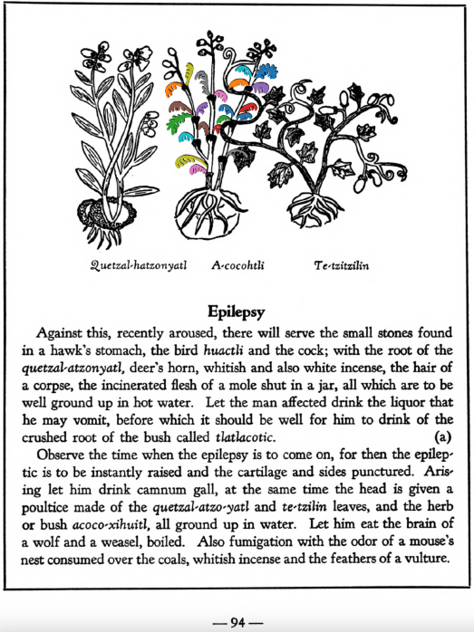

Variants: acoco-xihuitl  

## Subchapter 10a  
**Epilepsy.** Against this, recently aroused, there will serve the small stones found in a hawk’s stomach, the bird [huactli](huactli.md) and the cock; with the root of the[quetzal-atzonyatl](Quetzal-atzonyatl.md), deer’s horn, whitish and also white incense, the hair of a corpse, the incinerated flesh of a mole shut in a jar, all which are to be well ground up in hot water. Let the man affected drink the liquor that he may vomit, before which it should be well for him to drink of the crushed root of the bush called [tlatlacotic](Tlatlacotic.md). Observe the time when the epilepsy is to come on, for then the epileptic is to be instantly raised and the cartilage and sides punctured. Arising let him drink camnum gall, at the same time the head is given a poultice made of the [quetzal-atzo-yatl](Quetzal-atzonyatl.md) and [te-tzilin](Te-tzitzilin.md) leaves, and the herb or bush [acoco-xihuitl](Acoco-xihuitl.md), all ground up in water. Let him eat the brain of a wolf and a weasel, boiled. Also fumigation with the odor of a mouse’s nest consumed over the coals, whitish incense and the feathers of a vulture.  
[https://archive.org/details/aztec-herbal-of-1552/page/94](https://archive.org/details/aztec-herbal-of-1552/page/94)  

  
Leaf traces by: Zoë Migicovsky, Acadia University, Canada  
