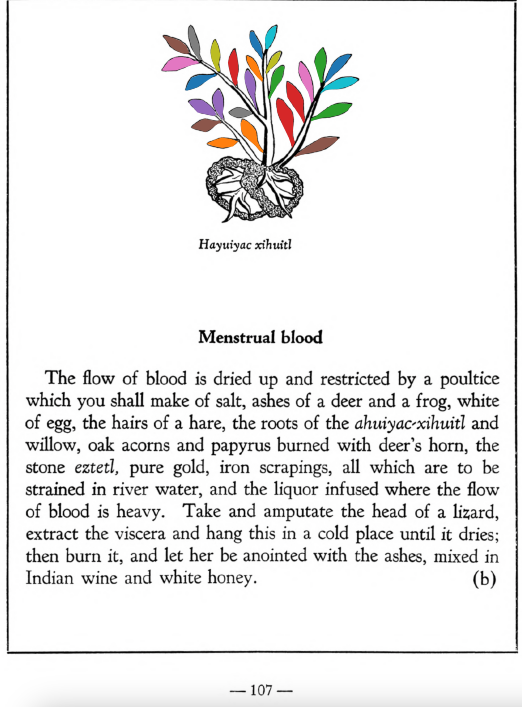

**Morphemes:**

- Xihuitl/herbs, green leaves

## Subchapter 8k  

=== "English :flag_us:"
    **Against lassitude.** One fatigued will be restored if the feet be bathed in choice liquor, with the [ahuiyac-xihuitl](Ahuiyac-xihuitl.md) or [tlatlanquaye](Tlatlanquaye.md), [tlatlaolton](Tlatlaolton.md), [itzcuin-patli](Itzquin-patli.md), [xiuh-ecapatli](Eca-patli.md), [iztauh-yatl](Iztauyattl.md), the [huitzihtzil-xochitl](Huitzihtzil-xochitl.md) flower, and the stones [tetlahuitl](tetlahuitl v2.md), [tlaca-huatzin](tlacal-huatzin.md) and [eztetl](eztetl.md), to be crushed in hot water.  
    [https://archive.org/details/aztec-herbal-of-1552/page/66](https://archive.org/details/aztec-herbal-of-1552/page/66)  

=== "Español :flag_mx:"
    **Contra el cansancio.** Uno fatigado se restaurará si se le bañan los pies en un licor escogido, con [ahuiyac-xihuitl](Ahuiyac-xihuitl.md) o [tlatlanquaye](Tlatlanquaye.md), [tlatlaolton](Tlatlaolton.md), [itzcuin-patli](Itzquin-patli.md), [xiuh-ecapatli](Eca-patli.md), [iztauh-yatl](Iztauyattl.md), la flor [huitzihtzil-xochitl](Huitzihtzil-xochitl.md) y las piedras [tetlahuitl](tetlahuitl v2.md), [tlaca-huatzin](tlacal-huatzin.md) y [eztetl](eztetl.md), todo triturado en agua caliente.  

## Subchapter 11b  

=== "English :flag_us:"
    **Menstrual blood.** The flow of blood is dried up and restricted by a poultice which you shall make of salt, ashes of a deer and a frog, white of egg, the hairs of a hare, the roots of the [ahuiyac-xihuitl](Ahuiyac-xihuitl.md) and willow, oak acorns and papyrus burned with deer’s horn, the stone [eztetl](eztetl.md), pure gold, iron scrapings, all which are to be strained in river water, and the liquor infused where the flow of blood is heavy. Take and amputate the head of a lizard, extract the viscera and hang this in a cold place until it dries; then burn it, and let her be anointed with the ashes, mixed in Indian wine and white honey.  
    [https://archive.org/details/aztec-herbal-of-1552/page/107](https://archive.org/details/aztec-herbal-of-1552/page/107)  

=== "Español :flag_mx:"
    **Sangrado menstrual.** El flujo de sangre se seca y restringe con un emplasto que se debe hacer con sal, cenizas de venado y rana, clara de huevo, pelos de liebre, raíces de [ahuiyac-xihuitl](Ahuiyac-xihuitl.md) y sauce, bellotas de encina y papiro quemado con cuerno de venado, la piedra [eztetl](eztetl.md), oro puro, limaduras de hierro, todo lo cual debe colarse en agua de río y el licor aplicarse donde el flujo de sangre sea abundante. Se debe cortar la cabeza de una lagartija, extraerle las vísceras y colgarla en un lugar frío hasta que se seque; luego se quema y se le unta a la mujer con las cenizas mezcladas en vino indígena y miel blanca.  

  
Leaf traces by: Alejandra Rougon-Cardoso, Laboratory of Agrigenomic Sciences, ENES Unidad León, México  
