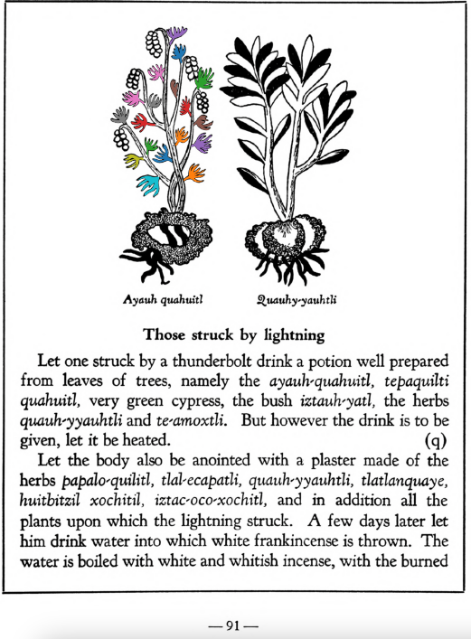

Variants: ayauh-quahuitl  

## Subchapter 8f  
**Gout.** One with gout can be cured in this way: the bush [piltzin-tecouh-xochitl](Piltzinte-couh-xochitl.md), the leaves of the cypress and laurel, are thrown in an ants’ ditch where ants go to and fro, or are sprinkled as a lotion. Then the leaves of the bush [quappo-quietl](Quappo-quietl.md), leaves and bark of the [ayauh-quahuitl](Ayauh-quahuitl.md), leaves of the [quetzal-mizquitl](Quetzal-misquitl.md), tla-que quetzal and [tepe-chian](Tepe-chian.md), the flowers of any plant, a small white or red stone, the plant called [itzquin-patli](Itzquin-patli.md), pine, an oyster shell ground up in hare’s blood, small foxes, serpentine rabbits (? for burrowing moles), [eca-cohuatl](eca-cohuatl.md), lizards; pearl, greenstone and bloodstone are to be ground up in water. If the foot is troubled with much heat, let it be soaked in the cold liquor; if it is chilled over the instep, it is to be heated. To the above named you also add a yellow-colored flint, and the flesh and excrement of a fox, which you must burn to a crisp.  
[https://archive.org/details/aztec-herbal-of-1552/page/62](https://archive.org/details/aztec-herbal-of-1552/page/62)  

## Subchapter 8l  
**The trees and flowers for relieving the fatigue of those administering the government, and discharging public offices.** The bark of the tree [quetzal-ylin](Quetzal-ylin.md), the flowers [elo-xochitl](Elo-xochitl.md) and[izqui-xochitl](Izqui-xochitl.md), the almond with its fruit, which is the [tlapal-cacahuatl](Tlapol-cacahuatl.md), the flowers [cacalo-xochitl](Cacalo-xochitl.md), [huacal-xochitl](Huacal-xochitl.md), [meca-xochitl](Meca-xochitl.md), [huey-nacaztli](Huey-nacaztli.md), and all fine smelling summer flowers; leaves of the trees [a-ylin](A-illin.md), [oyametl](Oyametl.md), [ocotl](Ocotl.md), [a-xocotl](A-xocotl.md), [eca-patli](Eca-patli.md), [tlaco-izqui-xochitl](Tlaco-izqui-xochitl.md), [quauh-yyauhtli](Quauh-yyauhtli.md), [tomazquitl](Tomaz-quitl.md), [ahuatl](Ahuatl.md), [tepe-ylin](Tepe-ylin.md), [ayauh-quahuitl](Ayauh-quahuitl.md), and te-papaquilti quahuitl, flower bearing plants with their shrubbery, which you gather before the wind rises; these are expressed one by one in clear spring water, into new vessels or vases. This then stays for a day and a night, when the [huitz-quahuitl](Huitz-quahuitl.md) wood, with a red juice, is added as coloring. Also the blood of wild animals, namely the red ocelot, [cuetlachtli](cuetlachtli.md), [miztli](miztli.md), [ocotochtli](ocotochtli.md), white ocelot, [tlaco-ocelotl](tlaco-ocelotl.md), is sought for. With this and the above liquors the body is well anointed. Second, the precious stones [quetzal-iztli](quetzal-iztli.md), [eztetl](eztetl.md), [tlacal-huatzin](tlacal-huatzin.md), [tetlahuitl](tetlahuitl_v2.md), red earth and the small stones in the stomachs of the birds [huexo-canauhtli](huexo-canauhtli.md), [hauctli](huactli.md) and [apopotli](apopotli.md) are cast into water in which they stay for a night in order that the healthful juice may be drawn out, with which the body is to be frequently bathed. Third, the brain and gall of these animals, the red ocelot, white ocelot, [cuetlachtli](cuetlachtli.md), [miztli](miztli.md), [ocotochtli](ocotochtli.md), [coyotl](coyotl.md), also the brain, gall and bladder of the white epatl, ground up; with these the body is moistened. These medicaments healthily give gladiatorial strength to the body, drive fatigue far off, and also cast out timidity and strengthen the human heart. As for the rest, let whoever wishes to follow through this reinvigoration of the body, eat other things also, but as of chief value the flesh of the white rabbit or white fox, either baked or boiled.  
[https://archive.org/details/aztec-herbal-of-1552/page/70](https://archive.org/details/aztec-herbal-of-1552/page/70)  

## Subchapter 9f  
**Remedy for lesions of the body.** Lesions caused by rough treatment should be treated with a poultice made from [tlazo-teo-zacatl](Tlazol-teo-zacatl.md), [centzon-xochitl](Centzon-xochitl.md), [xiuh-tontli](Xiuhtontli.md), [a-xocotl](A-xocotl.md), [tlayapaloni](Tla-yapaloni.md), [xiuhtontli](Xiuhtontli.md), moss from some tree, cypress nuts, seeds of the nettle, and the tree [ayauh-quahuitl](Ayauh-quahuitl.md). Let the ill-treated one drink a broth carefully prepared from the root of the [coanenepilli](Coanenepilli.md), tlanextia xihuitl, [chicom-catl](Chicom-acatl.md), the flower of the [a-xocotl](A-xocotl.md) and [izqui-xochitl](Izqui-xochitl.md), [tetlahuital](tetlahuitl_v2.md), [eztetl](eztetl.md), [te-amoxtli](Te-amoxtli.md), the blood of an aquatic bird, the [huexo-canauhtli](huexo-canauhtli.md), and some [tlatlanquaye](Tlatlanquaye.md) leaves, all of which are to be ground up in acidulous water.  
[https://archive.org/details/aztec-herbal-of-1552/page/80](https://archive.org/details/aztec-herbal-of-1552/page/80)  

## Subchapter 9q  
**Those struck by lightning.** Let one struck by a thunderbolt drink a potion well prepared from leaves of trees, namely the [ayauh-quahuitl](Ayauh-quahuitl.md), [tepaquilti quahuitl](tepaquilti_quahuitl.md), very green cypress, the bush [iztauh-yatl](Iztauyattl.md), the herbs[quauh-yyauhtli](Quauh-yyauhtli.md) and [te-amoxtli](Te-amoxtli.md). But however the drink is to be given, let it be heated.  Let the body also be anointed with a plaster made of the herbs [papalo-quilitl](Papalo-quilitl.md), [tlal-ecapatli](Tlal-ecapatli.md), [quauh-yyauhtli](Quauh-yyauhtli.md), [tlatlanquaye](Tlatlanquaye.md), huitbitzil xochitil, [iztac-oco-xochitl](Iztac_oco-xochitl.md), and in addition all the plants upon which the lightning struck. A few days later lethim drink water into which white frankincense is thrown. The water is boiled with white and whitish incense, with the burned bones of a fox added. Also mix some Indian wine with the above. Afterwards you will instill into the nostrils a medicine made of white pearl, the root [tlatlacotic](Tlatlacotic.md), and all plants growing in a garden that has been burned over. Let also be suffumigated by white incense thrown upon the coals, the wax ointment we call [xochi-oco-tzotl](xochi-ocotzotl.md), and the good odor of the herb [quauh-yyauhtli](Quauh-yyauhtli.md).  
[https://archive.org/details/aztec-herbal-of-1552/page/91](https://archive.org/details/aztec-herbal-of-1552/page/91)  

  
Leaf traces by: Zoë Migicovsky, Acadia University, Canada  
