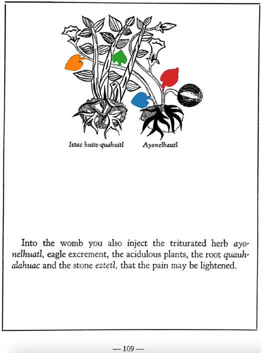

Variants: ayo-nelhuatl  

## Subchapter 11c  
**Ventral lotion in childbirth.** The womb of a woman entering childbirth is to be washed out with the juice of the plants [xiuh-eloquilitl](Xiuh-elo-quilitl.md), [tlaco-popotl](Tlaco-popotli.md), [centzon-xochitl](Centzon-xochitl.md), [xiuhpatli](Xiuh-patli.md), laurel, all which triturate in spring water with the stones [eztetl](eztetl.md) and [tetlahuitl](tetlahuitl v2.md). The feet are also to be frequently washed with this. When the birth is about to come, the [iztac huitz-quahuitl](Iztac huitz-quahuitl.md), [malinalli](Malinalli.md), white stone, white nitre, pine, palm and [eztetl](eztetl.md) are to be boiled in water. Into the womb you also inject the triturated herb [ayo-nelhuatl](Ayo-nelhuatl.md), eagle excrement, the acidulous plants, the root [quauh-alahuac](Quauh-alahuac.md) and the stone [eztetl](eztetl.md), that the pain may be lightened.  
[https://archive.org/details/aztec-herbal-of-1552/page/108](https://archive.org/details/aztec-herbal-of-1552/page/108)  

  
Leaf traces by: Alejandra Rougon, UNAM ENES León, México  
