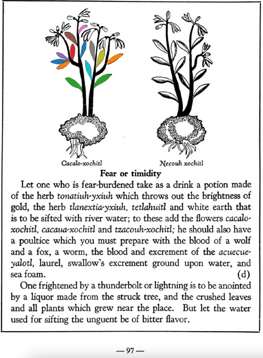

Variants: cacalo-xochitl  

## Subchapter 8l  
**The trees and flowers for relieving the fatigue of those administering the government, and discharging public offices.** The bark of the tree [quetzal-ylin](Quetzal-ylin.md), the flowers [elo-xochitl](Elo-xochitl.md) and[izqui-xochitl](Izqui-xochitl.md), the almond with its fruit, which is the [tlapal-cacahuatl](Tlapol-cacahuatl.md), the flowers [cacalo-xochitl](Cacalo-xochitl.md), [huacal-xochitl](Huacal-xochitl.md), [meca-xochitl](Meca-xochitl.md), [huey-nacaztli](Huey-nacaztli.md), and all fine smelling summer flowers; leaves of the trees [a-ylin](A-illin.md), [oyametl](Oyametl.md), [ocotl](Ocotl.md), [a-xocotl](A-xocotl.md), [eca-patli](Eca-patli.md), [tlaco-izqui-xochitl](Tlaco-izqui-xochitl.md), [quauh-yyauhtli](Quauh-yyauhtli.md), [tomazquitl](Tomaz-quitl.md), [ahuatl](Ahuatl.md), [tepe-ylin](Tepe-ylin.md), [ayauh-quahuitl](Ayauh-quahuitl.md), and te-papaquilti quahuitl, flower bearing plants with their shrubbery, which you gather before the wind rises; these are expressed one by one in clear spring water, into new vessels or vases. This then stays for a day and a night, when the [huitz-quahuitl](Huitz-quahuitl.md) wood, with a red juice, is added as coloring. Also the blood of wild animals, namely the red ocelot, [cuetlachtli](cuetlachtli.md), [miztli](miztli.md), [ocotochtli](ocotochtli.md), white ocelot, [tlaco-ocelotl](tlaco-ocelotl.md), is sought for. With this and the above liquors the body is well anointed. Second, the precious stones [quetzal-iztli](quetzal-iztli.md), [eztetl](eztetl.md), [tlacal-huatzin](tlacal-huatzin.md), [tetlahuitl](tetlahuitl_v2.md), red earth and the small stones in the stomachs of the birds [huexo-canauhtli](huexo-canauhtli.md), [hauctli](huactli.md) and [apopotli](apopotli.md) are cast into water in which they stay for a night in order that the healthful juice may be drawn out, with which the body is to be frequently bathed. Third, the brain and gall of these animals, the red ocelot, white ocelot, [cuetlachtli](cuetlachtli.md), [miztli](miztli.md), [ocotochtli](ocotochtli.md), [coyotl](coyotl.md), also the brain, gall and bladder of the white epatl, ground up; with these the body is moistened. These medicaments healthily give gladiatorial strength to the body, drive fatigue far off, and also cast out timidity and strengthen the human heart. As for the rest, let whoever wishes to follow through this reinvigoration of the body, eat other things also, but as of chief value the flesh of the white rabbit or white fox, either baked or boiled.  
[https://archive.org/details/aztec-herbal-of-1552/page/70](https://archive.org/details/aztec-herbal-of-1552/page/70)  

## Subchapter 9g  
**For ringworm and tetter.** For one laboring with this scaly disease, let there be ground together and set over coals the bark of the cherry, of the incense bearing[quauh-xiyotl](Quauh-xiyotl.md) tree, the apple, the flowers of the [topozan](Topozan.md) and [cacalo-xochitl](Cacalo-xochitl.md), oak roots, cypress nuts, leaves of the plants[tlatlanquaye](Tlatlanquaye.md), [quauh-yayahual](Quauh-yayahual.md), the herbs [tepe-chian](Tepe-chian.md), [coyo-xihuitl](Coyo-xihuitl.md), [a-quahuitl](A-quahuitl.md), cedar nuts and leaves; with these when heated let him bathe himself, and the affected part be rubbed with the burned pine, with which, and all the above, let him be rubbed.  
[https://archive.org/details/aztec-herbal-of-1552/page/81](https://archive.org/details/aztec-herbal-of-1552/page/81)  

## Subchapter 10d  
**Fear or timidity.** Let one who is fear-burdened take as a drink a potion made of the herb [tonatiuh-yxiuh](Tonatiuh_yxiuh_v1.md) which throws out the brightness of gold, the herb [tlanexti-yxiuh](Tlanextia-yxiuh.md), tetlahuitl and white earth that is to be sifted with river water; to these add the flowers [cacalo-xochitl](Cacalo-xochitl.md), [cacaua-xochitl](Cacaua-xochitl.md) and [tzacouh-xochitl](Tzacouh-xochitl.md); he should also have a poultice which you must prepare with the blood of a wolf and a fox, a worm, the blood and excrement of the acuecue-yalotl, laurel, swallow’s excrement ground upon water, and sea foam. One frightened by a thunderbolt or lightning is to be anointed by a liquor made from the struck tree, and the crushed leaves and all plants which grew near the place. But let the water used for sifting the unguent be of bitter flavor.  
[https://archive.org/details/aztec-herbal-of-1552/page/97](https://archive.org/details/aztec-herbal-of-1552/page/97)  

  
Leaf traces by: Zoë Migicovsky, Acadia University, Canada  
