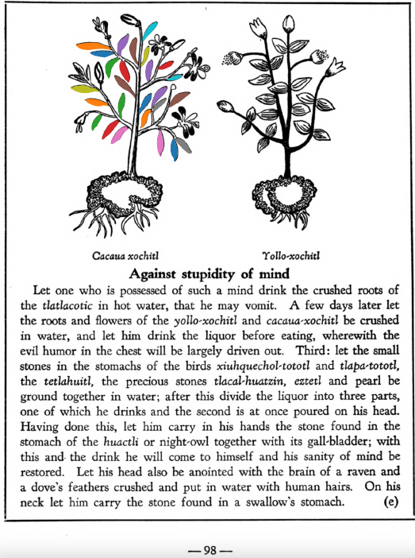

Variants: cacau-xochitl, cacaua-xochitl  

## Subchapter 8j  
**Lesions in the feet.** For cut feet prepare these herbs: [tlal-ecapatli](Tlal-ecapatli.md), [coyo-xihuitl](Coyo-xihuitl.md), [iztauh-yatl](Iztauyattl.md), [tepe-chian](Tepe-chian.md), [a-chilli](A-chilli.md), [xiuh-ecapatli](Eca-patli.md), [quauh-yyauhtli](Quauh-yyauhtli.md), [quetzal-xoxouhca-patli](Quetzal-xoxouca-patli.md), [tzotzotlani](Quetzal-xoxouhca-patli tzotzotlani.md), the flower of the [cacau-xochitl](Cacaua-xochitl.md) and the [piltzin-tecouh-xochitl](Piltzinte-couh-xochitl.md), with the leaves of the [eca-patli](Eca-patli.md) and the [itzcuin-patli](Itzquin-patli.md), the stones [tlacal-huatzin](tlacal-huatzin.md), [eztetl](eztetl.md) and [tetlahuitl](tetlahuitl v2.md), pale colored earth. Then divide all this into three parts. Put some in a basin over the coals or fire that it may heat, in water, and put the feet into the hot water in the basin. Let the fire placed at the feet lower somewhat, that it may not fall onto them; the feet are to be wrapped in a cloth. The following day put our ointment called [xochi-ocotzotl](xochi-ocotzotl.md), with white frankincense, into the fire, that the feet may improve by the odor and the heat; also let the seeds of the herb called [xe-xihuitl](Xe-xihuitl.md) be ground up and put pulverized into hot water to apply to the feet. Third, apply the herb[tolohua-xihuitl](Tolohua xihuitl.md)and brambles ground up in hot water.  
[https://archive.org/details/aztec-herbal-of-1552/page/65](https://archive.org/details/aztec-herbal-of-1552/page/65)  

## Subchapter 10d  
**Fear or timidity.** Let one who is fear-burdened take as a drink a potion made of the herb [tonatiuh-yxiuh](Tonatiuh yxiuh v1.md) which throws out the brightness of gold, the herb [tlanexti-yxiuh](Tlanextia-yxiuh.md), tetlahuitl and white earth that is to be sifted with river water; to these add the flowers [cacalo-xochitl](Cacalo-xochitl.md), [cacaua-xochitl](Cacaua-xochitl.md) and [tzacouh-xochitl](Tzacouh-xochitl.md); he should also have a poultice which you must prepare with the blood of a wolf and a fox, a worm, the blood and excrement of the acuecue-yalotl, laurel, swallow’s excrement ground upon water, and sea foam. One frightened by a thunderbolt or lightning is to be anointed by a liquor made from the struck tree, and the crushed leaves and all plants which grew near the place. But let the water used for sifting the unguent be of bitter flavor.  
[https://archive.org/details/aztec-herbal-of-1552/page/97](https://archive.org/details/aztec-herbal-of-1552/page/97)  

## Subchapter 10e  
**Against stupidity of mind.** Let one who is possessed of such a mind drink the crushed roots of the [tlatlacotic](Tlatlacotic.md) in hot water, that he may vomit. A few days later let the roots and flowers of the [yollo-xochitl](Yollo-xochitl.md) and [cacaua-xochitl](Cacaua-xochitl.md) be crushed in water, and let him drink the liquor before eating, wherewith the evil humor in the chest will be largely driven out. Third: let the small stones in the stomachs of the birds [xiuhquechol-tototl](xiuh-quechol-tototl.md) and [tlapa-tototl](tlapal-tototl.md), the [tetlahuitl](tetlahuitl v2.md), the precious stones [tlacal-huatzin](tlacal-huatzin.md), [eztetl](eztetl.md) and pearl be ground together in water; after this divide the liquor into three parts, one of which he drinks and the second is at once poured on his head. Having done this, let him carry in his hands the stone found in the stomach of the [huactli](huactli.md) or night-owl together with its gall-bladder; with this and the drink he will come to himself and his sanity of mind be restored. Let his head also be anointed with the brain of a raven and a dove’s feathers crushed and put in water with human hairs. On his neck let him carry the stone found in a swallow’s stomach.  
[https://archive.org/details/aztec-herbal-of-1552/page/98](https://archive.org/details/aztec-herbal-of-1552/page/98)  

  
Leaf traces by: Zoë Migicovsky, Acadia University, Canada  
