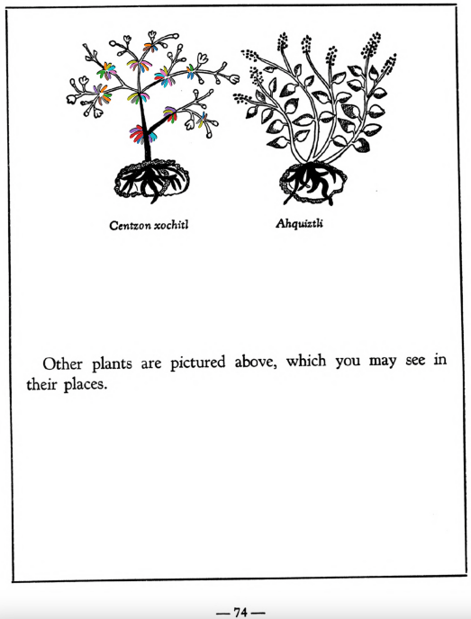

**Morphemes:**

- Centzon/four hundred or many
- Xochitl/flower

## Subchapter 9b  

=== "English :flag_us:"
    **Fevers.** The face in marking fevers has various changes, at times flushed, at times darkened, again blanched. He also spits blood, the body jerks and turns hither and thither, he sees little. At times bitterness, now burning, now sweetness of a kind fills the mouth, or rather palate. One who is such certain has his stomach corrupted. Although the urine is whitish, unless you avert the danger quickly the medicine will be prepared too late. Wherefore you will help him wonderfully if you macerate the plants [centzon-xochitl](Centzon-xochitl.md), [teo-iztacuilitl](Teo-iztaquilitl.md), [a-quiztli](Ahquiztli.md), tlanextia xihuitl, cuauhtla huita-quilitl, [tonatiuh yxiuh](Tonatiuh yxiuh v1.md), [tlazolco-zacatl](Tlazol-teo-zacatl.md), [mamaxtla-nelhuatl](Mamaxtla-nelhuatl.md), [oco-xochitl](Iztac oco-xochitl.md), [zaca-matlalin](Zaca-matlalin.md), the bush [tlanextia quahuitl](Tlanextia quahuitl.md), the stones you find in the stomachs of these birds: the [huitlalotl](huitlalotl.md), [huactli](huactli.md), [aztatl](aztatl.md), [apopotli](apopotli.md), [tlacahuilotl](tlacahuilotl.md), [huexo-canauhtli](huexo-canauhtli.md), [xiuh-quechol-tototl](xiuh-quechol-tototl.md), [tototl](tototl.md), [tlpal-tototl](tlapal-tototl.md), [noch-tototl](noch-tototl.md), [acatzanatl](acatzanatl.md), [zolin](zolin.md); the precious stones, fine green pearl, greenstone, sardonyx and [xiuh-tomolli](xiuh-tomolli.md), with burned human bone, from all which a liquor is to be heated quickly and then drunk. This potion being prepared, the stone [texalli](texalli.md) is ground in water, and a part of the liquor poured on his head, his feet bathed with a part, and the throat moistened with part. Also let him drink some. Then these plants are to be crushed in bitter water, the [xiuh-ecapatli](Eca-patli.md), [tetzmitl](Tetzmitl.md), [oco-xochitl](Iztac oco-xochitl.md), [centzon-xochitl](Centzon-xochitl.md), [tepe-chian](Tepe-chian.md), [tzom-pachtin](Tzon-pachtzin.md), [iztac-oco-xochitl](Iztac oco-xochitl.md), [tonatiuh yxiuh](Tonatiuh yxiuh v1.md), all of which are to be gathered in the fervent heat of the sun; then adding the willow and laurel and human bone, he is to be wet with their liquor. With this the tooth of a corpse is placed on the crown of the head. The plants [teco-xochiti-xihuitl](teco-xochiti-xihuitl.md) and [tlazol-patli](Tlazol-patli.md) are crushed in woman’s milk, and with this the occuput and nostrils are to be anointed; after all this is done, take heed that he smell a flower of some kind, and sleep during the day.  
    [https://archive.org/details/aztec-herbal-of-1552/page/75](https://archive.org/details/aztec-herbal-of-1552/page/75)  

=== "Español :flag_mx:"
    **Fiebres.** El rostro en quienes presentan fiebre cambia de muchas formas: a veces enrojecido, otras veces oscuro, otras pálido. También escupe sangre, el cuerpo da sacudidas y se retuerce, ve poco. A veces se llena la boca, o más bien el paladar, de amargor, ardor o un tipo de dulzura. Ciertamente, quien sufre esto tiene el estómago corrompido. Aunque la orina sea blanquecina, si no se evita el peligro rápidamente, la medicina se preparará demasiado tarde. Por eso lo ayudarás maravillosamente si maceras las plantas [centzon-xochitl](Centzon-xochitl.md), [teo-iztacuilitl](Teo-iztaquilitl.md), [a-quiztli](Ahquiztli.md), tlanextia xihuitl, cuauhtla huita-quilitl, [tonatiuh yxiuh](Tonatiuh yxiuh v1.md), [tlazolco-zacatl](Tlazol-teo-zacatl.md), [mamaxtla-nelhuatl](Mamaxtla-nelhuatl.md), [oco-xochitl](Iztac oco-xochitl.md), [zaca-matlalin](Zaca-matlalin.md), el arbusto [tlanextia quahuitl](Tlanextia quahuitl.md), las piedras que se encuentran en los estómagos de estas aves: [huitlalotl](huitlalotl.md), [huactli](huactli.md), [aztatl](aztatl.md), [apopotli](apopotli.md), [tlacahuilotl](tlacahuilotl.md), [huexo-canauhtli](huexo-canauhtli.md), [xiuh-quechol-tototl](xiuh-quechol-tototl.md), [tototl](tototl.md), [tlpal-tototl](tlapal-tototl.md), [noch-tototl](noch-tototl.md), [acatzanatl](acatzanatl.md), [zolin](zolin.md); las piedras preciosas como perla verde fina, piedra verde, sardónice y [xiuh-tomolli](xiuh-tomolli.md), junto con hueso humano quemado, de todo lo cual se calienta rápidamente un licor que luego debe beberse. Preparado este brebaje, se muele la piedra [texalli](texalli.md) en agua, y se vierte parte del licor sobre su cabeza, se le bañan los pies con otra parte, y se le humedece la garganta con otra porción. También debe beber un poco. Luego deben machacarse en agua amarga estas plantas: [xiuh-ecapatli](Eca-patli.md), [tetzmitl](Tetzmitl.md), [oco-xochitl](Iztac oco-xochitl.md), [centzon-xochitl](Centzon-xochitl.md), [tepe-chian](Tepe-chian.md), [tzom-pachtin](Tzon-pachtzin.md), [iztac-oco-xochitl](Iztac oco-xochitl.md), [tonatiuh yxiuh](Tonatiuh yxiuh v1.md), todas recolectadas bajo el calor intenso del sol. Añadiendo sauce, laurel y hueso humano, se moja con este licor. Con esto se coloca un diente de cadáver en la coronilla. Las plantas [teco-xochiti-xihuitl](teco-xochiti-xihuitl.md) y [tlazol-patli](Tlazol-patli.md) se trituran en leche de mujer, y con esto se ungen el occipucio y las fosas nasales. Después de todo esto, cuídese que huela alguna flor y duerma durante el día.  

## Subchapter 9f  

=== "English :flag_us:"
    **Remedy for lesions of the body.** Lesions caused by rough treatment should be treated with a poultice made from [tlazo-teo-zacatl](Tlazol-teo-zacatl.md), [centzon-xochitl](Centzon-xochitl.md), [xiuh-tontli](Xiuhtontli.md), [a-xocotl](A-xocotl.md), [tlayapaloni](Tla-yapaloni.md), [xiuhtontli](Xiuhtontli.md), moss from some tree, cypress nuts, seeds of the nettle, and the tree [ayauh-quahuitl](Ayauh-quahuitl.md). Let the ill-treated one drink a broth carefully prepared from the root of the [coanenepilli](Coanenepilli.md), tlanextia xihuitl, [chicom-catl](Chicom-acatl.md), the flower of the [a-xocotl](A-xocotl.md) and [izqui-xochitl](Izqui-xochitl.md), [tetlahuital](tetlahuitl v2.md), [eztetl](eztetl.md), [te-amoxtli](Te-amoxtli.md), the blood of an aquatic bird, the [huexo-canauhtli](huexo-canauhtli.md), and some [tlatlanquaye](Tlatlanquaye.md) leaves, all of which are to be ground up in acidulous water.  
    [https://archive.org/details/aztec-herbal-of-1552/page/80](https://archive.org/details/aztec-herbal-of-1552/page/80)  

=== "Español :flag_mx:"
    **Remedio para lesiones del cuerpo.** Las lesiones causadas por trato rudo deben tratarse con una cataplasma hecha de [tlazo-teo-zacatl](Tlazol-teo-zacatl.md), [centzon-xochitl](Centzon-xochitl.md), [xiuh-tontli](Xiuhtontli.md), [a-xocotl](A-xocotl.md), [tlayapaloni](Tla-yapaloni.md), [xiuhtontli](Xiuhtontli.md), musgo de algún árbol, nueces de ciprés, semillas de ortiga y el árbol [ayauh-quahuitl](Ayauh-quahuitl.md). El maltratado debe beber un caldo preparado cuidadosamente de la raíz del [coanenepilli](Coanenepilli.md), tlanextia xihuitl, [chicom-catl](Chicom-acatl.md), la flor del [a-xocotl](A-xocotl.md) y del [izqui-xochitl](Izqui-xochitl.md), [tetlahuital](tetlahuitl v2.md), [eztetl](eztetl.md), [te-amoxtli](Te-amoxtli.md), la sangre de un ave acuática, el [huexo-canauhtli](huexo-canauhtli.md), y algunas hojas de [tlatlanquaye](Tlatlanquaye.md), todo molido en agua acidulada.  

## Subchapter 11c  

=== "English :flag_us:"
    **Ventral lotion in childbirth.** The womb of a woman entering childbirth is to be washed out with the juice of the plants [xiuh-eloquilitl](Xiuh-elo-quilitl.md), [tlaco-popotl](Tlaco-popotli.md), [centzon-xochitl](Centzon-xochitl.md), [xiuhpatli](Xiuh-patli.md), laurel, all which triturate in spring water with the stones [eztetl](eztetl.md) and [tetlahuitl](tetlahuitl v2.md). The feet are also to be frequently washed with this. When the birth is about to come, the [iztac huitz-quahuitl](Iztac huitz-quahuitl.md), [malinalli](Malinalli.md), white stone, white nitre, pine, palm and [eztetl](eztetl.md) are to be boiled in water. Into the womb you also inject the triturated herb [ayo-nelhuatl](Ayo-nelhuatl.md), eagle excrement, the acidulous plants, the root [quauh-alahuac](Quauh-alahuac.md) and the stone [eztetl](eztetl.md), that the pain may be lightened.  
    [https://archive.org/details/aztec-herbal-of-1552/page/108](https://archive.org/details/aztec-herbal-of-1552/page/108)  

=== "Español :flag_mx:"
    **Loción ventral en el parto.** La matriz de una mujer que va a parir debe lavarse con el jugo de las plantas [xiuh-eloquilitl](Xiuh-elo-quilitl.md), [tlaco-popotl](Tlaco-popotli.md), [centzon-xochitl](Centzon-xochitl.md), [xiuhpatli](Xiuh-patli.md), laurel, todo lo cual se tritura en agua de manantial con las piedras [eztetl](eztetl.md) y [tetlahuitl](tetlahuitl v2.md). Los pies también deben lavarse frecuentemente con esto. Cuando el parto está por llegar, se deben hervir en agua el [iztac huitz-quahuitl](Iztac huitz-quahuitl.md), [malinalli](Malinalli.md), piedra blanca, nitro blanco, pino, palma y [eztetl](eztetl.md). En la matriz se debe inyectar también la hierba triturada [ayo-nelhuatl](Ayo-nelhuatl.md), excremento de águila, las plantas acidulosas, la raíz [quauh-alahuac](Quauh-alahuac.md) y la piedra [eztetl](eztetl.md), para que se alivie el dolor.  

  
Leaf traces by: Kylie DeViller, Jodrey School of Computer Science, Acadia University, Canada  
