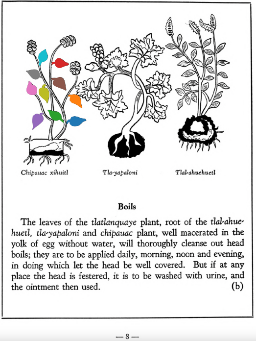

**Variants:**

- chipauac

**Morphemes:**

- Xihuitl/herbs, green leaves

## Subchapter 1b  

=== "English :flag_us:"
    **Boils.** The leaves of the [tlatlanquaye](Tlatlanquaye.md) plant, root of the [tlal-ahuehuetl](Tlal-ahuehuetl.md), [tla-yapaloni](Tla-yapaloni.md) and [chipauac](Chipauac xihuitl.md) plant, well macerated in the yolk of egg without water, will thoroughly cleanse out head boils; they are to be applied daily, morning, noon and evening, in doing which let the head be well covered. But if at any place the head is festered, it is to be washed with urine, and the ointment then used.  
    [https://archive.org/details/aztec-herbal-of-1552/page/8](https://archive.org/details/aztec-herbal-of-1552/page/8)  

=== "Español :flag_mx:"
    **Diviesos.**  Las hojas de la planta [tlatlanquaye](Tlatlanquaye.md), la raíz del [tlal-ahuehuetl](Tlal-ahuehuetl.md), [tla-yapaloni](Tla-yapaloni.md) y [chipauac](Chipauac xihuitl.md), bien maceradas en yema de huevo sin agua, limpian completamente los diviesos de la cabeza; deben aplicarse diariamente, por la mañana, al mediodía y por la tarde, cubriendo bien la cabeza al hacerlo. Pero si en alguna parte la cabeza está ulcerada, debe lavarse con orina y luego aplicarse el ungüento.  

  
Leaf traces by: Daniel H. Chitwood, Michigan State University, USA  
