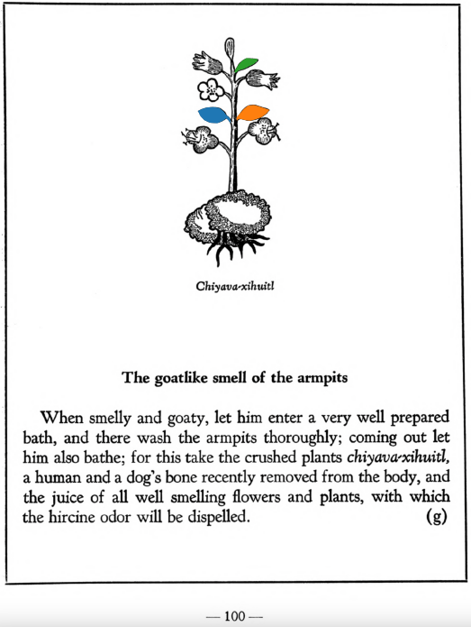

**Variants:**

- chiyava-xihuitl

**Morphemes:**

- Xihuitl/herbs, green leaves

## Subchapter 10g  

=== "English :flag_us:"
    **The goatlike smell of the armpits.** When smelly and goaty, let him enter a very well prepared bath, and there wash the armpits thoroughly; coming out let him also bathe; for this take the crushed plants [chiyava-xihuitl](Chiyava xihuitl.md), a human and a dog’s bone recently removed from the body, and the juice of all well smelling flowers and plants, with which the hircine odor will be dispelled.  
    [https://archive.org/details/aztec-herbal-of-1552/page/100](https://archive.org/details/aztec-herbal-of-1552/page/100)  

=== "Español :flag_mx:"
    **El olor a cabra de las axilas.** Cuando apestan y huelen a chivo, que entre en un baño muy bien preparado y allí se lave a fondo las axilas; al salir, que se bañe de nuevo; para esto se usan las plantas machacadas [chiyava-xihuitl](Chiyava xihuitl.md), un hueso humano y uno de perro recién extraídos del cuerpo, y el jugo de todas las flores y plantas bien olorosas, con lo cual se disipará el olor hircino.  

  
Leaf traces by: Alejandra Rougon, UNAM ENES León, México  
