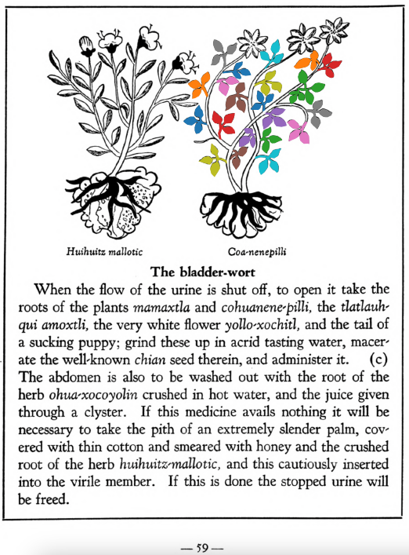

**Variants:**

- cohuanene-pilli

## Subchapter 8c  

=== "English :flag_us:"
    **The bladder-wort.** When the flow of the urine is shut off, to open it take the roots of the plants [mamaxtla](Mamaxtla.md) and [cohuanene-pilli](Coanenepilli.md), the tlatlauhqui amoxtli, the very white flower [yollo-xochitl](Yollo-xochitl.md), and the tail of a sucking puppy; grind these up in acrid tasting water, macerate the well-known [chian](Chian.md) seed therein, and administer it. The abdomen is also to be washed out with the root of the herb [ohua-xocoyolin](Ohua-xoxocoyolin.md) crushed in hot water, and the juice given through a clyster. If this medicine avails nothing it will be necessary to take the pith of an extremely slender palm, covered with thin cotton and smeared with honey and the crushed root of the herb [huihuitz-mallotic](Huihuitz-mallotic.md), and this cautiously inserted into the virile member. If this is done the stopped urine will be freed.  
    [https://archive.org/details/aztec-herbal-of-1552/page/59](https://archive.org/details/aztec-herbal-of-1552/page/59)  

=== "Español :flag_mx:"
    **La hierba de vejiga.** Cuando el flujo de la orina se detiene, para abrirlo se toman las raíces de las plantas [mamaxtla](Mamaxtla.md) y [cohuanene-pilli](Coanenepilli.md), el tlatlauhqui amoxtli, la flor muy blanca [yollo-xochitl](Yollo-xochitl.md), y la cola de un perrito lactante; se muelen en agua de sabor acre, se macera allí la semilla conocida [chian](Chian.md) y se administra. También debe lavarse el abdomen con la raíz de la hierba [ohua-xocoyolin](Ohua-xoxocoyolin.md) triturada en agua caliente, y el jugo debe administrarse como enema. Si este remedio no funciona, será necesario tomar la médula de una palma extremadamente delgada, cubierta con algodón fino y untada con miel y la raíz molida de la hierba [huihuitz-mallotic](Huihuitz-mallotic.md), e introducirla cuidadosamente en el miembro viril. Si se hace esto, se liberará la orina retenida.  

## Subchapter 9f  

=== "English :flag_us:"
    **Remedy for lesions of the body.** Lesions caused by rough treatment should be treated with a poultice made from [tlazo-teo-zacatl](Tlazol-teo-zacatl.md), [centzon-xochitl](Centzon-xochitl.md), [xiuh-tontli](Xiuhtontli.md), [a-xocotl](A-xocotl.md), [tlayapaloni](Tla-yapaloni.md), [xiuhtontli](Xiuhtontli.md), moss from some tree, cypress nuts, seeds of the nettle, and the tree [ayauh-quahuitl](Ayauh-quahuitl.md). Let the ill-treated one drink a broth carefully prepared from the root of the [coanenepilli](Coanenepilli.md), tlanextia xihuitl, [chicom-catl](Chicom-acatl.md), the flower of the [a-xocotl](A-xocotl.md) and [izqui-xochitl](Izqui-xochitl.md), [tetlahuital](tetlahuitl v2.md), [eztetl](eztetl.md), [te-amoxtli](Te-amoxtli.md), the blood of an aquatic bird, the [huexo-canauhtli](huexo-canauhtli.md), and some [tlatlanquaye](Tlatlanquaye.md) leaves, all of which are to be ground up in acidulous water.  
    [https://archive.org/details/aztec-herbal-of-1552/page/80](https://archive.org/details/aztec-herbal-of-1552/page/80)  

=== "Español :flag_mx:"
    **Remedio para lesiones del cuerpo.** Las lesiones causadas por trato rudo deben tratarse con una cataplasma hecha de [tlazo-teo-zacatl](Tlazol-teo-zacatl.md), [centzon-xochitl](Centzon-xochitl.md), [xiuh-tontli](Xiuhtontli.md), [a-xocotl](A-xocotl.md), [tlayapaloni](Tla-yapaloni.md), [xiuhtontli](Xiuhtontli.md), musgo de algún árbol, nueces de ciprés, semillas de ortiga y el árbol [ayauh-quahuitl](Ayauh-quahuitl.md). El maltratado debe beber un caldo preparado cuidadosamente de la raíz del [coanenepilli](Coanenepilli.md), tlanextia xihuitl, [chicom-catl](Chicom-acatl.md), la flor del [a-xocotl](A-xocotl.md) y del [izqui-xochitl](Izqui-xochitl.md), [tetlahuital](tetlahuitl v2.md), [eztetl](eztetl.md), [te-amoxtli](Te-amoxtli.md), la sangre de un ave acuática, el [huexo-canauhtli](huexo-canauhtli.md), y algunas hojas de [tlatlanquaye](Tlatlanquaye.md), todo molido en agua acidulada.  

  
Leaf traces by: J. Noé García-Chávez, Laboratory of Agrigenomic Sciences, ENES Unidad León, México  
