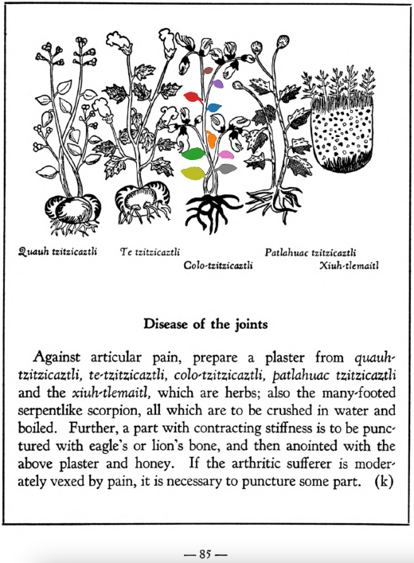

## Subchapter 9k  

=== "English :flag_us:"
    **Disease of the joints.** Against articular pain, prepare a plaster from [quauh-tzitzicaztli](Quauh-tzitzicaztli.md), [te-tzitzicaztli](Te-tzitzicaztli.md), [colo-tzitzicaztli](Colo-tzitzicaztli.md), [patlahuac tzitzicaztli](Patlahuac tzitzicaztli.md) and the [xiuh-tlemaitl](Xiuh-tlemaitl.md), which are herbs; also the many-footed serpentlike scorpion, all which are to be crushed in water and boiled. Further, a part with contracting stiffness is to be punctured with eagle’s or lion’s bone, and then anointed with the above plaster and honey. If the arthritic sufferer is moderately vexed by pain, it is necessary to puncture some part.  
    [https://archive.org/details/aztec-herbal-of-1552/page/85](https://archive.org/details/aztec-herbal-of-1552/page/85)  

=== "Español :flag_mx:"
    **Enfermedad de las articulaciones.** Contra el dolor articular se prepara un emplasto de [quauh-tzitzicaztli](Quauh-tzitzicaztli.md), [te-tzitzicaztli](Te-tzitzicaztli.md), [colo-tzitzicaztli](Colo-tzitzicaztli.md), [patlahuac tzitzicaztli](Patlahuac tzitzicaztli.md) y el [xiuh-tlemaitl](Xiuh-tlemaitl.md), que son hierbas; también se incluye el alacrán de muchas patas en forma de serpiente, todo lo cual se tritura en agua y se hierve. Además, la parte con rigidez contracturada debe ser punzada con hueso de águila o de león, y luego untada con el emplasto anterior y miel. Si el enfermo artrítico sufre dolor moderado, es necesario punzar alguna parte.  

  
Leaf traces by: Lachlann Simms, Acadia University, Canada  
