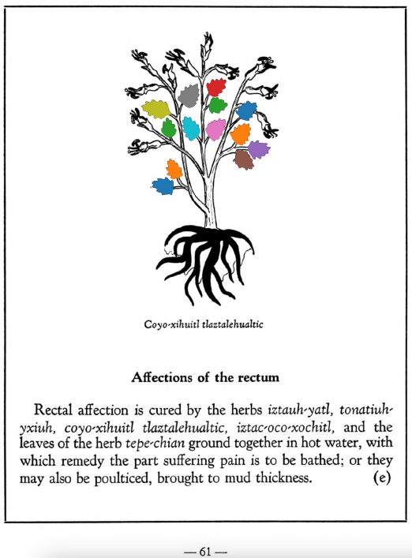

Variants: coyo-xihuitl  

## Subchapter 8g  
**Pain in the knees.** When the knees pain one, anoint them with the liquor of the plants [coyo-xihuitl](Coyo-xihuitl.md), [tepe-chian](Tepe-chian.md), [xoxouhca-patli](xoxouhca-patli.md) macerated with the [te-amoxtli](Te-amoxtli.md) in swallow's blood.  
[https://archive.org/details/aztec-herbal-of-1552/page/63](https://archive.org/details/aztec-herbal-of-1552/page/63)  

## Subchapter 8j  
**Lesions in the feet.** For cut feet prepare these herbs: [tlal-ecapatli](Tlal-ecapatli.md), [coyo-xihuitl](Coyo-xihuitl.md), [iztauh-yatl](Iztauyattl.md), [tepe-chian](Tepe-chian.md), [a-chilli](A-chilli.md), [xiuh-ecapatli](Eca-patli.md), [quauh-yyauhtli](Quauh-yyauhtli.md), [quetzal-xoxouhca-patli](Quetzal-xoxouca-patli.md), [tzotzotlani](Quetzal-xoxouhca-patli_tzotzotlani.md), the flower of the [cacau-xochitl](Cacaua-xochitl.md) and the [piltzin-tecouh-xochitl](Piltzinte-couh-xochitl.md), with the leaves of the [eca-patli](Eca-patli.md) and the [itzcuin-patli](Itzquin-patli.md), the stones [tlacal-huatzin](tlacal-huatzin.md), [eztetl](eztetl.md) and [tetlahuitl](tetlahuitl_v2.md), pale colored earth. Then divide all this into three parts. Put some in a basin over the coals or fire that it may heat, in water, and put the feet into the hot water in the basin. Let the fire placed at the feet lower somewhat, that it may not fall onto them; the feet are to be wrapped in a cloth. The following day put our ointment called [xochi-ocotzotl](xochi-ocotzotl.md), with white frankincense, into the fire, that the feet may improve by the odor and the heat; also let the seeds of the herb called [xe-xihuitl](Xe-xihuitl.md) be ground up and put pulverized into hot water to apply to the feet. Third, apply the herb[tolohua-xihuitl](Tolohua_xihuitl.md)and brambles ground up in hot water.  
[https://archive.org/details/aztec-herbal-of-1552/page/65](https://archive.org/details/aztec-herbal-of-1552/page/65)  

## Subchapter 9e  
**Excessive heat.** The body when overheated is relieved by the ground roots of the [huitz-quilitl](Huitz-quilitl.md), [xal-tomatl](Xal-tomatl.md), [tlaca-camotli](Tlaca-camotli.md), [teo-iztaquilitl](Teo-iztaquilitl.md), the stone [a-camollotetl](a-camallo-tetl_v2.md), the [eztetl](eztetl.md), [tlacal-huatzin](tlacal-huatzin.md), red earth, white earth, and the stones found in the stomachs of a cock and the [noch-totl](noch-tototl.md), with sharp stones, all then put in water. This is drunk and the abdomen purged with a clyster. A potion is also prepared from [tzayanal-quilitl](Tzayanal-quilitl.md) roots, the [acacapac-quilitl](Aca-capac-quilitl.md), [tol-patlctli](Tol-patlactli.md), the bushes [tetzmitl](Tetzmitl.md), [iztauhyauh](Iztauyattl.md), [huitz-quilitl](Huitz-quilitl.md), with added salt. The body is anointed with the latex squeezed from the [acapac-quilitl](Aca-capac-quilitl.md), [coyo-xihuitl](Coyo-xihuitl.md), [tlal-ecapatli](Tlal-ecapatli.md), [tonatiuh-yxiuh](Tonatiuh_yxiuh_v1.md), [iztac-oco-xochitl](Iztac_oco-xochitl.md), [centzon-oco-xochitl](Centzon-oco-xochitl.md), which are herbs; also using the leaves of the laurel, the bush [tetzmitl](Tetzmitl.md), and the fruit trees [xa-xocotl](Xa-xocotl.md), the plant [cohua-xochitl](Cohua-xochitl.md), leaves of the pine. This medicine is then divided, some poured on the head, some that is quite thick is applied as ointment on the body. If the heat rises, take the blood of the [huitzitzilin](huitzitzilin.md), the gall of the [huexo-canauhtli](huexo-canauhtli.md), the viscera of a quail, bladder of the [cocotli](cocotli.md), skin of the [pezotli](pezotli.md), burned together. These and the above are to be mixed together.  
[https://archive.org/details/aztec-herbal-of-1552/page/79](https://archive.org/details/aztec-herbal-of-1552/page/79)  

## Subchapter 9g  
**For ringworm and tetter.** For one laboring with this scaly disease, let there be ground together and set over coals the bark of the cherry, of the incense bearing[quauh-xiyotl](Quauh-xiyotl.md) tree, the apple, the flowers of the [topozan](Topozan.md) and [cacalo-xochitl](Cacalo-xochitl.md), oak roots, cypress nuts, leaves of the plants[tlatlanquaye](Tlatlanquaye.md), [quauh-yayahual](Quauh-yayahual.md), the herbs [tepe-chian](Tepe-chian.md), [coyo-xihuitl](Coyo-xihuitl.md), [a-quahuitl](A-quahuitl.md), cedar nuts and leaves; with these when heated let him bathe himself, and the affected part be rubbed with the burned pine, with which, and all the above, let him be rubbed.  
[https://archive.org/details/aztec-herbal-of-1552/page/81](https://archive.org/details/aztec-herbal-of-1552/page/81)  

## Subchapter 9l  
**Swelling of the veins after phlebotomy.** When a vein comes to swelling after being cut, the bushes[tzihuac-copalli](Tzihuac-copalli.md) and [tlaco-eca-patli](Tlaco-ecapatli.md), [tetzmitl](Tetzmitl.md), the root of the plant[tlanen-popoloa](Tla-nen-popoloua.md), the leaves of the herb [quauh-yyauhtli](Quauh-yyauhtli.md) andahuiyac tlatlanquaye, with the herb [coyo-xihuitl](Coyo-xihuitl.md) are ground together with yolk of egg, in which water breathing the odor of frankincense is then poured, and the incised vein soaked with this liquor.  
[https://archive.org/details/aztec-herbal-of-1552/page/86](https://archive.org/details/aztec-herbal-of-1552/page/86)  

  
Leaf traces by: Mariana Ruíz Amaro, UNAM ENES León, México  
