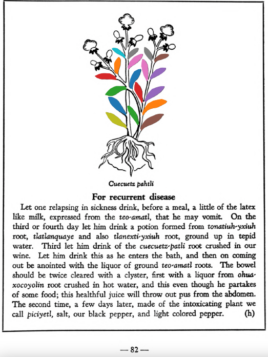

**Morphemes:**

- Patli/medicine

## Subchapter 9h  

=== "English :flag_us:"
    **For recurrent disease.** Let one relapsing in sickness drink, before a meal, a little of the latex like milk, expressed from the [teo-amatl](Teo-amatl.md), that he may vomit. On the third or fourth day let him drink a potion formed from [tonatiuh-yxiuh](Tonatiuh yxiuh v1.md) root, [tlatlanquaye](Tlatlanquaye.md) and also [tlanexti-yxiuh](Tlanextia-yxiuh.md) root, ground up in tepid water. Third let him drink of the [cuecuetz-patli](Cuecuetz-patli.md) root crushed in our wine. Let him drink this as he enters the bath, and then on coming out be anointed with the liquor of ground [teo-amatl](Teo-amatl.md) roots. The bowel should be twice cleared with a clyster, first with a liquor from [ohua-xocoyolin](Ohua-xoxocoyolin.md) root crushed in hot water, and this even though he partakes of some food; this healthful juice will throw out pus from the abdomen. The second time, a few days later, made of the intoxicating plant we call [piciyetl](Piciyetl.md), salt, our black pepper, and light colored pepper.  
    [https://archive.org/details/aztec-herbal-of-1552/page/82](https://archive.org/details/aztec-herbal-of-1552/page/82)  

=== "Español :flag_mx:"
    **Para enfermedad recurrente.** Quien recaiga en la enfermedad debe beber, antes de una comida, un poco del látex parecido a leche exprimido del [teo-amatl](Teo-amatl.md), para vomitar. Al tercer o cuarto día debe beber una poción formada con raíz de [tonatiuh-yxiuh](Tonatiuh yxiuh v1.md), [tlatlanquaye](Tlatlanquaye.md) y también raíz de [tlanexti-yxiuh](Tlanextia-yxiuh.md), molidas en agua tibia. En tercer lugar, debe beber raíz de [cuecuetz-patli](Cuecuetz-patli.md) triturada en nuestro vino. Debe beber esto al entrar al baño, y luego al salir ser untado con el licor de raíces molidas de [teo-amatl](Teo-amatl.md). Los intestinos deben vaciarse dos veces con un enema: primero con un licor de raíz de [ohua-xocoyolin](Ohua-xoxocoyolin.md) triturada en agua caliente, incluso si ha comido algo; este jugo saludable expulsará pus del abdomen. La segunda vez, unos días después, se hace con la planta embriagante llamada [piciyetl](Piciyetl.md), sal, nuestra pimienta negra y pimienta clara.  

  
Leaf traces by: Lachlann Simms, Acadia University, Canada  
