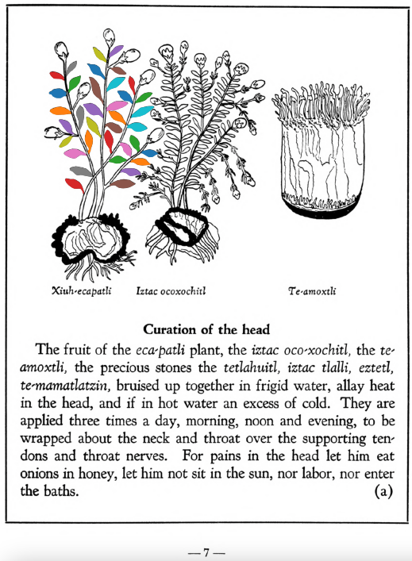
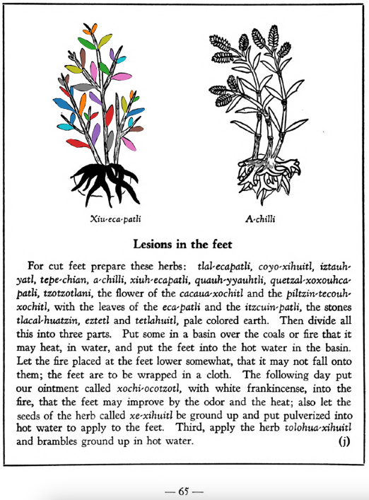

Variants: eca-patli, xiuh-ecapatli  

## Subchapter 1a  
**Curation of the head.** The fruit of the [eca-patli](Eca-patli.md) plant, the [iztac oco-xochitl](Iztac_oco-xochitl.md), the [te-amoxtli](Te-amoxtli.md), the precious stones the [tetlahuitl](tetlahuitl_v2.md), [iztac tlalli](iztac_tlalli.md), [eztetl](eztetl.md), [te-mamatlatzin](te-mamatlatzin.md), bruised up together in frigid water, allay heat in the head, and if in hot water an excess of cold. They are applied three times a day, morning, noon and evening, to be wrapped about the neck and throat over the supporting tendons and throat nerves. For pains in the head let him eat onions in honey, let him not sit in the sun, nor labor, nor enter the baths.  
[https://archive.org/details/aztec-herbal-of-1552/page/7](https://archive.org/details/aztec-herbal-of-1552/page/7)  

## Subchapter 5h  
**For bloody saliva.** For one spitting blood it is well to drink a potion made out of the root of the [tlaco-xilo-xochitl](Tlaco-xilo-xochitl.md), our pepper, the stones [teo-xihuitl](teo-xihuitl_v2.md) and [chichiltic tapachtli](chichiltic_tapachtli.md), the bones of an ape, the red flinty stones you find on the bank of a river, white frankincense, the leaves of the [huitz-colotli](Huitz-colotli.md) and the root of other plants whose tip is ruddy and small, crushing them in the whites of two eggs. Further to prepare the potion you should crush one root of the [tlaco-xilo-xochitl](Tlaco-xilo-xochitl.md), the leaves of the [huitz-colo-xochitl](Huitz-colotli.md) and the root of another plant called [xiuhtontli](Xiuhtontli.md), the stone [teo-xihuitl](teo-xihuitl_v2.md) and the bone of an ape, burn pepper to ashes, crush together the [chichiltic tapachtli](chichiltic_tapachtli.md) and a stone found in the river, that is, in water; cook the bone in water with white frankincense, and then before a meal let him take one saucer of the potion thus prepared, for his drink. For one who spits out yellow mucus, take the [malinalli](Malinalli.md) plant, pine cypress and leaves of the plant [eca-patli](Eca-patli.md), squeezed in water or liquor containing ashes, or if it seems right in sour water; let the above be ground and cooked for a potion he is to drink; it is however to be diligently studied. This consumes the noxious humor.  
[https://archive.org/details/aztec-herbal-of-1552/page/33](https://archive.org/details/aztec-herbal-of-1552/page/33)  

## Subchapter 6d  
**For face scabs or freckles.** To heal a scabby face, take the juice of crushed [tlal-quequetzal](Tlal-quequetzal.md), [a-quahuitl](A-quahuitl.md) and [eca-patli](Eca-patli.md) in water of an acid savor, adding pigeons’ excrement, as a wash.  
[https://archive.org/details/aztec-herbal-of-1552/page/39](https://archive.org/details/aztec-herbal-of-1552/page/39)  

## Subchapter 6e  
**For mouth sores.** Scabs on the lips will be completely removed by a medicament made up of the [tlal-mizquitl](Tlal-mizquitl.md) root, whose viscous drops or tears are condensed to the thickness of gum, the leaves of the [eca-patli](Eca-patli.md), nettle seeds, and pounded up leaves of the [te-tezhuatic](Tetezhuatic.md).  
[https://archive.org/details/aztec-herbal-of-1552/page/40](https://archive.org/details/aztec-herbal-of-1552/page/40)  

## Subchapter 8j  
**Lesions in the feet.** For cut feet prepare these herbs: [tlal-ecapatli](Tlal-ecapatli.md), [coyo-xihuitl](Coyo-xihuitl.md), [iztauh-yatl](Iztauyattl.md), [tepe-chian](Tepe-chian.md), [a-chilli](A-chilli.md), [xiuh-ecapatli](Eca-patli.md), [quauh-yyauhtli](Quauh-yyauhtli.md), [quetzal-xoxouhca-patli](Quetzal-xoxouca-patli.md), [tzotzotlani](Quetzal-xoxouhca-patli_tzotzotlani.md), the flower of the [cacau-xochitl](Cacaua-xochitl.md) and the [piltzin-tecouh-xochitl](Piltzinte-couh-xochitl.md), with the leaves of the [eca-patli](Eca-patli.md) and the [itzcuin-patli](Itzquin-patli.md), the stones [tlacal-huatzin](tlacal-huatzin.md), [eztetl](eztetl.md) and [tetlahuitl](tetlahuitl_v2.md), pale colored earth. Then divide all this into three parts. Put some in a basin over the coals or fire that it may heat, in water, and put the feet into the hot water in the basin. Let the fire placed at the feet lower somewhat, that it may not fall onto them; the feet are to be wrapped in a cloth. The following day put our ointment called [xochi-ocotzotl](xochi-ocotzotl.md), with white frankincense, into the fire, that the feet may improve by the odor and the heat; also let the seeds of the herb called [xe-xihuitl](Xe-xihuitl.md) be ground up and put pulverized into hot water to apply to the feet. Third, apply the herb[tolohua-xihuitl](Tolohua_xihuitl.md)and brambles ground up in hot water.  
[https://archive.org/details/aztec-herbal-of-1552/page/65](https://archive.org/details/aztec-herbal-of-1552/page/65)  

## Subchapter 8k  
**Against lassitude.** One fatigued will be restored if the feet be bathed in choice liquor, with the [ahuiyac-xihuitl](Ahuiyac-xihuitl.md) or [tlatlanquaye](Tlatlanquaye.md), [tlatlaolton](Tlatlaolton.md), [itzcuin-patli](Itzquin-patli.md), [xiuh-ecapatli](Eca-patli.md), [iztauh-yatl](Iztauyattl.md), the [huitzihtzil-xochitl](Huitzihtzil-xochitl.md)flower, and the stones [tetlahuitl](tetlahuitl_v2.md), [tlaca-huatzin](tlacal-huatzin.md) and [eztetl](eztetl.md), to be crushed in hot water.  
[https://archive.org/details/aztec-herbal-of-1552/page/66](https://archive.org/details/aztec-herbal-of-1552/page/66)  

## Subchapter 8l  
**The trees and flowers for relieving the fatigue of those administering the government, and discharging public offices.** The bark of the tree [quetzal-ylin](Quetzal-ylin.md), the flowers [elo-xochitl](Elo-xochitl.md) and[izqui-xochitl](Izqui-xochitl.md), the almond with its fruit, which is the [tlapal-cacahuatl](Tlapol-cacahuatl.md), the flowers [cacalo-xochitl](Cacalo-xochitl.md), [huacal-xochitl](Huacal-xochitl.md), [meca-xochitl](Meca-xochitl.md), [huey-nacaztli](Huey-nacaztli.md), and all fine smelling summer flowers; leaves of the trees [a-ylin](A-illin.md), [oyametl](Oyametl.md), [ocotl](Ocotl.md), [a-xocotl](A-xocotl.md), [eca-patli](Eca-patli.md), [tlaco-izqui-xochitl](Tlaco-izqui-xochitl.md), [quauh-yyauhtli](Quauh-yyauhtli.md), [tomazquitl](Tomaz-quitl.md), [ahuatl](Ahuatl.md), [tepe-ylin](Tepe-ylin.md), [ayauh-quahuitl](Ayauh-quahuitl.md), and te-papaquilti quahuitl, flower bearing plants with their shrubbery, which you gather before the wind rises; these are expressed one by one in clear spring water, into new vessels or vases. This then stays for a day and a night, when the [huitz-quahuitl](Huitz-quahuitl.md) wood, with a red juice, is added as coloring. Also the blood of wild animals, namely the red ocelot, [cuetlachtli](cuetlachtli.md), [miztli](miztli.md), [ocotochtli](ocotochtli.md), white ocelot, [tlaco-ocelotl](tlaco-ocelotl.md), is sought for. With this and the above liquors the body is well anointed. Second, the precious stones [quetzal-iztli](quetzal-iztli.md), [eztetl](eztetl.md), [tlacal-huatzin](tlacal-huatzin.md), [tetlahuitl](tetlahuitl_v2.md), red earth and the small stones in the stomachs of the birds [huexo-canauhtli](huexo-canauhtli.md), [hauctli](huactli.md) and [apopotli](apopotli.md) are cast into water in which they stay for a night in order that the healthful juice may be drawn out, with which the body is to be frequently bathed. Third, the brain and gall of these animals, the red ocelot, white ocelot, [cuetlachtli](cuetlachtli.md), [miztli](miztli.md), [ocotochtli](ocotochtli.md), [coyotl](coyotl.md), also the brain, gall and bladder of the white epatl, ground up; with these the body is moistened. These medicaments healthily give gladiatorial strength to the body, drive fatigue far off, and also cast out timidity and strengthen the human heart. As for the rest, let whoever wishes to follow through this reinvigoration of the body, eat other things also, but as of chief value the flesh of the white rabbit or white fox, either baked or boiled.  
[https://archive.org/details/aztec-herbal-of-1552/page/70](https://archive.org/details/aztec-herbal-of-1552/page/70)  

## Subchapter 9b  
**Fevers.** The face in marking fevers has various changes, at times flushed, at times darkened, again blanched. He also spits blood, the body jerks and turns hither and thither, he sees little. At times bitterness, now burning, now sweetness of a kind fills the mouth, or rather palate. One who is such certain has his stomach corrupted. Although the urine is whitish, unless you avert the danger quickly the medicine will be prepared too late. Wherefore you will help him wonderfully if you macerate the plants [centzon-xochitl](Centzon-xochitl.md), [teo-iztacuilitl](Teo-iztaquilitl.md), [a-quiztli](Ahquiztli.md), tlanextia xihuitl, cuauhtla huita-quilitl, [tonatiuh yxiuh](Tonatiuh_yxiuh_v1.md), [tlazolco-zacatl](Tlazol-teo-zacatl.md), [mamaxtla-nelhuatl](Mamaxtla-nelhuatl.md), [oco-xochitl](Iztac_oco-xochitl.md), [zaca-matlalin](Zaca-matlalin.md), the bush [tlanextia quahuitl](Tlanextia_quahuitl.md), the stones you find in the stomachs of these birds: the [huitlalotl](huitlalotl.md), [huactli](huactli.md), [aztatl](aztatl.md), [apopotli](apopotli.md), [tlacahuilotl](tlacahuilotl.md), [huexo-canauhtli](huexo-canauhtli.md), [xiuh-quechol-tototl](xiuh-quechol-tototl.md), [tototl](tototl.md), [tlpal-tototl](tlapal-tototl.md), [noch-tototl](noch-tototl.md), [acatzanatl](acatzanatl.md), [zolin](zolin.md); the precious stones, fine green pearl, greenstone, sardonyx and [xiuh-tomolli](xiuh-tomolli.md), with burned human bone, from all which a liquor is to be heated quickly and then drunk. This potion being prepared, the stone [texalli](texalli.md) is ground in water, and a part of the liquor poured on his head, his feet bathed with a part, and the throat moistened with part. Also let him drink some. Then these plants are to be crushed in bitter water, the [xiuh-ecapatli](Eca-patli.md), [tetzmitl](Tetzmitl.md), [oco-xochitl](Iztac_oco-xochitl.md), [centzon-xochitl](Centzon-xochitl.md), [tepe-chian](Tepe-chian.md), [tzom-pachtin](Tzon-pachtzin.md), [iztac-oco-xochitl](Iztac_oco-xochitl.md), [tonatiuh yxiuh](Tonatiuh_yxiuh_v1.md), all of which are to be gathered in the fervent heat of the sun; then adding the willow and laurel and human bone, he is to be wet with their liquor. With this the tooth of a corpse is placed on the crown of the head. The plants [teco-xochiti-xihuitl](teco-xochiti-xihuitl.md) and [tlazol-patli](Tlazol-patli.md)are crushed in woman’s milk, and with this the occuput and nostrils are to be anointed; after all this is done, take heed that he smell a flower of some kind, and sleep during the day.  
[https://archive.org/details/aztec-herbal-of-1552/page/75](https://archive.org/details/aztec-herbal-of-1552/page/75)  

## Subchapter 9p  
**Inflammations.** An inflamed part of the body will be relieved by a liquor from the [nohpalli](Nopalli.md), [te-amoxtli](Te-amoxtli.md), [tetzmitl](Tetzmitl.md), [eca-patli](Eca-patli.md), [te-xiyotl](Te-xiyotl.md) and [huitz-quilitl](Huitz-quilitl.md), anointing the part thoroughly and rubbing it with honey and yolk of egg.  
[https://archive.org/details/aztec-herbal-of-1552/page/90](https://archive.org/details/aztec-herbal-of-1552/page/90)  

## Subchapter 10b  
**The cure for one harassed by a tornado or evil wind.** One who has been caught in a tornado, let him drink the healthful liquor of the plant [quauh-yayahual](Quauh-yayahual.md), the [acxoyatl](Acxoyatl.md), with pine and laurel leaves crushed in water. The broth should be boiled and drunk thus. Drunk it expels the evil air entering within. Second; take the liquor of these stones, the red crystal, white pearl, white earth, ground up in water, with the leaves of the plant tlatlanquaye, boiling this with incense. Anoint him with cypress and cedar nuts, and the leaves of the plant [qauh-yyauhtli](Quauh-yyauhtli.md), and those of the plant [xiuh-ecapatli](Eca-patli.md), all ground in water with incense and the liquor carefully prepared.  
[https://archive.org/details/aztec-herbal-of-1552/page/95](https://archive.org/details/aztec-herbal-of-1552/page/95)  

## Subchapter 10f  
**Goaty armpits of sick people.** This evil smell is removed by anointing the body with the liquor of the herbs[ayauh-tonan-yxiuh](Ayauh-tonan-yxiuh.md), [papalo-quilitl](Papalo-quilitl.md), [xiuh-ecapatli](Eca-patli.md), the leaves being macerated in water; also the leaves of the pine and the flowers[oco-xochitl](Oco-xochitl.md), [tonaca-xochitl](Tonaca-xochitl.md), [totoloctzin](Totoloctzin.md)and sharp stones.  
[https://archive.org/details/aztec-herbal-of-1552/page/99](https://archive.org/details/aztec-herbal-of-1552/page/99)  

## Subchapter 12a  
**Infantile skin eruptions.** Phthiriasis, or the skin breaking out on infants, is cured by anointing the body with a poultice made from the seeds of the well known [michi-huauhtli](Michi-huauhtli.md), red incense, grain, which are to be burned; then the plant [tlatlanquaye](Tlatlanquaye.md), leaves of the [huitzitzil-xochitl](Huitzihtzil-xochitl.md), the root of the [tlal-ahuehuetl](Tlal-ahuehuetl.md) and [tla-yapaloni](Tla-yapaloni.md), laurel leaves, [xiuh-ecapatli](Eca-patli.md) leaves from which the acid water is to be drawn; let the boy also drink medicine made from white earth, the small white stones gathered from the bottom in flowing water, the stone[a-camallo-tetl](a-camallo-tetl_v2.md) and [coltotzin](Coltotzin.md), the bush [tlal-mizquitl](Tlal-mizquitl.md), and points ground in water.  
[https://archive.org/details/aztec-herbal-of-1552/page/113](https://archive.org/details/aztec-herbal-of-1552/page/113)  

  
Leaf traces by: Dan Chitwood, Michigan State University, USA  
  
Leaf traces by: Mariana Ruíz Amaro, UNAM ENES León, México  
