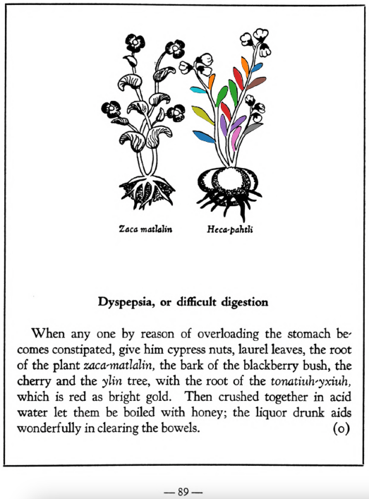

**Variants:**

- xiuh-ecapatli

**Morphemes:**

- Ecatl/wind
- Patli/medicine

## Subchapter 1a  

=== "English :flag_us:"
    **Curation of the head.** The fruit of the [eca-patli](Eca-patli.md) plant, the [iztac oco-xochitl](Iztac oco-xochitl.md), the [te-amoxtli](Te-amoxtli.md), the precious stones the [tetlahuitl](tetlahuitl v2.md), [iztac tlalli](iztac tlalli.md), [eztetl](eztetl.md), [te-mamatlatzin](te-mamatlatzin.md), bruised up together in frigid water, allay heat in the head, and if in hot water an excess of cold. They are applied three times a day, morning, noon and evening, to be wrapped about the neck and throat over the supporting tendons and throat nerves. For pains in the head let him eat onions in honey, let him not sit in the sun, nor labor, nor enter the baths.  
    [https://archive.org/details/aztec-herbal-of-1552/page/7](https://archive.org/details/aztec-herbal-of-1552/page/7)  

=== "Español :flag_mx:"
    **Curación de la cabeza.**  El fruto de la planta [eca-patli](Eca-patli.md), el [iztac oco-xochitl](Iztac oco-xochitl.md), el [te-amoxtli](Te-amoxtli.md), las piedras preciosas [tetlahuitl](tetlahuitl v2.md), [iztac tlalli](iztac tlalli.md), [eztetl](eztetl.md), [te-mamatlatzin](te-mamatlatzin.md), machacadas juntas en agua fría, calman el calor en la cabeza, y si se preparan en agua caliente, contrarrestan el exceso de frío. Se aplican tres veces al día, por la mañana, al mediodía y por la tarde, envueltas alrededor del cuello y la garganta sobre los tendones de sostén y los nervios del cuello. Para los dolores de cabeza, que coma cebollas con miel, que no se exponga al sol, ni realice esfuerzos, ni entre en los baños.  

## Subchapter 5h  

=== "English :flag_us:"
    **For bloody saliva.** For one spitting blood it is well to drink a potion made out of the root of the [tlaco-xilo-xochitl](Tlaco-xilo-xochitl.md), our pepper, the stones [teo-xihuitl](teo-xihuitl v2.md) and [chichiltic tapachtli](chichiltic tapachtli.md), the bones of an ape, the red flinty stones you find on the bank of a river, white frankincense, the leaves of the [huitz-colotli](Huitz-colotli.md) and the root of other plants whose tip is ruddy and small, crushing them in the whites of two eggs. Further to prepare the potion you should crush one root of the [tlaco-xilo-xochitl](Tlaco-xilo-xochitl.md), the leaves of the [huitz-colo-xochitl](Huitz-colotli.md) and the root of another plant called [xiuhtontli](Xiuhtontli.md), the stone [teo-xihuitl](teo-xihuitl v2.md) and the bone of an ape, burn pepper to ashes, crush together the [chichiltic tapachtli](chichiltic tapachtli.md) and a stone found in the river, that is, in water; cook the bone in water with white frankincense, and then before a meal let him take one saucer of the potion thus prepared, for his drink. For one who spits out yellow mucus, take the [malinalli](Malinalli.md) plant, pine cypress and leaves of the plant [eca-patli](Eca-patli.md), squeezed in water or liquor containing ashes, or if it seems right in sour water; let the above be ground and cooked for a potion he is to drink; it is however to be diligently studied. This consumes the noxious humor.  
    [https://archive.org/details/aztec-herbal-of-1552/page/33](https://archive.org/details/aztec-herbal-of-1552/page/33)  

=== "Español :flag_mx:"
    **Para la saliva con sangre.** A quien escupe sangre le conviene beber una poción hecha con la raíz del [tlaco-xilo-xochitl](Tlaco-xilo-xochitl.md), nuestro pimiento, las piedras [teo-xihuitl](teo-xihuitl v2.md) y [chichiltic tapachtli](chichiltic tapachtli.md), los huesos de un mono, las piedras rojas de pedernal que se encuentran en la orilla de un río, incienso blanco, las hojas del [huitz-colotli](Huitz-colotli.md) y la raíz de otras plantas cuya punta es rojiza y pequeña, triturando todo con las claras de dos huevos. Para preparar mejor la poción se debe triturar una raíz del [tlaco-xilo-xochitl](Tlaco-xilo-xochitl.md), las hojas del [huitz-colo-xochitl](Huitz-colotli.md) y la raíz de otra planta llamada [xiuhtontli](Xiuhtontli.md), la piedra [teo-xihuitl](teo-xihuitl v2.md) y el hueso de un mono; se quema el pimiento hasta reducirlo a cenizas, se trituran juntos el [chichiltic tapachtli](chichiltic tapachtli.md) y una piedra hallada en el río, es decir, en el agua; se cuece el hueso en agua con incienso blanco, y luego, antes de comer, debe tomarse un platillo de la poción así preparada. Para quien escupe moco amarillo, se toma la planta [malinalli](Malinalli.md), el ciprés y las hojas de la planta [eca-patli](Eca-patli.md), exprimidas en agua o licor que contenga cenizas, o si parece adecuado, en agua agria; se debe moler y cocer lo anterior para una poción que ha de beber; sin embargo, debe estudiarse con diligencia. Esto consume el humor nocivo.  

## Subchapter 6d  

=== "English :flag_us:"
    **For face scabs or freckles.** To heal a scabby face, take the juice of crushed [tlal-quequetzal](Tlal-quequetzal.md), [a-quahuitl](A-quahuitl.md) and [eca-patli](Eca-patli.md) in water of an acid savor, adding pigeons’ excrement, as a wash.  
    [https://archive.org/details/aztec-herbal-of-1552/page/39](https://archive.org/details/aztec-herbal-of-1552/page/39)  

=== "Español :flag_mx:"
    **Para costras o pecas en la cara.** Para curar una cara con costras, se toma el jugo de [tlal-quequetzal](Tlal-quequetzal.md), [a-quahuitl](A-quahuitl.md) y [eca-patli](Eca-patli.md) machacados en agua de sabor ácido, añadiendo excremento de paloma, como lavado.  

## Subchapter 6e  

=== "English :flag_us:"
    **For mouth sores.** Scabs on the lips will be completely removed by a medicament made up of the [tlal-mizquitl](Tlal-mizquitl.md) root, whose viscous drops or tears are condensed to the thickness of gum, the leaves of the [eca-patli](Eca-patli.md), nettle seeds, and pounded up leaves of the [te-tezhuatic](Tetezhuatic.md).  
    [https://archive.org/details/aztec-herbal-of-1552/page/40](https://archive.org/details/aztec-herbal-of-1552/page/40)  

=== "Español :flag_mx:"
    **Para llagas en la boca.** Las costras en los labios se eliminarán completamente con un medicamento hecho de la raíz del [tlal-mizquitl](Tlal-mizquitl.md), cuyas gotas viscosas o lágrimas se condensan hasta tener el grosor de la goma, las hojas del [eca-patli](Eca-patli.md), semillas de ortiga y hojas machacadas del [te-tezhuatic](Tetezhuatic.md).  

## Subchapter 8j  

=== "English :flag_us:"
    **Lesions in the feet.** For cut feet prepare these herbs: [tlal-ecapatli](Tlal-ecapatli.md), [coyo-xihuitl](Coyo-xihuitl.md), [iztauh-yatl](Iztauyattl.md), [tepe-chian](Tepe-chian.md), [a-chilli](A-chilli.md), [xiuh-ecapatli](Eca-patli.md), [quauh-yyauhtli](Quauh-yyauhtli.md), [quetzal-xoxouhca-patli](Quetzal-xoxouca-patli.md), [tzotzotlani](Quetzal-xoxouhca-patli tzotzotlani.md), the flower of the [cacau-xochitl](Cacaua-xochitl.md) and the [piltzin-tecouh-xochitl](Piltzinte-couh-xochitl.md), with the leaves of the [eca-patli](Eca-patli.md) and the [itzcuin-patli](Itzquin-patli.md), the stones [tlacal-huatzin](tlacal-huatzin.md), [eztetl](eztetl.md) and [tetlahuitl](tetlahuitl v2.md), pale colored earth. Then divide all this into three parts. Put some in a basin over the coals or fire that it may heat, in water, and put the feet into the hot water in the basin. Let the fire placed at the feet lower somewhat, that it may not fall onto them; the feet are to be wrapped in a cloth. The following day put our ointment called xochi-ocotzotl, with white frankincense, into the fire, that the feet may improve by the odor and the heat; also let the seeds of the herb called [xe-xihuitl](Xe-xihuitl.md) be ground up and put pulverized into hot water to apply to the feet. Third, apply the herb [tolohua-xihuitl](Tolohua xihuitl.md) and brambles ground up in hot water.  
    [https://archive.org/details/aztec-herbal-of-1552/page/65](https://archive.org/details/aztec-herbal-of-1552/page/65)  

=== "Español :flag_mx:"
    **Lesiones en los pies.** Para pies cortados prepara estas hierbas: [tlal-ecapatli](Tlal-ecapatli.md), [coyo-xihuitl](Coyo-xihuitl.md), [iztauh-yatl](Iztauyattl.md), [tepe-chian](Tepe-chian.md), [a-chilli](A-chilli.md), [xiuh-ecapatli](Eca-patli.md), [quauh-yyauhtli](Quauh-yyauhtli.md), [quetzal-xoxouhca-patli](Quetzal-xoxouca-patli.md), [tzotzotlani](Quetzal-xoxouhca-patli tzotzotlani.md), la flor de [cacau-xochitl](Cacaua-xochitl.md) y el [piltzin-tecouh-xochitl](Piltzinte-couh-xochitl.md), con las hojas de [eca-patli](Eca-patli.md) e [itzcuin-patli](Itzquin-patli.md), las piedras [tlacal-huatzin](tlacal-huatzin.md), [eztetl](eztetl.md) y [tetlahuitl](tetlahuitl v2.md), tierra de color pálido. Luego divide todo esto en tres partes. Una parte se pone en una vasija sobre las brasas o el fuego para calentarla en agua, y se meten los pies en esa agua caliente. El fuego bajo los pies debe bajarse un poco para que no los queme; los pies se envuelven en un paño. Al día siguiente se pone nuestro ungüento llamado xochi-ocotzotl con incienso blanco en el fuego, para que los pies mejoren con el olor y el calor; también se muelen las semillas de la hierba llamada [xe-xihuitl](Xe-xihuitl.md) y se agregan pulverizadas en agua caliente para aplicarlas en los pies. En tercer lugar, se aplican la hierba [tolohua-xihuitl](Tolohua xihuitl.md) y zarzas molidas en agua caliente.  

## Subchapter 8k  

=== "English :flag_us:"
    **Against lassitude.** One fatigued will be restored if the feet be bathed in choice liquor, with the [ahuiyac-xihuitl](Ahuiyac-xihuitl.md) or [tlatlanquaye](Tlatlanquaye.md), [tlatlaolton](Tlatlaolton.md), [itzcuin-patli](Itzquin-patli.md), [xiuh-ecapatli](Eca-patli.md), [iztauh-yatl](Iztauyattl.md), the [huitzihtzil-xochitl](Huitzihtzil-xochitl.md) flower, and the stones [tetlahuitl](tetlahuitl v2.md), [tlaca-huatzin](tlacal-huatzin.md) and [eztetl](eztetl.md), to be crushed in hot water.  
    [https://archive.org/details/aztec-herbal-of-1552/page/66](https://archive.org/details/aztec-herbal-of-1552/page/66)  

=== "Español :flag_mx:"
    **Contra el cansancio.** Uno fatigado se restaurará si se le bañan los pies en un licor escogido, con [ahuiyac-xihuitl](Ahuiyac-xihuitl.md) o [tlatlanquaye](Tlatlanquaye.md), [tlatlaolton](Tlatlaolton.md), [itzcuin-patli](Itzquin-patli.md), [xiuh-ecapatli](Eca-patli.md), [iztauh-yatl](Iztauyattl.md), la flor [huitzihtzil-xochitl](Huitzihtzil-xochitl.md) y las piedras [tetlahuitl](tetlahuitl v2.md), [tlaca-huatzin](tlacal-huatzin.md) y [eztetl](eztetl.md), todo triturado en agua caliente.  

## Subchapter 8l  

=== "English :flag_us:"
    **The trees and flowers for relieving the fatigue of those administering the government, and discharging public offices.** The bark of the tree [quetzal-ylin](Quetzal-ylin.md), the flowers [elo-xochitl](Elo-xochitl.md) and [izqui-xochitl](Izqui-xochitl.md), the almond with its fruit, which is the [tlapal-cacahuatl](Tlapol-cacahuatl.md), the flowers [cacalo-xochitl](Cacalo-xochitl.md), [huacal-xochitl](Huacal-xochitl.md), [meca-xochitl](Meca-xochitl.md), [huey-nacaztli](Huey-nacaztli.md), and all fine smelling summer flowers; leaves of the trees [a-ylin](A-illin.md), [oyametl](Oyametl.md), [ocotl](Ocotl.md), [a-xocotl](A-xocotl.md), [eca-patli](Eca-patli.md), [tlaco-izqui-xochitl](Tlaco-izqui-xochitl.md), [quauh-yyauhtli](Quauh-yyauhtli.md), [tomazquitl](Tomaz-quitl.md), [ahuatl](Ahuatl.md), [tepe-ylin](Tepe-ylin.md), [ayauh-quahuitl](Ayauh-quahuitl.md), and te-papaquilti quahuitl, flower bearing plants with their shrubbery, which you gather before the wind rises; these are expressed one by one in clear spring water, into new vessels or vases. This then stays for a day and a night, when the [huitz-quahuitl](Huitz-quahuitl.md) wood, with a red juice, is added as coloring. Also the blood of wild animals, namely the red ocelot, [cuetlachtli](cuetlachtli.md), [miztli](miztli.md), [ocotochtli](ocotochtli.md), white ocelot, [tlaco-ocelotl](tlaco-ocelotl.md), is sought for. With this and the above liquors the body is well anointed. Second, the precious stones [quetzal-iztli](quetzal-iztli.md), [eztetl](eztetl.md), [tlacal-huatzin](tlacal-huatzin.md), [tetlahuitl](tetlahuitl v2.md), red earth and the small stones in the stomachs of the birds [huexo-canauhtli](huexo-canauhtli.md), [hauctli](huactli.md) and [apopotli](apopotli.md) are cast into water in which they stay for a night in order that the healthful juice may be drawn out, with which the body is to be frequently bathed. Third, the brain and gall of these animals, the red ocelot, white ocelot, [cuetlachtli](cuetlachtli.md), [miztli](miztli.md), [ocotochtli](ocotochtli.md), [coyotl](coyotl.md), also the brain, gall and bladder of the white epatl, ground up; with these the body is moistened. These medicaments healthily give gladiatorial strength to the body, drive fatigue far off, and also cast out timidity and strengthen the human heart. As for the rest, let whoever wishes to follow through this reinvigoration of the body, eat other things also, but as of chief value the flesh of the white rabbit or white fox, either baked or boiled.  
    [https://archive.org/details/aztec-herbal-of-1552/page/70](https://archive.org/details/aztec-herbal-of-1552/page/70)  

=== "Español :flag_mx:"
    **Los árboles y flores para aliviar el cansancio de quienes gobiernan y desempeñan cargos públicos.** La corteza del árbol [quetzal-ylin](Quetzal-ylin.md), las flores [elo-xochitl](Elo-xochitl.md) e [izqui-xochitl](Izqui-xochitl.md), la almendra con su fruto llamado [tlapal-cacahuatl](Tlapol-cacahuatl.md), las flores [cacalo-xochitl](Cacalo-xochitl.md), [huacal-xochitl](Huacal-xochitl.md), [meca-xochitl](Meca-xochitl.md), [huey-nacaztli](Huey-nacaztli.md), y todas las flores veraniegas de buen aroma; hojas de los árboles [a-ylin](A-illin.md), [oyametl](Oyametl.md), [ocotl](Ocotl.md), [a-xocotl](A-xocotl.md), [eca-patli](Eca-patli.md), [tlaco-izqui-xochitl](Tlaco-izqui-xochitl.md), [quauh-yyauhtli](Quauh-yyauhtli.md), [tomazquitl](Tomaz-quitl.md), [ahuatl](Ahuatl.md), [tepe-ylin](Tepe-ylin.md), [ayauh-quahuitl](Ayauh-quahuitl.md) y te-papaquilti quahuitl, plantas con flores y su follaje, que se recogen antes de que sople el viento; todo esto se exprime uno por uno en agua clara de manantial, en recipientes nuevos. Esto se deja reposar un día y una noche, luego se añade la madera [huitz-quahuitl](Huitz-quahuitl.md) con jugo rojo como colorante. También se busca la sangre de animales salvajes: el ocelote rojo, [cuetlachtli](cuetlachtli.md), [miztli](miztli.md), [ocotochtli](ocotochtli.md), ocelote blanco, [tlaco-ocelotl](tlaco-ocelotl.md). Con esto y los licores anteriores se unta bien el cuerpo. En segundo lugar, se echan en agua las piedras preciosas [quetzal-iztli](quetzal-iztli.md), [eztetl](eztetl.md), [tlacal-huatzin](tlacal-huatzin.md), [tetlahuitl](tetlahuitl v2.md), tierra roja y las piedras pequeñas halladas en los estómagos de las aves [huexo-canauhtli](huexo-canauhtli.md), [hauctli](huactli.md) y [apopotli](apopotli.md), y se dejan allí una noche para que suelten su jugo saludable, con el cual debe bañarse frecuentemente el cuerpo. En tercer lugar, se trituran el cerebro y la bilis de estos animales: ocelote rojo, ocelote blanco, [cuetlachtli](cuetlachtli.md), [miztli](miztli.md), [ocotochtli](ocotochtli.md), [coyotl](coyotl.md), así como el cerebro, la bilis y la vejiga del epatl blanco; con esto se humedece el cuerpo. Estos remedios dan saludablemente fuerza gladiatoria al cuerpo, alejan el cansancio, expulsan la timidez y fortalecen el corazón humano. Además, quien desee seguir este fortalecimiento del cuerpo puede comer otras cosas también, pero como lo más valioso se considera la carne de conejo blanco o zorro blanco, ya sea asada o hervida.  

## Subchapter 9b  

=== "English :flag_us:"
    **Fevers.** The face in marking fevers has various changes, at times flushed, at times darkened, again blanched. He also spits blood, the body jerks and turns hither and thither, he sees little. At times bitterness, now burning, now sweetness of a kind fills the mouth, or rather palate. One who is such certain has his stomach corrupted. Although the urine is whitish, unless you avert the danger quickly the medicine will be prepared too late. Wherefore you will help him wonderfully if you macerate the plants [centzon-xochitl](Centzon-xochitl.md), [teo-iztacuilitl](Teo-iztaquilitl.md), [a-quiztli](Ahquiztli.md), tlanextia xihuitl, cuauhtla huita-quilitl, [tonatiuh yxiuh](Tonatiuh yxiuh v1.md), [tlazolco-zacatl](Tlazol-teo-zacatl.md), [mamaxtla-nelhuatl](Mamaxtla-nelhuatl.md), [oco-xochitl](Iztac oco-xochitl.md), [zaca-matlalin](Zaca-matlalin.md), the bush [tlanextia quahuitl](Tlanextia quahuitl.md), the stones you find in the stomachs of these birds: the [huitlalotl](huitlalotl.md), [huactli](huactli.md), [aztatl](aztatl.md), [apopotli](apopotli.md), [tlacahuilotl](tlacahuilotl.md), [huexo-canauhtli](huexo-canauhtli.md), [xiuh-quechol-tototl](xiuh-quechol-tototl.md), [tototl](tototl.md), [tlpal-tototl](tlapal-tototl.md), [noch-tototl](noch-tototl.md), [acatzanatl](acatzanatl.md), [zolin](zolin.md); the precious stones, fine green pearl, greenstone, sardonyx and [xiuh-tomolli](xiuh-tomolli.md), with burned human bone, from all which a liquor is to be heated quickly and then drunk. This potion being prepared, the stone [texalli](texalli.md) is ground in water, and a part of the liquor poured on his head, his feet bathed with a part, and the throat moistened with part. Also let him drink some. Then these plants are to be crushed in bitter water, the [xiuh-ecapatli](Eca-patli.md), [tetzmitl](Tetzmitl.md), [oco-xochitl](Iztac oco-xochitl.md), [centzon-xochitl](Centzon-xochitl.md), [tepe-chian](Tepe-chian.md), [tzom-pachtin](Tzon-pachtzin.md), [iztac-oco-xochitl](Iztac oco-xochitl.md), [tonatiuh yxiuh](Tonatiuh yxiuh v1.md), all of which are to be gathered in the fervent heat of the sun; then adding the willow and laurel and human bone, he is to be wet with their liquor. With this the tooth of a corpse is placed on the crown of the head. The plants [teco-xochiti-xihuitl](teco-xochiti-xihuitl.md) and [tlazol-patli](Tlazol-patli.md) are crushed in woman’s milk, and with this the occuput and nostrils are to be anointed; after all this is done, take heed that he smell a flower of some kind, and sleep during the day.  
    [https://archive.org/details/aztec-herbal-of-1552/page/75](https://archive.org/details/aztec-herbal-of-1552/page/75)  

=== "Español :flag_mx:"
    **Fiebres.** El rostro en quienes presentan fiebre cambia de muchas formas: a veces enrojecido, otras veces oscuro, otras pálido. También escupe sangre, el cuerpo da sacudidas y se retuerce, ve poco. A veces se llena la boca, o más bien el paladar, de amargor, ardor o un tipo de dulzura. Ciertamente, quien sufre esto tiene el estómago corrompido. Aunque la orina sea blanquecina, si no se evita el peligro rápidamente, la medicina se preparará demasiado tarde. Por eso lo ayudarás maravillosamente si maceras las plantas [centzon-xochitl](Centzon-xochitl.md), [teo-iztacuilitl](Teo-iztaquilitl.md), [a-quiztli](Ahquiztli.md), tlanextia xihuitl, cuauhtla huita-quilitl, [tonatiuh yxiuh](Tonatiuh yxiuh v1.md), [tlazolco-zacatl](Tlazol-teo-zacatl.md), [mamaxtla-nelhuatl](Mamaxtla-nelhuatl.md), [oco-xochitl](Iztac oco-xochitl.md), [zaca-matlalin](Zaca-matlalin.md), el arbusto [tlanextia quahuitl](Tlanextia quahuitl.md), las piedras que se encuentran en los estómagos de estas aves: [huitlalotl](huitlalotl.md), [huactli](huactli.md), [aztatl](aztatl.md), [apopotli](apopotli.md), [tlacahuilotl](tlacahuilotl.md), [huexo-canauhtli](huexo-canauhtli.md), [xiuh-quechol-tototl](xiuh-quechol-tototl.md), [tototl](tototl.md), [tlpal-tototl](tlapal-tototl.md), [noch-tototl](noch-tototl.md), [acatzanatl](acatzanatl.md), [zolin](zolin.md); las piedras preciosas como perla verde fina, piedra verde, sardónice y [xiuh-tomolli](xiuh-tomolli.md), junto con hueso humano quemado, de todo lo cual se calienta rápidamente un licor que luego debe beberse. Preparado este brebaje, se muele la piedra [texalli](texalli.md) en agua, y se vierte parte del licor sobre su cabeza, se le bañan los pies con otra parte, y se le humedece la garganta con otra porción. También debe beber un poco. Luego deben machacarse en agua amarga estas plantas: [xiuh-ecapatli](Eca-patli.md), [tetzmitl](Tetzmitl.md), [oco-xochitl](Iztac oco-xochitl.md), [centzon-xochitl](Centzon-xochitl.md), [tepe-chian](Tepe-chian.md), [tzom-pachtin](Tzon-pachtzin.md), [iztac-oco-xochitl](Iztac oco-xochitl.md), [tonatiuh yxiuh](Tonatiuh yxiuh v1.md), todas recolectadas bajo el calor intenso del sol. Añadiendo sauce, laurel y hueso humano, se moja con este licor. Con esto se coloca un diente de cadáver en la coronilla. Las plantas [teco-xochiti-xihuitl](teco-xochiti-xihuitl.md) y [tlazol-patli](Tlazol-patli.md) se trituran en leche de mujer, y con esto se ungen el occipucio y las fosas nasales. Después de todo esto, cuídese que huela alguna flor y duerma durante el día.  

## Subchapter 9p  

=== "English :flag_us:"
    **Inflammations.** An inflamed part of the body will be relieved by a liquor from the [nohpalli](Nopalli.md), [te-amoxtli](Te-amoxtli.md), [tetzmitl](Tetzmitl.md), [eca-patli](Eca-patli.md), [te-xiyotl](Te-xiyotl.md) and [huitz-quilitl](Huitz-quilitl.md), anointing the part thoroughly and rubbing it with honey and yolk of egg.  
    [https://archive.org/details/aztec-herbal-of-1552/page/90](https://archive.org/details/aztec-herbal-of-1552/page/90)  

=== "Español :flag_mx:"
    **Inflamaciones.** Una parte inflamada del cuerpo se alivia con un licor hecho de [nohpalli](Nopalli.md), [te-amoxtli](Te-amoxtli.md), [tetzmitl](Tetzmitl.md), [eca-patli](Eca-patli.md), [te-xiyotl](Te-xiyotl.md) y [huitz-quilitl](Huitz-quilitl.md), untando bien la zona y frotándola con miel y yema de huevo.  

## Subchapter 10b  

=== "English :flag_us:"
    **The cure for one harassed by a tornado or evil wind.** One who has been caught in a tornado, let him drink the healthful liquor of the plant [quauh-yayahual](Quauh-yayahual.md), the [acxoyatl](Acxoyatl.md), with pine and laurel leaves crushed in water. The broth should be boiled and drunk thus. Drunk it expels the evil air entering within. Second; take the liquor of these stones, the red crystal, white pearl, white earth, ground up in water, with the leaves of the plant tlatlanquaye, boiling this with incense. Anoint him with cypress and cedar nuts, and the leaves of the plant [qauh-yyauhtli](Quauh-yyauhtli.md), and those of the plant [xiuh-ecapatli](Eca-patli.md), all ground in water with incense and the liquor carefully prepared.  
    [https://archive.org/details/aztec-herbal-of-1552/page/95](https://archive.org/details/aztec-herbal-of-1552/page/95)  

=== "Español :flag_mx:"
    **Remedio para quien ha sido hostigado por un torbellino o viento maligno.** A quien ha sido atrapado por un torbellino, que beba el licor saludable de la planta [quauh-yayahual](Quauh-yayahual.md), el [acxoyatl](Acxoyatl.md), con hojas de pino y laurel machacadas en agua. El cocimiento debe hervirse y beberse así. Al beberlo expulsa el aire maligno que ha entrado. En segundo lugar: tomar el licor de estas piedras, el cristal rojo, perla blanca y tierra blanca, molidas en agua con las hojas de la planta tlatlanquaye, hirviendo todo esto con incienso. Se le debe untar con nueces de ciprés y cedro, y con hojas de la planta [qauh-yyauhtli](Quauh-yyauhtli.md), y de la planta [xiuh-ecapatli](Eca-patli.md), todas molidas en agua con incienso y el licor cuidadosamente preparado.  

## Subchapter 10f  

=== "English :flag_us:"
    **Goaty armpits of sick people.** This evil smell is removed by anointing the body with the liquor of the herbs [ayauh-tonan-yxiuh](Papalo-quilitl.md), [papalo-quilitl](Oco-xochitl.md), [xiuh-ecapatli](Eca-patli.md), the leaves being macerated in water; also the leaves of the pine and the flowers [oco-xochitl](Oco-xochitl.md), [tonaca-xochitl](Papalo-quilitl.md), [totoloctzin](Tonaca-xochitl.md) and sharp stones.  
    [https://archive.org/details/aztec-herbal-of-1552/page/99](https://archive.org/details/aztec-herbal-of-1552/page/99)  

=== "Español :flag_mx:"
    **Axilas de cabra de los enfermos.** Este mal olor se elimina ungiendo el cuerpo con el licor de las hierbas [ayauh-tonan-yxiuh](Papalo-quilitl.md), [papalo-quilitl](Oco-xochitl.md), [xiuh-ecapatli](Eca-patli.md), maceradas en agua; también con hojas de pino y las flores [oco-xochitl](Oco-xochitl.md), [tonaca-xochitl](Papalo-quilitl.md), [totoloctzin](Tonaca-xochitl.md) y piedras puntiagudas.  

## Subchapter 12a  

=== "English :flag_us:"
    **Infantile skin eruptions.** Phthiriasis, or the skin breaking out on infants, is cured by anointing the body with a poultice made from the seeds of the well known [michi-huauhtli](Michi-huauhtli.md), red incense, grain, which are to be burned; then the plant [tlatlanquaye](Tlatlanquaye.md), leaves of the [huitzitzil-xochitl](Huitzihtzil-xochitl.md), the root of the [tlal-ahuehuetl](Tlal-ahuehuetl.md) and [tla-yapaloni](Tla-yapaloni.md), laurel leaves, [xiuh-ecapatli](Eca-patli.md) leaves from which the acid water is to be drawn; let the boy also drink medicine made from white earth, the small white stones gathered from the bottom in flowing water, the stone [a-camallo-tetl](A-camallo-tetl v1.md) and [coltotzin](Coltotzin.md), the bush [tlal-mizquitl](Tlal-mizquitl.md), and points ground in water.  
    [https://archive.org/details/aztec-herbal-of-1552/page/113](https://archive.org/details/aztec-herbal-of-1552/page/113)  

=== "Español :flag_mx:"
    **Erupciones cutáneas infantiles.** La ftiriasis, o las erupciones en la piel de los niños, se cura untando el cuerpo con una cataplasma hecha de las semillas del conocido [michi-huauhtli](Michi-huauhtli.md), incienso rojo, grano, que deben quemarse; luego la planta [tlatlanquaye](Tlatlanquaye.md), hojas del [huitzitzil-xochitl](Huitzihtzil-xochitl.md), la raíz del [tlal-ahuehuetl](Tlal-ahuehuetl.md) y [tla-yapaloni](Tla-yapaloni.md), hojas de laurel, hojas de [xiuh-ecapatli](Eca-patli.md) de las cuales se extrae el agua ácida; que el niño también beba medicina hecha de tierra blanca, las pequeñas piedras blancas recogidas del fondo en aguas corrientes, la piedra [a-camallo-tetl](A-camallo-tetl v1.md) y [coltotzin](Coltotzin.md), el arbusto [tlal-mizquitl](Tlal-mizquitl.md), y puntas molidas en agua.  

  
Leaf traces by: Daniel H. Chitwood, Michigan State University, USA  
  
Leaf traces by: Mariana Jaired Ruíz Amaro, Laboratory of Agrigenomic Sciences, ENES Unidad León, México  
  
Leaf traces by: Zoë Migicovsky, Acadia University, Canada  
