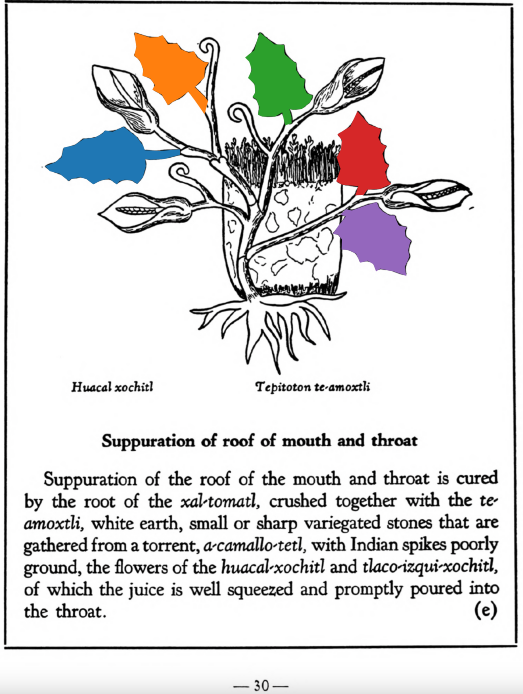

Variants: huacal-xochitl  

## Subchapter 2b  
**Overheated eyes.** Into eyes much heated from sickness the ground root of this bush is instilled; let the face be further wiped with the squeezed juice of the bushes [oco-xochitl](Oco-xochitl.md), [huacal-xochitl](Huacal-xochitl.md), [matlal-xochitl](Matlal-xochitl.md)and [tlaco-izqui-xochitl](Tlaco-izqui-xochitl.md). Slightly troubled eyes are helped by the leaves of the [mizquitl](Mizquitl.md) tree and of the xoxouhqui [matlal-xochitl](Matlal-xochitl.md), macerated in woman’s milk, or dew, or limpid water, and instilled. One suffering from a defect of the eyes should abstain from sexual acts, the heat of the sun, smoke and wind, not use [chilmolli](chilmolli.md) as a sauce in his food, not eat hot foods. On his neck he must carry a red crystal, and not look at white things but black. The eye of a fox will help vitiated eyes wonderfully, being bound on the upper arm. If the eyes are so hurt that they look pulled out, pearls, reddish crystal, red mussels, the stone foundin the small bird called [molo-tototl](molo-tototl.md), the stone [tlacal-huatzin](tlacal-huatzin.md), and the stone in the stomach of the Indian dove, ground up in goose’s grease, woman’s milk and spring water, should be taken; the juice thus prepared you shall instill into the effused eyes. When then something falls into the eyes, so that they fester from it, there should be instilled liquor prepared from ground siliqua or pulse, salt and flour, in spring water. If however the trouble comes from chill, it will be corrected if reddish crystal be ground in Indian wine and the liquor dropped in the eyes.  
[https://archive.org/details/aztec-herbal-of-1552/page/14](https://archive.org/details/aztec-herbal-of-1552/page/14)  

## Subchapter 5e  
**Suppuration of roof of mouth and throat.** Suppuration of the roof of the mouth and throat is cured by the root of the [xal-tomatl](Xal-tomatl.md), crushed together with the [te-amoxtli](Te-amoxtli.md), white earth, small or sharp variegated stones that are gathered from a torrent, [a-camallo-tetl](a-camallo-tetl_v2.md), with Indian spikes poorly ground, the flowers of the [huacal-xochitl](Huacal-xochitl.md) and [tlaco-izqui-xochitl](Tlaco-izqui-xochitl.md), of which the juice is well squeezed and promptly poured into the throat.  
[https://archive.org/details/aztec-herbal-of-1552/page/30](https://archive.org/details/aztec-herbal-of-1552/page/30)  

## Subchapter 7b  
**For pain in the chest.** Pain in the chest is relieved by the plants [tetlahuitl](Tetlahuitl_v1.md)and [teo-iztaquilitl](Teo-iztaquilitl.md)growing on a rock, together with the stone [tlacahuatzin](tlacal-huatzin.md), and red and white earth triturated in water; the skin of a lion is also to be burned and its broth drunk; the chest is to be rubbed with the juice expressed from the herb [tzitzicton](Tzitzicton.md), [tlatlaolton](Tlatlaolton.md), [ayauhtli](Ayauhtli.md), cypress seeds or nuts, and the [itzcuinpatli](Itzquin-patli.md)with the [huacal-xochitl](Huacal-xochitl.md) and [papalo-quilitl](Papalo-quilitl.md).  
[https://archive.org/details/aztec-herbal-of-1552/page/46](https://archive.org/details/aztec-herbal-of-1552/page/46)  

## Subchapter 8l  
**The trees and flowers for relieving the fatigue of those administering the government, and discharging public offices.** The bark of the tree [quetzal-ylin](Quetzal-ylin.md), the flowers [elo-xochitl](Elo-xochitl.md) and[izqui-xochitl](Izqui-xochitl.md), the almond with its fruit, which is the [tlapal-cacahuatl](Tlapol-cacahuatl.md), the flowers [cacalo-xochitl](Cacalo-xochitl.md), [huacal-xochitl](Huacal-xochitl.md), [meca-xochitl](Meca-xochitl.md), [huey-nacaztli](Huey-nacaztli.md), and all fine smelling summer flowers; leaves of the trees [a-ylin](A-illin.md), [oyametl](Oyametl.md), [ocotl](Ocotl.md), [a-xocotl](A-xocotl.md), [eca-patli](Eca-patli.md), [tlaco-izqui-xochitl](Tlaco-izqui-xochitl.md), [quauh-yyauhtli](Quauh-yyauhtli.md), [tomazquitl](Tomaz-quitl.md), [ahuatl](Ahuatl.md), [tepe-ylin](Tepe-ylin.md), [ayauh-quahuitl](Ayauh-quahuitl.md), and te-papaquilti quahuitl, flower bearing plants with their shrubbery, which you gather before the wind rises; these are expressed one by one in clear spring water, into new vessels or vases. This then stays for a day and a night, when the [huitz-quahuitl](Huitz-quahuitl.md) wood, with a red juice, is added as coloring. Also the blood of wild animals, namely the red ocelot, [cuetlachtli](cuetlachtli.md), [miztli](miztli.md), [ocotochtli](ocotochtli.md), white ocelot, [tlaco-ocelotl](tlaco-ocelotl.md), is sought for. With this and the above liquors the body is well anointed. Second, the precious stones [quetzal-iztli](quetzal-iztli.md), [eztetl](eztetl.md), [tlacal-huatzin](tlacal-huatzin.md), [tetlahuitl](tetlahuitl_v2.md), red earth and the small stones in the stomachs of the birds [huexo-canauhtli](huexo-canauhtli.md), [hauctli](huactli.md) and [apopotli](apopotli.md) are cast into water in which they stay for a night in order that the healthful juice may be drawn out, with which the body is to be frequently bathed. Third, the brain and gall of these animals, the red ocelot, white ocelot, [cuetlachtli](cuetlachtli.md), [miztli](miztli.md), [ocotochtli](ocotochtli.md), [coyotl](coyotl.md), also the brain, gall and bladder of the white epatl, ground up; with these the body is moistened. These medicaments healthily give gladiatorial strength to the body, drive fatigue far off, and also cast out timidity and strengthen the human heart. As for the rest, let whoever wishes to follow through this reinvigoration of the body, eat other things also, but as of chief value the flesh of the white rabbit or white fox, either baked or boiled.  
[https://archive.org/details/aztec-herbal-of-1552/page/70](https://archive.org/details/aztec-herbal-of-1552/page/70)  

## Subchapter 10k  
**The traveler’s protection.** The dried flowers [meca-xochitl](Meca-xochitl.md), [tlil-xochitl](Tlil-xochitl.md), [huey-nacaztli](Huey-nacaztli.md), the bark of the trees [copal-xocotl](Copal-xocotl.md) and [atoya-xocotl](Atoya-xocotl.md), the leaves of the [a-xocotl](A-xocotl.md) tree, white incense, the salve [xochi-ocotzotl](xochi-ocotzotl.md) and[yollo-xochitl](Yollo-xochitl.md), thus crushed and pulverized; then crushed placed within the cavity of the well-known and most fragrant [huacal-xochitl](Huacal-xochitl.md) flower, that they may receive the very redolent odor of this flower, and breathe it out. Then take at the end the highly praised flower [yollo-xochitl](Yollo-xochitl.md), which you must nicely hollow out and therein cover up the health bearing fine powder, suspending the capsule from the neck.  
[https://archive.org/details/aztec-herbal-of-1552/page/104](https://archive.org/details/aztec-herbal-of-1552/page/104)  

  
Leaf traces by: Dan Chitwood, Michigan State University, USA  
