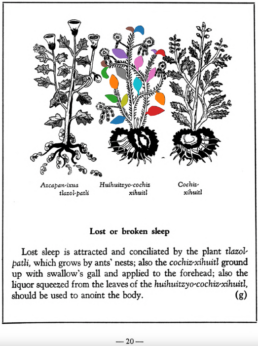

**Morphemes:**

- Huitz/needle or thorn
- Xihuitl/herbs, green leaves

## Subchapter 2g  

=== "English :flag_us:"
    **Lost or broken sleep.** Lost sleep is attracted and conciliated by the plant [tlazol-patli](Tlazol-patli.md), which grows by ants’ nests; also the [cochiz-xihuitl](Cochiz-xihuitl.md) ground up with swallow’s gall and applied to the forehead; also the liquor squeezed from the leaves of the [huihuitzyo-cochiz-xihuitl](Huihuitzyo-cochiz-xihuitl.md), should be used to anoint the body.  
    [https://archive.org/details/aztec-herbal-of-1552/page/20](https://archive.org/details/aztec-herbal-of-1552/page/20)  

=== "Español :flag_mx:"
    **Pérdida o interrupción del sueño.** El sueño perdido se recupera y se reconcilia con la planta [tlazol-patli](Tlazol-patli.md), que crece junto a los nidos de hormigas; también con el [cochiz-xihuitl](Cochiz-xihuitl.md), molido con bilis de golondrina y aplicado en la frente; además, debe untarse el cuerpo con el líquido exprimido de las hojas del [huihuitzyo-cochiz-xihuitl](Huihuitzyo-cochiz-xihuitl.md).  

  
Leaf traces by: Daniel H. Chitwood, Michigan State University, USA  
