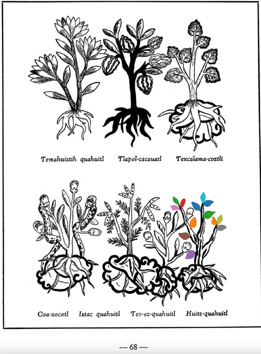

**Morphemes:**

- Huitz/needle or thorn
- Quahuitl/tree or wood

## Subchapter 8l  

=== "English :flag_us:"
    **The trees and flowers for relieving the fatigue of those administering the government, and discharging public offices.** The bark of the tree [quetzal-ylin](Quetzal-ylin.md), the flowers [elo-xochitl](Elo-xochitl.md) and [izqui-xochitl](Izqui-xochitl.md), the almond with its fruit, which is the [tlapal-cacahuatl](Tlapol-cacahuatl.md), the flowers [cacalo-xochitl](Cacalo-xochitl.md), [huacal-xochitl](Huacal-xochitl.md), [meca-xochitl](Meca-xochitl.md), [huey-nacaztli](Huey-nacaztli.md), and all fine smelling summer flowers; leaves of the trees [a-ylin](A-illin.md), [oyametl](Oyametl.md), [ocotl](Ocotl.md), [a-xocotl](A-xocotl.md), [eca-patli](Eca-patli.md), [tlaco-izqui-xochitl](Tlaco-izqui-xochitl.md), [quauh-yyauhtli](Quauh-yyauhtli.md), [tomazquitl](Tomaz-quitl.md), [ahuatl](Ahuatl.md), [tepe-ylin](Tepe-ylin.md), [ayauh-quahuitl](Ayauh-quahuitl.md), and te-papaquilti quahuitl, flower bearing plants with their shrubbery, which you gather before the wind rises; these are expressed one by one in clear spring water, into new vessels or vases. This then stays for a day and a night, when the [huitz-quahuitl](Huitz-quahuitl.md) wood, with a red juice, is added as coloring. Also the blood of wild animals, namely the red ocelot, [cuetlachtli](cuetlachtli.md), [miztli](miztli.md), [ocotochtli](ocotochtli.md), white ocelot, [tlaco-ocelotl](tlaco-ocelotl.md), is sought for. With this and the above liquors the body is well anointed. Second, the precious stones [quetzal-iztli](quetzal-iztli.md), [eztetl](eztetl.md), [tlacal-huatzin](tlacal-huatzin.md), [tetlahuitl](tetlahuitl v2.md), red earth and the small stones in the stomachs of the birds [huexo-canauhtli](huexo-canauhtli.md), [hauctli](huactli.md) and [apopotli](apopotli.md) are cast into water in which they stay for a night in order that the healthful juice may be drawn out, with which the body is to be frequently bathed. Third, the brain and gall of these animals, the red ocelot, white ocelot, [cuetlachtli](cuetlachtli.md), [miztli](miztli.md), [ocotochtli](ocotochtli.md), [coyotl](coyotl.md), also the brain, gall and bladder of the white epatl, ground up; with these the body is moistened. These medicaments healthily give gladiatorial strength to the body, drive fatigue far off, and also cast out timidity and strengthen the human heart. As for the rest, let whoever wishes to follow through this reinvigoration of the body, eat other things also, but as of chief value the flesh of the white rabbit or white fox, either baked or boiled.  
    [https://archive.org/details/aztec-herbal-of-1552/page/70](https://archive.org/details/aztec-herbal-of-1552/page/70)  

=== "Español :flag_mx:"
    **Los árboles y flores para aliviar el cansancio de quienes gobiernan y desempeñan cargos públicos.** La corteza del árbol [quetzal-ylin](Quetzal-ylin.md), las flores [elo-xochitl](Elo-xochitl.md) e [izqui-xochitl](Izqui-xochitl.md), la almendra con su fruto llamado [tlapal-cacahuatl](Tlapol-cacahuatl.md), las flores [cacalo-xochitl](Cacalo-xochitl.md), [huacal-xochitl](Huacal-xochitl.md), [meca-xochitl](Meca-xochitl.md), [huey-nacaztli](Huey-nacaztli.md), y todas las flores veraniegas de buen aroma; hojas de los árboles [a-ylin](A-illin.md), [oyametl](Oyametl.md), [ocotl](Ocotl.md), [a-xocotl](A-xocotl.md), [eca-patli](Eca-patli.md), [tlaco-izqui-xochitl](Tlaco-izqui-xochitl.md), [quauh-yyauhtli](Quauh-yyauhtli.md), [tomazquitl](Tomaz-quitl.md), [ahuatl](Ahuatl.md), [tepe-ylin](Tepe-ylin.md), [ayauh-quahuitl](Ayauh-quahuitl.md) y te-papaquilti quahuitl, plantas con flores y su follaje, que se recogen antes de que sople el viento; todo esto se exprime uno por uno en agua clara de manantial, en recipientes nuevos. Esto se deja reposar un día y una noche, luego se añade la madera [huitz-quahuitl](Huitz-quahuitl.md) con jugo rojo como colorante. También se busca la sangre de animales salvajes: el ocelote rojo, [cuetlachtli](cuetlachtli.md), [miztli](miztli.md), [ocotochtli](ocotochtli.md), ocelote blanco, [tlaco-ocelotl](tlaco-ocelotl.md). Con esto y los licores anteriores se unta bien el cuerpo. En segundo lugar, se echan en agua las piedras preciosas [quetzal-iztli](quetzal-iztli.md), [eztetl](eztetl.md), [tlacal-huatzin](tlacal-huatzin.md), [tetlahuitl](tetlahuitl v2.md), tierra roja y las piedras pequeñas halladas en los estómagos de las aves [huexo-canauhtli](huexo-canauhtli.md), [hauctli](huactli.md) y [apopotli](apopotli.md), y se dejan allí una noche para que suelten su jugo saludable, con el cual debe bañarse frecuentemente el cuerpo. En tercer lugar, se trituran el cerebro y la bilis de estos animales: ocelote rojo, ocelote blanco, [cuetlachtli](cuetlachtli.md), [miztli](miztli.md), [ocotochtli](ocotochtli.md), [coyotl](coyotl.md), así como el cerebro, la bilis y la vejiga del epatl blanco; con esto se humedece el cuerpo. Estos remedios dan saludablemente fuerza gladiatoria al cuerpo, alejan el cansancio, expulsan la timidez y fortalecen el corazón humano. Además, quien desee seguir este fortalecimiento del cuerpo puede comer otras cosas también, pero como lo más valioso se considera la carne de conejo blanco o zorro blanco, ya sea asada o hervida.  

## Subchapter 9d  

=== "English :flag_us:"
    **Rectal swellings.** Oak-bark, that of the [huitz-quahuitl](Huitz-quahuitl.md) and of the [capolla-xipe-hualli](Capolla-xipehualli.md) and [tlaco-xilo-xochitl](Tlaco-xilo-xochitl.md) are macerated. With these is mixed the [tlapal-achiyotl](Tlapal-achiyotl.md) and the salve called in our language the [holli](Holli.md), the gall of a crow, root of the almond, bark of the [izqui-xochitl](Izqui-xochitl.md), leaves and bark of the texcal-amatl chichic. A potion is prepared from salt, nitre and ashes, which is to be heated or rather boiled. Bread soaked with honey is brought gently touching the swelling. If this ailment starts at the buttocks, well heated water should be injected in the anus, and it should also be bathed in [teo-amatl](Teo-amatl.md) bark with honey. This then done, let the part affected by the swelling be frequently soaked with the juice of the [yamanqui-patli](Yamanqui patli.md). The [tlal-quequetzal](Tlal-quequetzal.md) plant is to be crushed in hot water and the broth drunk.  
    [https://archive.org/details/aztec-herbal-of-1552/page/78](https://archive.org/details/aztec-herbal-of-1552/page/78)  

=== "Español :flag_mx:"
    **Hinchazones rectales.** Se maceran cortezas de encino, del [huitz-quahuitl](Huitz-quahuitl.md) y del [capolla-xipe-hualli](Capolla-xipehualli.md) y [tlaco-xilo-xochitl](Tlaco-xilo-xochitl.md). A ellas se les mezcla el [tlapal-achiyotl](Tlapal-achiyotl.md) y el ungüento llamado en nuestra lengua [holli](Holli.md), la bilis de cuervo, raíz de almendra, corteza del [izqui-xochitl](Izqui-xochitl.md), hojas y corteza del texcal-amatl chichic. Se prepara una poción con sal, salitre y ceniza, que debe calentarse o mejor aún hervirse. Se lleva pan empapado en miel y se aplica con suavidad sobre la hinchazón. Si este mal comienza en los glúteos, se debe inyectar agua bien caliente en el ano, y también debe bañarse con corteza de [teo-amatl](Teo-amatl.md) y miel. Hecho esto, la parte afectada por la hinchazón debe mojarse con frecuencia con el jugo del [yamanqui-patli](Yamanqui patli.md). La planta [tlal-quequetzal](Tlal-quequetzal.md) debe machacarse en agua caliente y beberse el caldo.  

  
Leaf traces by: Mariana Ruíz Amaro, UNAM ENES León, México  
