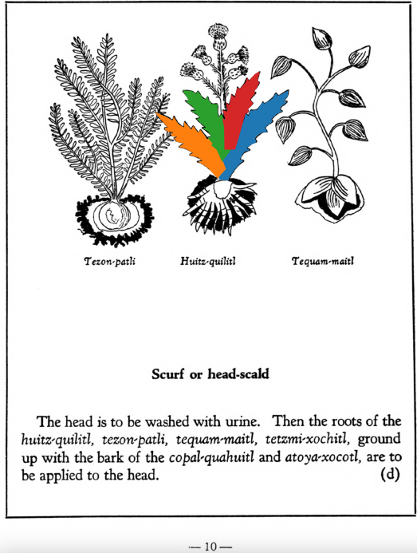

Variants: huitz-quilitl  

## Subchapter 1d  
**Scurf or head-scald.** The head is to be washed with urine. Then the roots of the [huitz-quilitl](Huitz-quilitl.md), [tezon-patli](Tezon-patli.md), [tequam-maitl](Tequam-maitl.md), [tetzmi-xochitl](Tetzmi-xochitl.md), groundup with the bark of the [copal-quahuitl](Copal-quahuitl.md) and [atoya-xocotl](Atoya-xocotl.md), are tobe applied to the head.  
[https://archive.org/details/aztec-herbal-of-1552/page/10](https://archive.org/details/aztec-herbal-of-1552/page/10)  

## Subchapter 9e  
**Excessive heat.** The body when overheated is relieved by the ground roots of the [huitz-quilitl](Huitz-quilitl.md), [xal-tomatl](Xal-tomatl.md), [tlaca-camotli](Tlaca-camotli.md), [teo-iztaquilitl](Teo-iztaquilitl.md), the stone [a-camollotetl](a-camallo-tetl v2.md), the [eztetl](eztetl.md), [tlacal-huatzin](tlacal-huatzin.md), red earth, white earth, and the stones found in the stomachs of a cock and the [noch-totl](noch-tototl.md), with sharp stones, all then put in water. This is drunk and the abdomen purged with a clyster. A potion is also prepared from [tzayanal-quilitl](Tzayanal-quilitl.md) roots, the [acacapac-quilitl](Aca-capac-quilitl.md), [tol-patlctli](Tol-patlactli.md), the bushes [tetzmitl](Tetzmitl.md), [iztauhyauh](Iztauyattl.md), [huitz-quilitl](Huitz-quilitl.md), with added salt. The body is anointed with the latex squeezed from the [acapac-quilitl](Aca-capac-quilitl.md), [coyo-xihuitl](Coyo-xihuitl.md), [tlal-ecapatli](Tlal-ecapatli.md), [tonatiuh-yxiuh](Tonatiuh yxiuh v1.md), [iztac-oco-xochitl](Iztac oco-xochitl.md), [centzon-oco-xochitl](Centzon-oco-xochitl.md), which are herbs; also using the leaves of the laurel, the bush [tetzmitl](Tetzmitl.md), and the fruit trees [xa-xocotl](Xa-xocotl.md), the plant [cohua-xochitl](Cohua-xochitl.md), leaves of the pine. This medicine is then divided, some poured on the head, some that is quite thick is applied as ointment on the body. If the heat rises, take the blood of the [huitzitzilin](huitzitzilin.md), the gall of the [huexo-canauhtli](huexo-canauhtli.md), the viscera of a quail, bladder of the [cocotli](cocotli.md), skin of the [pezotli](pezotli.md), burned together. These and the above are to be mixed together.  
[https://archive.org/details/aztec-herbal-of-1552/page/79](https://archive.org/details/aztec-herbal-of-1552/page/79)  

## Subchapter 9p  
**Inflammations.** An inflamed part of the body will be relieved by a liquor from the [nohpalli](Nopalli.md), [te-amoxtli](Te-amoxtli.md), [tetzmitl](Tetzmitl.md), [eca-patli](Eca-patli.md), [te-xiyotl](Te-xiyotl.md) and [huitz-quilitl](Huitz-quilitl.md), anointing the part thoroughly and rubbing it with honey and yolk of egg.  
[https://archive.org/details/aztec-herbal-of-1552/page/90](https://archive.org/details/aztec-herbal-of-1552/page/90)  

  
Leaf traces by: Dan Chitwood, Michigan State University, USA  
