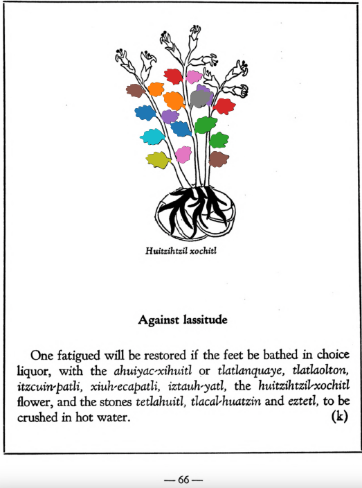

Variants: huitzihtzil-xochitl, huitzitzil-xochitl  

## Subchapter 8k  
**Against lassitude.** One fatigued will be restored if the feet be bathed in choice liquor, with the [ahuiyac-xihuitl](Ahuiyac-xihuitl.md) or [tlatlanquaye](Tlatlanquaye.md), [tlatlaolton](Tlatlaolton.md), [itzcuin-patli](Itzquin-patli.md), [xiuh-ecapatli](Eca-patli.md), [iztauh-yatl](Iztauyattl.md), the [huitzihtzil-xochitl](Huitzihtzil-xochitl.md)flower, and the stones [tetlahuitl](tetlahuitl_v2.md), [tlaca-huatzin](tlacal-huatzin.md) and [eztetl](eztetl.md), to be crushed in hot water.  
[https://archive.org/details/aztec-herbal-of-1552/page/66](https://archive.org/details/aztec-herbal-of-1552/page/66)  

## Subchapter 12a  
**Infantile skin eruptions.** Phthiriasis, or the skin breaking out on infants, is cured by anointing the body with a poultice made from the seeds of the well known [michi-huauhtli](Michi-huauhtli.md), red incense, grain, which are to be burned; then the plant [tlatlanquaye](Tlatlanquaye.md), leaves of the [huitzitzil-xochitl](Huitzihtzil-xochitl.md), the root of the [tlal-ahuehuetl](Tlal-ahuehuetl.md) and [tla-yapaloni](Tla-yapaloni.md), laurel leaves, [xiuh-ecapatli](Eca-patli.md) leaves from which the acid water is to be drawn; let the boy also drink medicine made from white earth, the small white stones gathered from the bottom in flowing water, the stone[a-camallo-tetl](a-camallo-tetl_v2.md) and [coltotzin](Coltotzin.md), the bush [tlal-mizquitl](Tlal-mizquitl.md), and points ground in water.  
[https://archive.org/details/aztec-herbal-of-1552/page/113](https://archive.org/details/aztec-herbal-of-1552/page/113)  

  
Leaf traces by: Mariana Ruíz Amaro, UNAM ENES León, México  
