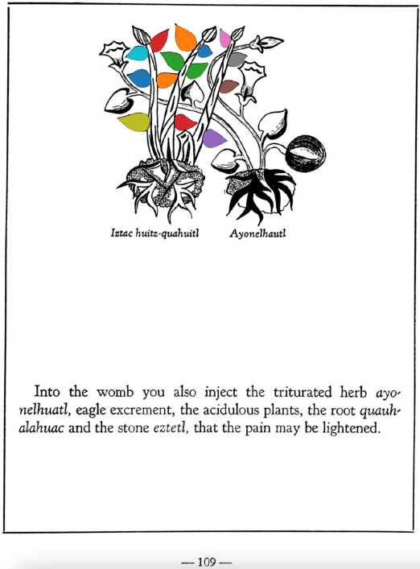

**Morphemes:**

- Huitz/needle or thorn
- Iztac/white
- Quahuitl/tree or wood

## Subchapter 11c  

=== "English :flag_us:"
    **Ventral lotion in childbirth.** The womb of a woman entering childbirth is to be washed out with the juice of the plants [xiuh-eloquilitl](Xiuh-elo-quilitl.md), [tlaco-popotl](Tlaco-popotli.md), [centzon-xochitl](Centzon-xochitl.md), [xiuhpatli](Xiuh-patli.md), laurel, all which triturate in spring water with the stones [eztetl](eztetl.md) and [tetlahuitl](tetlahuitl v2.md). The feet are also to be frequently washed with this. When the birth is about to come, the [iztac huitz-quahuitl](Iztac huitz-quahuitl.md), [malinalli](Malinalli.md), white stone, white nitre, pine, palm and [eztetl](eztetl.md) are to be boiled in water. Into the womb you also inject the triturated herb [ayo-nelhuatl](Ayo-nelhuatl.md), eagle excrement, the acidulous plants, the root [quauh-alahuac](Quauh-alahuac.md) and the stone [eztetl](eztetl.md), that the pain may be lightened.  
    [https://archive.org/details/aztec-herbal-of-1552/page/108](https://archive.org/details/aztec-herbal-of-1552/page/108)  

=== "Español :flag_mx:"
    **Loción ventral en el parto.** La matriz de una mujer que va a parir debe lavarse con el jugo de las plantas [xiuh-eloquilitl](Xiuh-elo-quilitl.md), [tlaco-popotl](Tlaco-popotli.md), [centzon-xochitl](Centzon-xochitl.md), [xiuhpatli](Xiuh-patli.md), laurel, todo lo cual se tritura en agua de manantial con las piedras [eztetl](eztetl.md) y [tetlahuitl](tetlahuitl v2.md). Los pies también deben lavarse frecuentemente con esto. Cuando el parto está por llegar, se deben hervir en agua el [iztac huitz-quahuitl](Iztac huitz-quahuitl.md), [malinalli](Malinalli.md), piedra blanca, nitro blanco, pino, palma y [eztetl](eztetl.md). En la matriz se debe inyectar también la hierba triturada [ayo-nelhuatl](Ayo-nelhuatl.md), excremento de águila, las plantas acidulosas, la raíz [quauh-alahuac](Quauh-alahuac.md) y la piedra [eztetl](eztetl.md), para que se alivie el dolor.  

  
Leaf traces by: Alejandra Rougon-Cardoso, Laboratory of Agrigenomic Sciences, ENES Unidad León, México  
