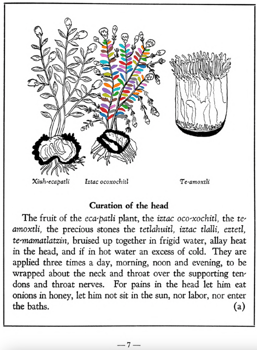

Variants: iztac oco-xochitl, iztac-oco-xochitl, oco-xochitl  

## Subchapter 1a  
**Curation of the head.** The fruit of the [eca-patli](Eca-patli.md) plant, the [iztac oco-xochitl](Iztac_oco-xochitl.md), the [te-amoxtli](Te-amoxtli.md), the precious stones the [tetlahuitl](tetlahuitl_v2.md), [iztac tlalli](iztac_tlalli.md), [eztetl](eztetl.md), [te-mamatlatzin](te-mamatlatzin.md), bruised up together in frigid water, allay heat in the head, and if in hot water an excess of cold. They are applied three times a day, morning, noon and evening, to be wrapped about the neck and throat over the supporting tendons and throat nerves. For pains in the head let him eat onions in honey, let him not sit in the sun, nor labor, nor enter the baths.  
[https://archive.org/details/aztec-herbal-of-1552/page/7](https://archive.org/details/aztec-herbal-of-1552/page/7)  

## Subchapter 7l  
**For a rumbling in the abdomen.** For one whose intestines rumble because of some flux in the abdomen, let him take by means of an ear syringe (clyster oriculario), a liquor prepared from leaves of the [tlatlanquaye](Tlatlanquaye.md) herb, the bark of the [quetzal-ylin](Quetzal-ylin.md), [iztac-oco-xochitl](Iztac_oco-xochitl.md) leaves, and the herbs [tlanexti-xiuhtontli](Tlanextia_xiuhtontli.md), [elo-zacatl](Elo-zacatl.md), the tree [tlanextia-quahuitl](Tlanextia_quahuitl.md), ground up in acidulous water with ashes, a little honey, salt, pepper, alectorium and finally [pizietl](Piciyetl.md) or tobacco.  
[https://archive.org/details/aztec-herbal-of-1552/page/54](https://archive.org/details/aztec-herbal-of-1552/page/54)  

## Subchapter 8e  
**Affections of the rectum.** Rectal affection is cured by the herbs [iztauh-yatl](Iztauyattl.md), [tonatiuh-yxiuh](Tonatiuh_yxiuh_v1.md), coyo-xihuitl tlaztalehualtic, [iztac-oco-xochitl](Iztac_oco-xochitl.md), and the leaves of the herb [tepe-chian](Tepe-chian.md) ground together in hot water, with which remedy the part suffering pain is to be bathed; or they may also be poulticed, brought to mud thickness.  
[https://archive.org/details/aztec-herbal-of-1552/page/61](https://archive.org/details/aztec-herbal-of-1552/page/61)  

## Subchapter 9b  
**Fevers.** The face in marking fevers has various changes, at times flushed, at times darkened, again blanched. He also spits blood, the body jerks and turns hither and thither, he sees little. At times bitterness, now burning, now sweetness of a kind fills the mouth, or rather palate. One who is such certain has his stomach corrupted. Although the urine is whitish, unless you avert the danger quickly the medicine will be prepared too late. Wherefore you will help him wonderfully if you macerate the plants [centzon-xochitl](Centzon-xochitl.md), [teo-iztacuilitl](Teo-iztaquilitl.md), [a-quiztli](Ahquiztli.md), tlanextia xihuitl, cuauhtla huita-quilitl, [tonatiuh yxiuh](Tonatiuh_yxiuh_v1.md), [tlazolco-zacatl](Tlazol-teo-zacatl.md), [mamaxtla-nelhuatl](Mamaxtla-nelhuatl.md), [oco-xochitl](Iztac_oco-xochitl.md), [zaca-matlalin](Zaca-matlalin.md), the bush [tlanextia quahuitl](Tlanextia_quahuitl.md), the stones you find in the stomachs of these birds: the [huitlalotl](huitlalotl.md), [huactli](huactli.md), [aztatl](aztatl.md), [apopotli](apopotli.md), [tlacahuilotl](tlacahuilotl.md), [huexo-canauhtli](huexo-canauhtli.md), [xiuh-quechol-tototl](xiuh-quechol-tototl.md), [tototl](tototl.md), [tlpal-tototl](tlapal-tototl.md), [noch-tototl](noch-tototl.md), [acatzanatl](acatzanatl.md), [zolin](zolin.md); the precious stones, fine green pearl, greenstone, sardonyx and [xiuh-tomolli](xiuh-tomolli.md), with burned human bone, from all which a liquor is to be heated quickly and then drunk. This potion being prepared, the stone [texalli](texalli.md) is ground in water, and a part of the liquor poured on his head, his feet bathed with a part, and the throat moistened with part. Also let him drink some. Then these plants are to be crushed in bitter water, the [xiuh-ecapatli](Eca-patli.md), [tetzmitl](Tetzmitl.md), [oco-xochitl](Iztac_oco-xochitl.md), [centzon-xochitl](Centzon-xochitl.md), [tepe-chian](Tepe-chian.md), [tzom-pachtin](Tzon-pachtzin.md), [iztac-oco-xochitl](Iztac_oco-xochitl.md), [tonatiuh yxiuh](Tonatiuh_yxiuh_v1.md), all of which are to be gathered in the fervent heat of the sun; then adding the willow and laurel and human bone, he is to be wet with their liquor. With this the tooth of a corpse is placed on the crown of the head. The plants [teco-xochiti-xihuitl](teco-xochiti-xihuitl.md) and [tlazol-patli](Tlazol-patli.md)are crushed in woman’s milk, and with this the occuput and nostrils are to be anointed; after all this is done, take heed that he smell a flower of some kind, and sleep during the day.  
[https://archive.org/details/aztec-herbal-of-1552/page/75](https://archive.org/details/aztec-herbal-of-1552/page/75)  

## Subchapter 9e  
**Excessive heat.** The body when overheated is relieved by the ground roots of the [huitz-quilitl](Huitz-quilitl.md), [xal-tomatl](Xal-tomatl.md), [tlaca-camotli](Tlaca-camotli.md), [teo-iztaquilitl](Teo-iztaquilitl.md), the stone [a-camollotetl](a-camallo-tetl_v2.md), the [eztetl](eztetl.md), [tlacal-huatzin](tlacal-huatzin.md), red earth, white earth, and the stones found in the stomachs of a cock and the [noch-totl](noch-tototl.md), with sharp stones, all then put in water. This is drunk and the abdomen purged with a clyster. A potion is also prepared from [tzayanal-quilitl](Tzayanal-quilitl.md) roots, the [acacapac-quilitl](Aca-capac-quilitl.md), [tol-patlctli](Tol-patlactli.md), the bushes [tetzmitl](Tetzmitl.md), [iztauhyauh](Iztauyattl.md), [huitz-quilitl](Huitz-quilitl.md), with added salt. The body is anointed with the latex squeezed from the [acapac-quilitl](Aca-capac-quilitl.md), [coyo-xihuitl](Coyo-xihuitl.md), [tlal-ecapatli](Tlal-ecapatli.md), [tonatiuh-yxiuh](Tonatiuh_yxiuh_v1.md), [iztac-oco-xochitl](Iztac_oco-xochitl.md), [centzon-oco-xochitl](Centzon-oco-xochitl.md), which are herbs; also using the leaves of the laurel, the bush [tetzmitl](Tetzmitl.md), and the fruit trees [xa-xocotl](Xa-xocotl.md), the plant [cohua-xochitl](Cohua-xochitl.md), leaves of the pine. This medicine is then divided, some poured on the head, some that is quite thick is applied as ointment on the body. If the heat rises, take the blood of the [huitzitzilin](huitzitzilin.md), the gall of the [huexo-canauhtli](huexo-canauhtli.md), the viscera of a quail, bladder of the [cocotli](cocotli.md), skin of the [pezotli](pezotli.md), burned together. These and the above are to be mixed together.  
[https://archive.org/details/aztec-herbal-of-1552/page/79](https://archive.org/details/aztec-herbal-of-1552/page/79)  

## Subchapter 9q  
**Those struck by lightning.** Let one struck by a thunderbolt drink a potion well prepared from leaves of trees, namely the [ayauh-quahuitl](Ayauh-quahuitl.md), [tepaquilti quahuitl](tepaquilti_quahuitl.md), very green cypress, the bush [iztauh-yatl](Iztauyattl.md), the herbs[quauh-yyauhtli](Quauh-yyauhtli.md) and [te-amoxtli](Te-amoxtli.md). But however the drink is to be given, let it be heated.  Let the body also be anointed with a plaster made of the herbs [papalo-quilitl](Papalo-quilitl.md), [tlal-ecapatli](Tlal-ecapatli.md), [quauh-yyauhtli](Quauh-yyauhtli.md), [tlatlanquaye](Tlatlanquaye.md), huitbitzil xochitil, [iztac-oco-xochitl](Iztac_oco-xochitl.md), and in addition all the plants upon which the lightning struck. A few days later lethim drink water into which white frankincense is thrown. The water is boiled with white and whitish incense, with the burned bones of a fox added. Also mix some Indian wine with the above. Afterwards you will instill into the nostrils a medicine made of white pearl, the root [tlatlacotic](Tlatlacotic.md), and all plants growing in a garden that has been burned over. Let also be suffumigated by white incense thrown upon the coals, the wax ointment we call [xochi-oco-tzotl](xochi-ocotzotl.md), and the good odor of the herb [quauh-yyauhtli](Quauh-yyauhtli.md).  
[https://archive.org/details/aztec-herbal-of-1552/page/91](https://archive.org/details/aztec-herbal-of-1552/page/91)  

  
Leaf traces by: Dan Chitwood, Michigan State University, USA  
