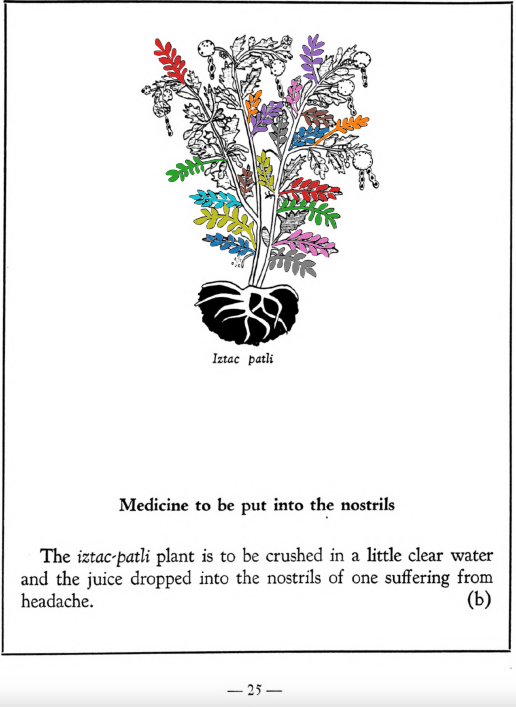

Variants: iztac-patli  

## Subchapter 4b  
**Medicine to be put into the nostrils.** The [iztac-patli](Iztac-patli.md) plant is to be crushed in a little clear water and the juice dropped into the nostrils of one suffering from headache.  
[https://archive.org/details/aztec-herbal-of-1552/page/25](https://archive.org/details/aztec-herbal-of-1552/page/25)  

  
Leaf traces by: Dan Chitwood, Michigan State University, USA  
