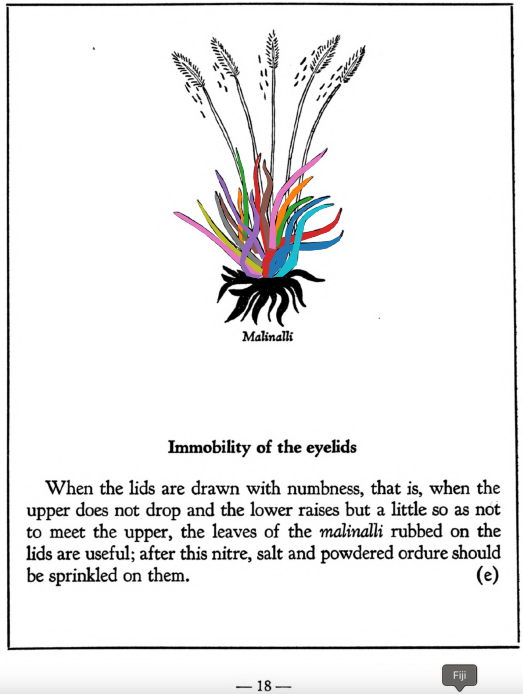

## Subchapter 2e  

=== "English :flag_us:"
    **Immobility of the eyelids.** When the lids are drawn with numbness, that is, when the upper does not drop and the lower raises but a little so as not to meet the upper, the leaves of the [malinalli](Malinalli.md) rubbed on the lids are useful; after this nitre, salt and powdered ordure should be sprinkled on them.  
    [https://archive.org/details/aztec-herbal-of-1552/page/18](https://archive.org/details/aztec-herbal-of-1552/page/18)  

=== "Español :flag_mx:"
    **Parálisis de los párpados.** Cuando los párpados se entumecen, es decir, cuando el superior no cae y el inferior apenas sube, sin llegar a cerrarse, es útil frotar sobre ellos hojas de [malinalli](Malinalli.md); después se espolvorea salitre, sal y excremento seco.  

## Subchapter 5h  

=== "English :flag_us:"
    **For bloody saliva.** For one spitting blood it is well to drink a potion made out of the root of the [tlaco-xilo-xochitl](Tlaco-xilo-xochitl.md), our pepper, the stones [teo-xihuitl](teo-xihuitl v2.md) and [chichiltic tapachtli](chichiltic tapachtli.md), the bones of an ape, the red flinty stones you find on the bank of a river, white frankincense, the leaves of the [huitz-colotli](Huitz-colotli.md) and the root of other plants whose tip is ruddy and small, crushing them in the whites of two eggs. Further to prepare the potion you should crush one root of the [tlaco-xilo-xochitl](Tlaco-xilo-xochitl.md), the leaves of the [huitz-colo-xochitl](Huitz-colotli.md) and the root of another plant called [xiuhtontli](Xiuhtontli.md), the stone [teo-xihuitl](teo-xihuitl v2.md) and the bone of an ape, burn pepper to ashes, crush together the [chichiltic tapachtli](chichiltic tapachtli.md) and a stone found in the river, that is, in water; cook the bone in water with white frankincense, and then before a meal let him take one saucer of the potion thus prepared, for his drink. For one who spits out yellow mucus, take the [malinalli](Malinalli.md) plant, pine cypress and leaves of the plant [eca-patli](Eca-patli.md), squeezed in water or liquor containing ashes, or if it seems right in sour water; let the above be ground and cooked for a potion he is to drink; it is however to be diligently studied. This consumes the noxious humor.  
    [https://archive.org/details/aztec-herbal-of-1552/page/33](https://archive.org/details/aztec-herbal-of-1552/page/33)  

=== "Español :flag_mx:"
    **Para la saliva con sangre.** A quien escupe sangre le conviene beber una poción hecha con la raíz del [tlaco-xilo-xochitl](Tlaco-xilo-xochitl.md), nuestro pimiento, las piedras [teo-xihuitl](teo-xihuitl v2.md) y [chichiltic tapachtli](chichiltic tapachtli.md), los huesos de un mono, las piedras rojas de pedernal que se encuentran en la orilla de un río, incienso blanco, las hojas del [huitz-colotli](Huitz-colotli.md) y la raíz de otras plantas cuya punta es rojiza y pequeña, triturando todo con las claras de dos huevos. Para preparar mejor la poción se debe triturar una raíz del [tlaco-xilo-xochitl](Tlaco-xilo-xochitl.md), las hojas del [huitz-colo-xochitl](Huitz-colotli.md) y la raíz de otra planta llamada [xiuhtontli](Xiuhtontli.md), la piedra [teo-xihuitl](teo-xihuitl v2.md) y el hueso de un mono; se quema el pimiento hasta reducirlo a cenizas, se trituran juntos el [chichiltic tapachtli](chichiltic tapachtli.md) y una piedra hallada en el río, es decir, en el agua; se cuece el hueso en agua con incienso blanco, y luego, antes de comer, debe tomarse un platillo de la poción así preparada. Para quien escupe moco amarillo, se toma la planta [malinalli](Malinalli.md), el ciprés y las hojas de la planta [eca-patli](Eca-patli.md), exprimidas en agua o licor que contenga cenizas, o si parece adecuado, en agua agria; se debe moler y cocer lo anterior para una poción que ha de beber; sin embargo, debe estudiarse con diligencia. Esto consume el humor nocivo.  

## Subchapter 11c  

=== "English :flag_us:"
    **Ventral lotion in childbirth.** The womb of a woman entering childbirth is to be washed out with the juice of the plants [xiuh-eloquilitl](Xiuh-elo-quilitl.md), [tlaco-popotl](Tlaco-popotli.md), [centzon-xochitl](Centzon-xochitl.md), [xiuhpatli](Xiuh-patli.md), laurel, all which triturate in spring water with the stones [eztetl](eztetl.md) and [tetlahuitl](tetlahuitl v2.md). The feet are also to be frequently washed with this. When the birth is about to come, the [iztac huitz-quahuitl](Iztac huitz-quahuitl.md), [malinalli](Malinalli.md), white stone, white nitre, pine, palm and [eztetl](eztetl.md) are to be boiled in water. Into the womb you also inject the triturated herb [ayo-nelhuatl](Ayo-nelhuatl.md), eagle excrement, the acidulous plants, the root [quauh-alahuac](Quauh-alahuac.md) and the stone [eztetl](eztetl.md), that the pain may be lightened.  
    [https://archive.org/details/aztec-herbal-of-1552/page/108](https://archive.org/details/aztec-herbal-of-1552/page/108)  

=== "Español :flag_mx:"
    **Loción ventral en el parto.** La matriz de una mujer que va a parir debe lavarse con el jugo de las plantas [xiuh-eloquilitl](Xiuh-elo-quilitl.md), [tlaco-popotl](Tlaco-popotli.md), [centzon-xochitl](Centzon-xochitl.md), [xiuhpatli](Xiuh-patli.md), laurel, todo lo cual se tritura en agua de manantial con las piedras [eztetl](eztetl.md) y [tetlahuitl](tetlahuitl v2.md). Los pies también deben lavarse frecuentemente con esto. Cuando el parto está por llegar, se deben hervir en agua el [iztac huitz-quahuitl](Iztac huitz-quahuitl.md), [malinalli](Malinalli.md), piedra blanca, nitro blanco, pino, palma y [eztetl](eztetl.md). En la matriz se debe inyectar también la hierba triturada [ayo-nelhuatl](Ayo-nelhuatl.md), excremento de águila, las plantas acidulosas, la raíz [quauh-alahuac](Quauh-alahuac.md) y la piedra [eztetl](eztetl.md), para que se alivie el dolor.  

  
Leaf traces by: Dan Chitwood, Michigan State University, USA  
