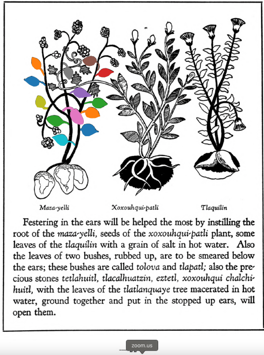

## Subchapter 3a  

=== "English :flag_us:"
    **On festering in the ears, and deafness or stoppage.** Festering in the ears will be helped the most by instilling the root of the [maza-yelli](Maza-yelli.md), seeds of the [xoxouhqui-patli](xoxouhca-patli.md) plant, some leaves of the [tlaquilin](Tlaquilin.md) with a grain of salt in hot water. Also the leaves of two bushes, rubbed up, are to be smeared below the ears; these bushes are called [tolova](Tolohua xihuitl.md) and [tlapatl](Tlapatl.md); also the precious stones [tetlahuitl](tetlahuitl v2.md), [tlacalhuatzin](tlacal-huatzin.md), [eztetl](eztetl.md), xoxouhqui chalchi-huitl, with the leaves of the [tlatlanquaye](Tlatlanquaye.md) tree macerated in hot water, ground together and put in the stopped up ears, willopen them.  
    [https://archive.org/details/aztec-herbal-of-1552/page/22](https://archive.org/details/aztec-herbal-of-1552/page/22)  

=== "Español :flag_mx:"
    **Sobre la supuración en los oídos, y la sordera u obstrucción.** La supuración en los oídos se alivia sobre todo instilando la raíz del [maza-yelli](Maza-yelli.md), semillas de la planta [xoxouhqui-patli](xoxouhca-patli.md), algunas hojas del [tlaquilin](Tlaquilin.md) con un grano de sal en agua caliente. También deben frotarse bajo las orejas hojas de dos arbustos llamados [tolova](Tolohua xihuitl.md) y [tlapatl](Tlapatl.md); además, las piedras preciosas [tetlahuitl](tetlahuitl v2.md), [tlacalhuatzin](tlacal-huatzin.md), [eztetl](eztetl.md), xoxouhqui chalchi-huitl, con las hojas del árbol [tlatlanquaye](Tlatlanquaye.md) maceradas en agua caliente, todo molido junto y colocado en los oídos tapados, los abrirán.  

  
Leaf traces by: Dan Chitwood, Michigan State University, USA  
