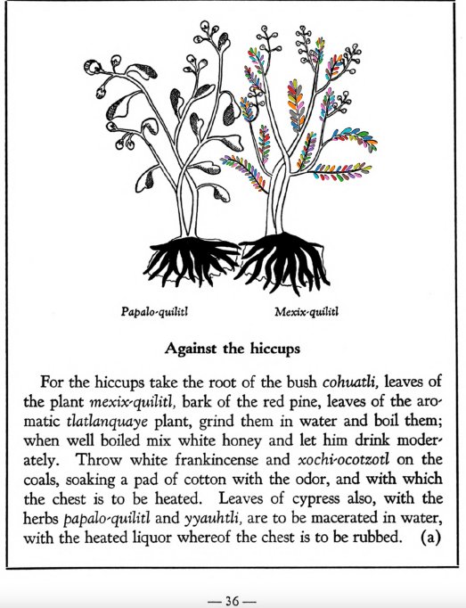

**Morphemes:**

- Quilitl/edible green

## Subchapter 6a  

=== "English :flag_us:"
    **Against the hiccups.** For the hiccups take the root of the bush cohuatli, leaves of the plant [mexix-quilitl](Mexix-quilitl.md), bark of the red pine, leaves of the aromatic [tlatlanquaye](Tlatlanquaye.md) plant, grind them in water and boil them; when well boiled mix white honey and let him drink moderately. Throw white frankincense and xochi-ocotzotl on the coals, soaking a pad of cotton with the odor, and with which the chest is to be heated. Leaves of cypress also, with the herbs [papalo-quilitl](Papalo-quilitl.md) and [yyauhtli](Y-yauhtli.md), are to be macerated in water, with the heated liquor whereof the chest is to be rubbed.  
    [https://archive.org/details/aztec-herbal-of-1552/page/36](https://archive.org/details/aztec-herbal-of-1552/page/36)  

=== "Español :flag_mx:"
    **Contra el hipo.** Para el hipo, se toma la raíz del arbusto cohuatli, hojas de la planta [mexix-quilitl](Mexix-quilitl.md), corteza del pino rojo, hojas de la aromática [tlatlanquaye](Tlatlanquaye.md), se muelen en agua y se hierven; cuando esté bien hervido, se mezcla miel blanca y se bebe con moderación. Se arroja incienso blanco y xochi-ocotzotl sobre las brasas, empapando un algodón con el olor, con el cual se calienta el pecho. También las hojas de ciprés, junto con las hierbas [papalo-quilitl](Papalo-quilitl.md) e [yyauhtli](Y-yauhtli.md), se maceran en agua, y con el líquido calentado se frota el pecho.  

  
Leaf traces by: Jimena Jazmin Hurtado Olvera, Laboratory of Agrigenomic Sciences, ENES Unidad León, México  
