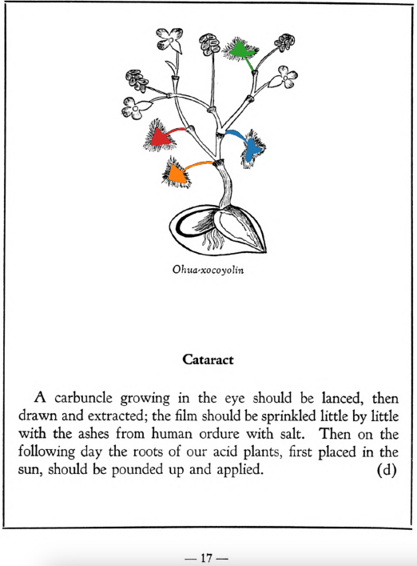

Variants: ohua-xocoyolin  

## Subchapter 7j  
**Pain in the belly.** Let the root of the plant [ohua-xocoyolin](Ohua-xoxocoyolin.md) and alectorium be ground together, and the liquor to be taken into the abdomen by the posterior part; as a drink also give him the ground root of the plant [huitz-mallotic](Huihuitz-mallotic.md).  
[https://archive.org/details/aztec-herbal-of-1552/page/52](https://archive.org/details/aztec-herbal-of-1552/page/52)  

## Subchapter 8c  
**The bladder-wort.** When the flow of the urine is shut off, to open it take the roots of the plants [mamaxtla](Mamaxtla.md) and [cohuanene-pilli](Coanenepilli.md), the tlatlauhqui amoxtli, the very white flower [yollo-xochitl](Yollo-xochitl.md), and the tail of a sucking puppy; grind these up in acrid tasting water, macerate the well-known [chian](Chian.md) seed therein, and administer it. The abdomen is also to be washed out with the root of the herb [ohua-xocoyolin](Ohua-xoxocoyolin.md) crushed in hot water, and the juice given through a clyster. If this medicine avails nothing it will be necessary to take the pith of an extremely slender palm, covered with thin cotton and smeared with honey and the crushed root of the herb [huihuitz-mallotic](Huihuitz-mallotic.md), and this cautiously inserted into the virile member. If this is done the stopped urine will be freed.  
[https://archive.org/details/aztec-herbal-of-1552/page/59](https://archive.org/details/aztec-herbal-of-1552/page/59)  

## Subchapter 9h  
**For recurrent disease.** Let one relapsing in sickness drink, before a meal, a little of the latex like milk, expressed from the [teo-amatl](Teo-amatl.md), that he may vomit. On the third or fourth day let him drink a potion formed from [tonatiuh-yxiuh](Tonatiuh yxiuh v1.md) root, [tlatlanquaye](Tlatlanquaye.md) and also [tlanexti-yxiuh](Tlanextia-yxiuh.md) root, ground up in tepid water. Third let him drink of the [cuecuetz-patli](Cuecuetz-patli.md) root crushed in our wine. Let him drink this as he enters the bath, and then on coming out be anointed with the liquor of ground [teo-amatl](Teo-amatl.md) roots. The bowel should be twice cleared with a clyster, first with a liquor from [ohua-xocoyolin](Ohua-xoxocoyolin.md)root crushed in hot water, and this even though he partakes of some food; this healthful juice will throw out pus from the abdomen. The second time, a few days later, made of the intoxicating plant we call [piciyetl](Piciyetl.md), salt, our black pepper, and light colored pepper.  
[https://archive.org/details/aztec-herbal-of-1552/page/82](https://archive.org/details/aztec-herbal-of-1552/page/82)  

  
Leaf traces by: Dan Chitwood, Michigan State University, USA  
