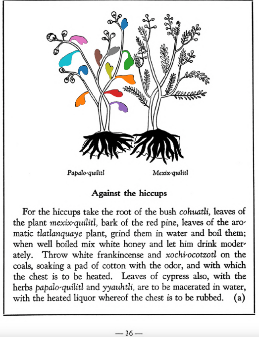

**Variants:**

- nan

**Morphemes:**

- Papalo/butterfly
- Quilitl/edible green

## Subchapter 6a  

=== "English :flag_us:"
    **Against the hiccups.** For the hiccups take the root of the bush cohuatli, leaves of the plant [mexix-quilitl](Mexix-quilitl.md), bark of the red pine, leaves of the aromatic [tlatlanquaye](Tlatlanquaye.md) plant, grind them in water and boil them; when well boiled mix white honey and let him drink moderately. Throw white frankincense and xochi-ocotzotl on the coals, soaking a pad of cotton with the odor, and with which the chest is to be heated. Leaves of cypress also, with the herbs [papalo-quilitl](Papalo-quilitl.md) and [yyauhtli](Y-yauhtli.md), are to be macerated in water, with the heated liquor whereof the chest is to be rubbed.  
    [https://archive.org/details/aztec-herbal-of-1552/page/36](https://archive.org/details/aztec-herbal-of-1552/page/36)  

=== "Español :flag_mx:"
    **Contra el hipo.** Para el hipo, se toma la raíz del arbusto cohuatli, hojas de la planta [mexix-quilitl](Mexix-quilitl.md), corteza del pino rojo, hojas de la aromática [tlatlanquaye](Tlatlanquaye.md), se muelen en agua y se hierven; cuando esté bien hervido, se mezcla miel blanca y se bebe con moderación. Se arroja incienso blanco y xochi-ocotzotl sobre las brasas, empapando un algodón con el olor, con el cual se calienta el pecho. También las hojas de ciprés, junto con las hierbas [papalo-quilitl](Papalo-quilitl.md) e [yyauhtli](Y-yauhtli.md), se maceran en agua, y con el líquido calentado se frota el pecho.  

## Subchapter 7b  

=== "English :flag_us:"
    **For pain in the chest.** Pain in the chest is relieved by the plants [tetlahuitl](Tetlahuitl v1.md) and [teo-iztaquilitl](Teo-iztaquilitl.md) growing on a rock, together with the stone [tlacahuatzin](tlacal-huatzin.md), and red and white earth triturated in water; the skin of a lion is also to be burned and its broth drunk; the chest is to be rubbed with the juice expressed from the herb [tzitzicton](Tzitzicton.md), [tlatlaolton](Tlatlaolton.md), [ayauhtli](Ayauhtli.md), cypress seeds or nuts, and the [itzcuinpatli](Itzquin-patli.md) with the [huacal-xochitl](Huacal-xochitl.md) and [papalo-quilitl](Papalo-quilitl.md).  
    [https://archive.org/details/aztec-herbal-of-1552/page/46](https://archive.org/details/aztec-herbal-of-1552/page/46)  

=== "Español :flag_mx:"
    **Para dolor en el pecho.** El dolor en el pecho se alivia con las plantas [tetlahuitl](Tetlahuitl v1.md) y [teo-iztaquilitl](Teo-iztaquilitl.md) que crecen sobre la roca, junto con la piedra [tlacahuatzin](tlacal-huatzin.md), tierra roja y blanca trituradas en agua; también se debe quemar la piel de león y beber su caldo; se debe frotar el pecho con el jugo exprimido de la hierba [tzitzicton](Tzitzicton.md), [tlatlaolton](Tlatlaolton.md), [ayauhtli](Ayauhtli.md), semillas de ciprés o nueces, y el [itzcuinpatli](Itzquin-patli.md) con el [huacal-xochitl](Huacal-xochitl.md) y el [papalo-quilitl](Papalo-quilitl.md).  

## Subchapter 9q  

=== "English :flag_us:"
    **Those struck by lightning.** Let one struck by a thunderbolt drink a potion well prepared from leaves of trees, namely the [ayauh-quahuitl](Ayauh-quahuitl.md), [tepaquilti quahuitl](tepaquilti quahuitl.md), very green cypress, the bush [iztauh-yatl](Iztauyattl.md), the herbs [quauh-yyauhtli](Quauh-yyauhtli.md) and [te-amoxtli](Te-amoxtli.md). But however the drink is to be given, let it be heated.  Let the body also be anointed with a plaster made of the herbs [papalo-quilitl](Papalo-quilitl.md), [tlal-ecapatli](Tlal-ecapatli.md), [quauh-yyauhtli](Quauh-yyauhtli.md), [tlatlanquaye](Tlatlanquaye.md), huitbitzil xochitil, [iztac-oco-xochitl](Iztac oco-xochitl.md), and in addition all the plants upon which the lightning struck. A few days later lethim drink water into which white frankincense is thrown. The water is boiled with white and whitish incense, with the burned bones of a fox added. Also mix some Indian wine with the above. Afterwards you will instill into the nostrils a medicine made of white pearl, the root [tlatlacotic](Tlatlacotic.md), and all plants growing in a garden that has been burned over. Let also be suffumigated by white incense thrown upon the coals, the wax ointment we call xochi-oco-tzotl, and the good odor of the herb [quauh-yyauhtli](Quauh-yyauhtli.md).  
    [https://archive.org/details/aztec-herbal-of-1552/page/91](https://archive.org/details/aztec-herbal-of-1552/page/91)  

=== "Español :flag_mx:"
    **Golpeados por un rayo.** Quien haya sido golpeado por un rayo debe beber una poción bien preparada con hojas de árboles, a saber: [ayauh-quahuitl](Ayauh-quahuitl.md), [tepaquilti quahuitl](tepaquilti quahuitl.md), ciprés muy verde, el arbusto [iztauh-yatl](Iztauyattl.md), las hierbas [quauh-yyauhtli](Quauh-yyauhtli.md) y [te-amoxtli](Te-amoxtli.md). Pero sea como sea que se le dé a beber, debe calentarse. También se unta el cuerpo con un emplasto hecho de las hierbas [papalo-quilitl](Papalo-quilitl.md), [tlal-ecapatli](Tlal-ecapatli.md), [quauh-yyauhtli](Quauh-yyauhtli.md), [tlatlanquaye](Tlatlanquaye.md), huitbitzil xochitil, [iztac-oco-xochitl](Iztac oco-xochitl.md), y además todas las plantas sobre las que cayó el rayo. Unos días después debe beber agua en la que se ha arrojado copal blanco. El agua se hierve con incienso blanco y blanquecino, con huesos quemados de zorro añadidos. También se mezcla algo de vino indígena con lo anterior. Después se le instila en las narices un medicamento hecho de perla blanca, la raíz [tlatlacotic](Tlatlacotic.md), y todas las plantas que crecen en un jardín quemado. También debe ser sahumado con copal blanco sobre las brasas, el ungüento de cera que llamamos xochi-oco-tzotl, y el buen aroma de la hierba [quauh-yyauhtli](Quauh-yyauhtli.md).  

## Subchapter 10f  

=== "English :flag_us:"
    **Goaty armpits of sick people.** This evil smell is removed by anointing the body with the liquor of the herbs [ayauh-tonan-yxiuh](Papalo-quilitl.md), [papalo-quilitl](Oco-xochitl.md), [xiuh-ecapatli](Eca-patli.md), the leaves being macerated in water; also the leaves of the pine and the flowers [oco-xochitl](Oco-xochitl.md), [tonaca-xochitl](Papalo-quilitl.md), [totoloctzin](Tonaca-xochitl.md) and sharp stones.  
    [https://archive.org/details/aztec-herbal-of-1552/page/99](https://archive.org/details/aztec-herbal-of-1552/page/99)  

=== "Español :flag_mx:"
    **Axilas de cabra de los enfermos.** Este mal olor se elimina ungiendo el cuerpo con el licor de las hierbas [ayauh-tonan-yxiuh](Papalo-quilitl.md), [papalo-quilitl](Oco-xochitl.md), [xiuh-ecapatli](Eca-patli.md), maceradas en agua; también con hojas de pino y las flores [oco-xochitl](Oco-xochitl.md), [tonaca-xochitl](Papalo-quilitl.md), [totoloctzin](Tonaca-xochitl.md) y piedras puntiagudas.  

  
Leaf traces by: Jimena Jazmin Hurtado Olvera, Laboratory of Agrigenomic Sciences, ENES Unidad León, México  
