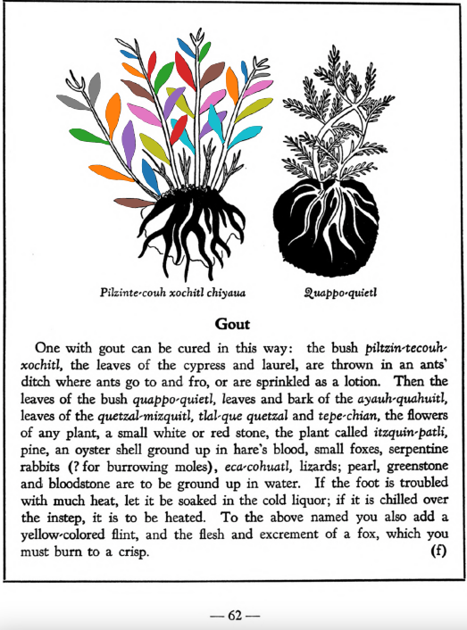
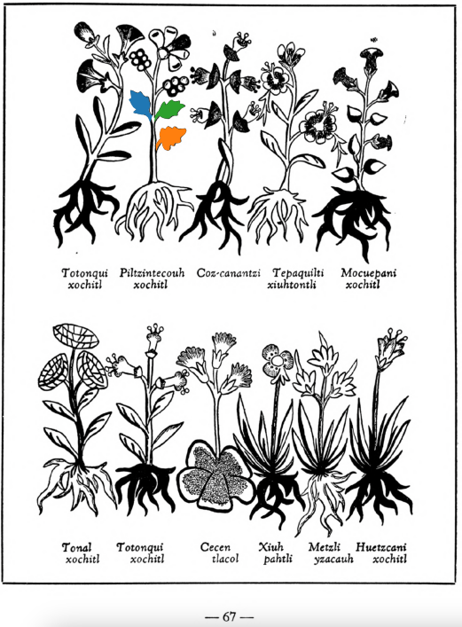

**Variants:**

- piltzin-tecouh-xochitl

**Morphemes:**

- Xochitl/flower

## Subchapter 8f  

=== "English :flag_us:"
    **Gout.** One with gout can be cured in this way: the bush [piltzin-tecouh-xochitl](Piltzinte-couh-xochitl.md), the leaves of the cypress and laurel, are thrown in an ants’ ditch where ants go to and fro, or are sprinkled as a lotion. Then the leaves of the bush [quappo-quietl](Quappo-quietl.md), leaves and bark of the [ayauh-quahuitl](Ayauh-quahuitl.md), leaves of the [quetzal-mizquitl](Quetzal-misquitl.md), tla-que quetzal and [tepe-chian](Tepe-chian.md), the flowers of any plant, a small white or red stone, the plant called [itzquin-patli](Itzquin-patli.md), pine, an oyster shell ground up in hare’s blood, small foxes, serpentine rabbits (? for burrowing moles), [eca-cohuatl](eca-cohuatl.md), lizards; pearl, greenstone and bloodstone are to be ground up in water. If the foot is troubled with much heat, let it be soaked in the cold liquor; if it is chilled over the instep, it is to be heated. To the above named you also add a yellow-colored flint, and the flesh and excrement of a fox, which you must burn to a crisp.  
    [https://archive.org/details/aztec-herbal-of-1552/page/62](https://archive.org/details/aztec-herbal-of-1552/page/62)  

=== "Español :flag_mx:"
    **Gota.** Alguien con gota puede curarse así: el arbusto [piltzin-tecouh-xochitl](Piltzinte-couh-xochitl.md), las hojas del ciprés y el laurel, se echan en una zanja de hormigas donde estas van y vienen, o se espolvorean como loción. Luego se toman las hojas del arbusto [quappo-quietl](Quappo-quietl.md), hojas y corteza del [ayauh-quahuitl](Ayauh-quahuitl.md), hojas del [quetzal-mizquitl](Quetzal-misquitl.md), tla-que quetzal y [tepe-chian](Tepe-chian.md), flores de cualquier planta, una piedra blanca o roja pequeña, la planta llamada [itzquin-patli](Itzquin-patli.md), pino, una concha de ostra molida en sangre de liebre, pequeños zorros, conejos serpenteantes (¿topos?), [eca-cohuatl](eca-cohuatl.md), lagartijas; perla, piedra verde y hematites, todo debe molerse en agua. Si el pie sufre de mucho calor, debe remojarse en el licor frío; si está helado sobre el empeine, debe calentarse. A lo anterior se añade también un pedernal de color amarillo, y la carne y excremento de zorro, que deben quemarse hasta quedar carbonizados.  

## Subchapter 8j  

=== "English :flag_us:"
    **Lesions in the feet.** For cut feet prepare these herbs: [tlal-ecapatli](Tlal-ecapatli.md), [coyo-xihuitl](Coyo-xihuitl.md), [iztauh-yatl](Iztauyattl.md), [tepe-chian](Tepe-chian.md), [a-chilli](A-chilli.md), [xiuh-ecapatli](Eca-patli.md), [quauh-yyauhtli](Quauh-yyauhtli.md), [quetzal-xoxouhca-patli](Quetzal-xoxouca-patli.md), [tzotzotlani](Quetzal-xoxouhca-patli tzotzotlani.md), the flower of the [cacau-xochitl](Cacaua-xochitl.md) and the [piltzin-tecouh-xochitl](Piltzinte-couh-xochitl.md), with the leaves of the [eca-patli](Eca-patli.md) and the [itzcuin-patli](Itzquin-patli.md), the stones [tlacal-huatzin](tlacal-huatzin.md), [eztetl](eztetl.md) and [tetlahuitl](tetlahuitl v2.md), pale colored earth. Then divide all this into three parts. Put some in a basin over the coals or fire that it may heat, in water, and put the feet into the hot water in the basin. Let the fire placed at the feet lower somewhat, that it may not fall onto them; the feet are to be wrapped in a cloth. The following day put our ointment called xochi-ocotzotl, with white frankincense, into the fire, that the feet may improve by the odor and the heat; also let the seeds of the herb called [xe-xihuitl](Xe-xihuitl.md) be ground up and put pulverized into hot water to apply to the feet. Third, apply the herb [tolohua-xihuitl](Tolohua xihuitl.md) and brambles ground up in hot water.  
    [https://archive.org/details/aztec-herbal-of-1552/page/65](https://archive.org/details/aztec-herbal-of-1552/page/65)  

=== "Español :flag_mx:"
    **Lesiones en los pies.** Para pies cortados prepara estas hierbas: [tlal-ecapatli](Tlal-ecapatli.md), [coyo-xihuitl](Coyo-xihuitl.md), [iztauh-yatl](Iztauyattl.md), [tepe-chian](Tepe-chian.md), [a-chilli](A-chilli.md), [xiuh-ecapatli](Eca-patli.md), [quauh-yyauhtli](Quauh-yyauhtli.md), [quetzal-xoxouhca-patli](Quetzal-xoxouca-patli.md), [tzotzotlani](Quetzal-xoxouhca-patli tzotzotlani.md), la flor de [cacau-xochitl](Cacaua-xochitl.md) y el [piltzin-tecouh-xochitl](Piltzinte-couh-xochitl.md), con las hojas de [eca-patli](Eca-patli.md) e [itzcuin-patli](Itzquin-patli.md), las piedras [tlacal-huatzin](tlacal-huatzin.md), [eztetl](eztetl.md) y [tetlahuitl](tetlahuitl v2.md), tierra de color pálido. Luego divide todo esto en tres partes. Una parte se pone en una vasija sobre las brasas o el fuego para calentarla en agua, y se meten los pies en esa agua caliente. El fuego bajo los pies debe bajarse un poco para que no los queme; los pies se envuelven en un paño. Al día siguiente se pone nuestro ungüento llamado xochi-ocotzotl con incienso blanco en el fuego, para que los pies mejoren con el olor y el calor; también se muelen las semillas de la hierba llamada [xe-xihuitl](Xe-xihuitl.md) y se agregan pulverizadas en agua caliente para aplicarlas en los pies. En tercer lugar, se aplican la hierba [tolohua-xihuitl](Tolohua xihuitl.md) y zarzas molidas en agua caliente.  

  
Leaf traces by: Mariana Jaired Ruíz Amaro, Laboratory of Agrigenomic Sciences, ENES Unidad León, México  
  
Leaf traces by: Mariana Jaired Ruíz Amaro, Laboratory of Agrigenomic Sciences, ENES Unidad León, México  
