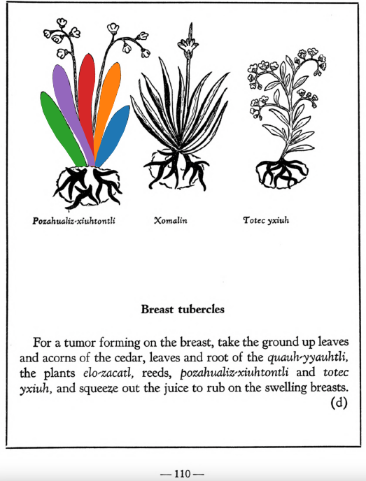

**Morphemes:**

- Xihuitl/herbs, green leaves

## Subchapter 11d  

=== "English :flag_us:"
    **Breast tubercles.** For a tumor forming on the breast, take the ground up leaves and acorns of the cedar, leaves and root of the [quauh-yyauhtli](Quauh-yyauhtli.md), the plants [elo-zacatl](Elo-zacatl.md), reeds, [pozahualiz-xiuhtontli](Pozahualiz-xiuhtontli.md) and totec yxiuh, and squeeze out the juice to rub on the swelling breasts.  
    [https://archive.org/details/aztec-herbal-of-1552/page/110](https://archive.org/details/aztec-herbal-of-1552/page/110)  

=== "Español :flag_mx:"
    **Nódulos en el pecho.** Para un tumor que se forma en el pecho, tomar las hojas y bellotas del cedro molidas, hojas y raíz del [quauh-yyauhtli](Quauh-yyauhtli.md), las plantas [elo-zacatl](Elo-zacatl.md), cañas, [pozahualiz-xiuhtontli](Pozahualiz-xiuhtontli.md) y totec yxiuh, y exprimir el jugo para frotarlo en los pechos hinchados.  

  
Leaf traces by: Alejandra Rougon-Cardoso, Laboratory of Agrigenomic Sciences, ENES Unidad León, México  
