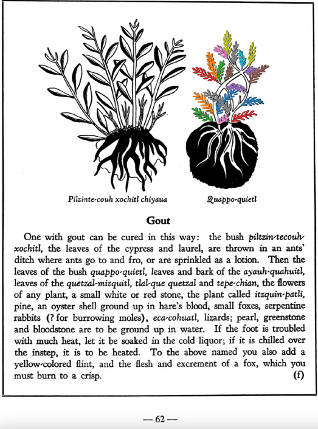

## Subchapter 8f  

=== "English :flag_us:"
    **Gout.** One with gout can be cured in this way: the bush [piltzin-tecouh-xochitl](Piltzinte-couh-xochitl.md), the leaves of the cypress and laurel, are thrown in an ants’ ditch where ants go to and fro, or are sprinkled as a lotion. Then the leaves of the bush [quappo-quietl](Quappo-quietl.md), leaves and bark of the [ayauh-quahuitl](Ayauh-quahuitl.md), leaves of the [quetzal-mizquitl](Quetzal-misquitl.md), tla-que quetzal and [tepe-chian](Tepe-chian.md), the flowers of any plant, a small white or red stone, the plant called [itzquin-patli](Itzquin-patli.md), pine, an oyster shell ground up in hare’s blood, small foxes, serpentine rabbits (? for burrowing moles), [eca-cohuatl](eca-cohuatl.md), lizards; pearl, greenstone and bloodstone are to be ground up in water. If the foot is troubled with much heat, let it be soaked in the cold liquor; if it is chilled over the instep, it is to be heated. To the above named you also add a yellow-colored flint, and the flesh and excrement of a fox, which you must burn to a crisp.  
    [https://archive.org/details/aztec-herbal-of-1552/page/62](https://archive.org/details/aztec-herbal-of-1552/page/62)  

=== "Español :flag_mx:"
    **Gota.** Alguien con gota puede curarse así: el arbusto [piltzin-tecouh-xochitl](Piltzinte-couh-xochitl.md), las hojas del ciprés y el laurel, se echan en una zanja de hormigas donde estas van y vienen, o se espolvorean como loción. Luego se toman las hojas del arbusto [quappo-quietl](Quappo-quietl.md), hojas y corteza del [ayauh-quahuitl](Ayauh-quahuitl.md), hojas del [quetzal-mizquitl](Quetzal-misquitl.md), tla-que quetzal y [tepe-chian](Tepe-chian.md), flores de cualquier planta, una piedra blanca o roja pequeña, la planta llamada [itzquin-patli](Itzquin-patli.md), pino, una concha de ostra molida en sangre de liebre, pequeños zorros, conejos serpenteantes (¿topos?), [eca-cohuatl](eca-cohuatl.md), lagartijas; perla, piedra verde y hematites, todo debe molerse en agua. Si el pie sufre de mucho calor, debe remojarse en el licor frío; si está helado sobre el empeine, debe calentarse. A lo anterior se añade también un pedernal de color amarillo, y la carne y excremento de zorro, que deben quemarse hasta quedar carbonizados.  

  
Leaf traces by: Mariana Jaired Ruíz Amaro, Laboratory of Agrigenomic Sciences, ENES Unidad León, México  
