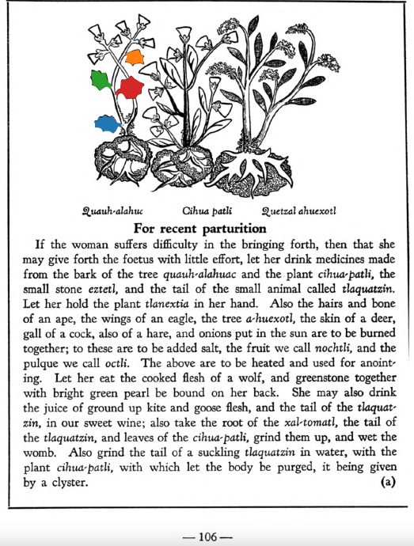

Variants: quauh-alahuac  

## Subchapter 11a  
**For recent parturition.** If the woman suffers difficulty in the bringing forth, then that she may give forth the fetus with little effort, let her drink medicines made from the bark of the tree[quauh-alahuac](Quauh-alahuac.md) and the plant [cihua-patli](Cihua-patli.md), the small stone [eztetl](eztetl.md), and the tail of the small animal called [tlaquatzin](tlaquatzin.md). Let her hold the plant [tlanextia](Tlanextia xiuhtontli.md) in her hand. Also the hairs and bone of an ape, the wings of an eagle, the tree [a-huexotl](Quetzal-ahuexotl.md), the skin of a deer, gall of a cock, also of a hare, and onions put in the sun are to be burned together; to these are to be added salt, the fruit we call [nochtli](Nochtli.md), and the pulque we call [octli](octli.md). The above are to be heated and used for anointing. Let her eat the cooked flesh of a wolf, and greenstone together with bright green pearl be bound on her back. She may also drink the juice of ground up kite and goose flesh, and the tail of the tlaquauzin, in our sweet wine; also take the root of the [xal-tomatl](Xal-tomatl.md), the tail of the [tlaquatzin](tlaquatzin.md), and leaves of the [cihua-patli](Cihua-patli.md), grind them up, and wet the womb. Also grind the tail of a suckling [tlaquatzin](tlaquatzin.md) in water, with the plant [cihua-patli](Cihua-patli.md), with which let the body be purged, it being given by a clyster.  
[https://archive.org/details/aztec-herbal-of-1552/page/106](https://archive.org/details/aztec-herbal-of-1552/page/106)  

## Subchapter 11c  
**Ventral lotion in childbirth.** The womb of a woman entering childbirth is to be washed out with the juice of the plants [xiuh-eloquilitl](Xiuh-elo-quilitl.md), [tlaco-popotl](Tlaco-popotli.md), [centzon-xochitl](Centzon-xochitl.md), [xiuhpatli](Xiuh-patli.md), laurel, all which triturate in spring water with the stones [eztetl](eztetl.md) and [tetlahuitl](tetlahuitl v2.md). The feet are also to be frequently washed with this. When the birth is about to come, the [iztac huitz-quahuitl](Iztac huitz-quahuitl.md), [malinalli](Malinalli.md), white stone, white nitre, pine, palm and [eztetl](eztetl.md) are to be boiled in water. Into the womb you also inject the triturated herb [ayo-nelhuatl](Ayo-nelhuatl.md), eagle excrement, the acidulous plants, the root [quauh-alahuac](Quauh-alahuac.md) and the stone [eztetl](eztetl.md), that the pain may be lightened.  
[https://archive.org/details/aztec-herbal-of-1552/page/108](https://archive.org/details/aztec-herbal-of-1552/page/108)  

  
Leaf traces by: Alejandra Rougon, UNAM ENES León, México  
