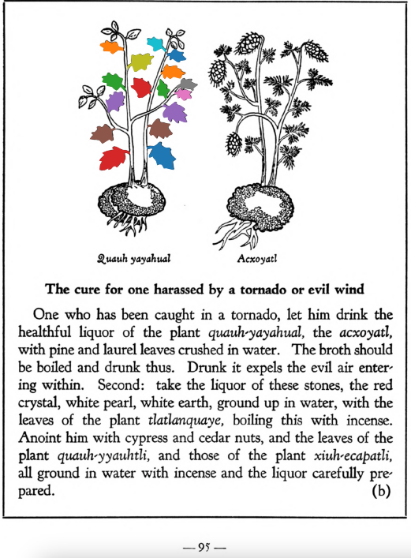

**Morphemes:**

- Quahuitl/tree or wood

## Subchapter 9g  

=== "English :flag_us:"
    **For ringworm and tetter.** For one laboring with this scaly disease, let there be ground together and set over coals the bark of the cherry, of the incense bearing [quauh-xiyotl](Quauh-xiyotl.md) tree, the apple, the flowers of the [topozan](Topozan.md) and [cacalo-xochitl](Cacalo-xochitl.md), oak roots, cypress nuts, leaves of the plants [tlatlanquaye](Tlatlanquaye.md), [quauh-yayahual](Quauh-yayahual.md), the herbs [tepe-chian](Tepe-chian.md), [coyo-xihuitl](Coyo-xihuitl.md), [a-quahuitl](A-quahuitl.md), cedar nuts and leaves; with these when heated let him bathe himself, and the affected part be rubbed with the burned pine, with which, and all the above, let him be rubbed.  
    [https://archive.org/details/aztec-herbal-of-1552/page/81](https://archive.org/details/aztec-herbal-of-1552/page/81)  

=== "Español :flag_mx:"
    **Para tiña y sarna.** Para quien sufre de esta enfermedad escamosa, se deben moler juntos y poner sobre brasas la corteza del cerezo, del árbol [quauh-xiyotl](Quauh-xiyotl.md) que produce incienso, del manzano, las flores del [topozan](Topozan.md) y [cacalo-xochitl](Cacalo-xochitl.md), raíces de roble, nueces de ciprés, hojas de las plantas [tlatlanquaye](Tlatlanquaye.md), [quauh-yayahual](Quauh-yayahual.md), las hierbas [tepe-chian](Tepe-chian.md), [coyo-xihuitl](Coyo-xihuitl.md), [a-quahuitl](A-quahuitl.md), nueces y hojas de cedro; con esto, una vez caliente, debe bañarse, y la parte afectada frotarse con pino quemado, con el cual y todo lo anterior, debe ser frotado.  

## Subchapter 10b  

=== "English :flag_us:"
    **The cure for one harassed by a tornado or evil wind.** One who has been caught in a tornado, let him drink the healthful liquor of the plant [quauh-yayahual](Quauh-yayahual.md), the [acxoyatl](Acxoyatl.md), with pine and laurel leaves crushed in water. The broth should be boiled and drunk thus. Drunk it expels the evil air entering within. Second; take the liquor of these stones, the red crystal, white pearl, white earth, ground up in water, with the leaves of the plant tlatlanquaye, boiling this with incense. Anoint him with cypress and cedar nuts, and the leaves of the plant [qauh-yyauhtli](Quauh-yyauhtli.md), and those of the plant [xiuh-ecapatli](Eca-patli.md), all ground in water with incense and the liquor carefully prepared.  
    [https://archive.org/details/aztec-herbal-of-1552/page/95](https://archive.org/details/aztec-herbal-of-1552/page/95)  

=== "Español :flag_mx:"
    **Remedio para quien ha sido hostigado por un torbellino o viento maligno.** A quien ha sido atrapado por un torbellino, que beba el licor saludable de la planta [quauh-yayahual](Quauh-yayahual.md), el [acxoyatl](Acxoyatl.md), con hojas de pino y laurel machacadas en agua. El cocimiento debe hervirse y beberse así. Al beberlo expulsa el aire maligno que ha entrado. En segundo lugar: tomar el licor de estas piedras, el cristal rojo, perla blanca y tierra blanca, molidas en agua con las hojas de la planta tlatlanquaye, hirviendo todo esto con incienso. Se le debe untar con nueces de ciprés y cedro, y con hojas de la planta [qauh-yyauhtli](Quauh-yyauhtli.md), y de la planta [xiuh-ecapatli](Eca-patli.md), todas molidas en agua con incienso y el licor cuidadosamente preparado.  

  
Leaf traces by: Zoë Migicovsky, Acadia University, Canada  
