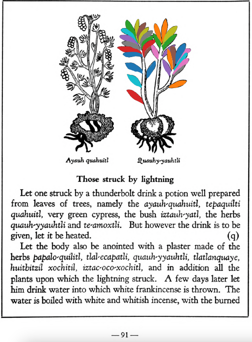

Variants: qauh-yyauhtli, quauh-yyauhtli, yyauhtli  

## Subchapter 8j  
**Lesions in the feet.** For cut feet prepare these herbs: [tlal-ecapatli](Tlal-ecapatli.md), [coyo-xihuitl](Coyo-xihuitl.md), [iztauh-yatl](Iztauyattl.md), [tepe-chian](Tepe-chian.md), [a-chilli](A-chilli.md), [xiuh-ecapatli](Eca-patli.md), [quauh-yyauhtli](Quauh-yyauhtli.md), [quetzal-xoxouhca-patli](Quetzal-xoxouca-patli.md), [tzotzotlani](Quetzal-xoxouhca-patli_tzotzotlani.md), the flower of the [cacau-xochitl](Cacaua-xochitl.md) and the [piltzin-tecouh-xochitl](Piltzinte-couh-xochitl.md), with the leaves of the [eca-patli](Eca-patli.md) and the [itzcuin-patli](Itzquin-patli.md), the stones [tlacal-huatzin](tlacal-huatzin.md), [eztetl](eztetl.md) and [tetlahuitl](tetlahuitl_v2.md), pale colored earth. Then divide all this into three parts. Put some in a basin over the coals or fire that it may heat, in water, and put the feet into the hot water in the basin. Let the fire placed at the feet lower somewhat, that it may not fall onto them; the feet are to be wrapped in a cloth. The following day put our ointment called [xochi-ocotzotl](xochi-ocotzotl.md), with white frankincense, into the fire, that the feet may improve by the odor and the heat; also let the seeds of the herb called [xe-xihuitl](Xe-xihuitl.md) be ground up and put pulverized into hot water to apply to the feet. Third, apply the herb[tolohua-xihuitl](Tolohua_xihuitl.md)and brambles ground up in hot water.  
[https://archive.org/details/aztec-herbal-of-1552/page/65](https://archive.org/details/aztec-herbal-of-1552/page/65)  

## Subchapter 8l  
**The trees and flowers for relieving the fatigue of those administering the government, and discharging public offices.** The bark of the tree [quetzal-ylin](Quetzal-ylin.md), the flowers [elo-xochitl](Elo-xochitl.md) and[izqui-xochitl](Izqui-xochitl.md), the almond with its fruit, which is the [tlapal-cacahuatl](Tlapol-cacahuatl.md), the flowers [cacalo-xochitl](Cacalo-xochitl.md), [huacal-xochitl](Huacal-xochitl.md), [meca-xochitl](Meca-xochitl.md), [huey-nacaztli](Huey-nacaztli.md), and all fine smelling summer flowers; leaves of the trees [a-ylin](A-illin.md), [oyametl](Oyametl.md), [ocotl](Ocotl.md), [a-xocotl](A-xocotl.md), [eca-patli](Eca-patli.md), [tlaco-izqui-xochitl](Tlaco-izqui-xochitl.md), [quauh-yyauhtli](Quauh-yyauhtli.md), [tomazquitl](Tomaz-quitl.md), [ahuatl](Ahuatl.md), [tepe-ylin](Tepe-ylin.md), [ayauh-quahuitl](Ayauh-quahuitl.md), and te-papaquilti quahuitl, flower bearing plants with their shrubbery, which you gather before the wind rises; these are expressed one by one in clear spring water, into new vessels or vases. This then stays for a day and a night, when the [huitz-quahuitl](Huitz-quahuitl.md) wood, with a red juice, is added as coloring. Also the blood of wild animals, namely the red ocelot, [cuetlachtli](cuetlachtli.md), [miztli](miztli.md), [ocotochtli](ocotochtli.md), white ocelot, [tlaco-ocelotl](tlaco-ocelotl.md), is sought for. With this and the above liquors the body is well anointed. Second, the precious stones [quetzal-iztli](quetzal-iztli.md), [eztetl](eztetl.md), [tlacal-huatzin](tlacal-huatzin.md), [tetlahuitl](tetlahuitl_v2.md), red earth and the small stones in the stomachs of the birds [huexo-canauhtli](huexo-canauhtli.md), [hauctli](huactli.md) and [apopotli](apopotli.md) are cast into water in which they stay for a night in order that the healthful juice may be drawn out, with which the body is to be frequently bathed. Third, the brain and gall of these animals, the red ocelot, white ocelot, [cuetlachtli](cuetlachtli.md), [miztli](miztli.md), [ocotochtli](ocotochtli.md), [coyotl](coyotl.md), also the brain, gall and bladder of the white epatl, ground up; with these the body is moistened. These medicaments healthily give gladiatorial strength to the body, drive fatigue far off, and also cast out timidity and strengthen the human heart. As for the rest, let whoever wishes to follow through this reinvigoration of the body, eat other things also, but as of chief value the flesh of the white rabbit or white fox, either baked or boiled.  
[https://archive.org/details/aztec-herbal-of-1552/page/70](https://archive.org/details/aztec-herbal-of-1552/page/70)  

## Subchapter 9l  
**Swelling of the veins after phlebotomy.** When a vein comes to swelling after being cut, the bushes[tzihuac-copalli](Tzihuac-copalli.md) and [tlaco-eca-patli](Tlaco-ecapatli.md), [tetzmitl](Tetzmitl.md), the root of the plant[tlanen-popoloa](Tla-nen-popoloua.md), the leaves of the herb [quauh-yyauhtli](Quauh-yyauhtli.md) andahuiyac tlatlanquaye, with the herb [coyo-xihuitl](Coyo-xihuitl.md) are ground together with yolk of egg, in which water breathing the odor of frankincense is then poured, and the incised vein soaked with this liquor.  
[https://archive.org/details/aztec-herbal-of-1552/page/86](https://archive.org/details/aztec-herbal-of-1552/page/86)  

## Subchapter 9q  
**Those struck by lightning.** Let one struck by a thunderbolt drink a potion well prepared from leaves of trees, namely the [ayauh-quahuitl](Ayauh-quahuitl.md), [tepaquilti quahuitl](tepaquilti_quahuitl.md), very green cypress, the bush [iztauh-yatl](Iztauyattl.md), the herbs[quauh-yyauhtli](Quauh-yyauhtli.md) and [te-amoxtli](Te-amoxtli.md). But however the drink is to be given, let it be heated.  Let the body also be anointed with a plaster made of the herbs [papalo-quilitl](Papalo-quilitl.md), [tlal-ecapatli](Tlal-ecapatli.md), [quauh-yyauhtli](Quauh-yyauhtli.md), [tlatlanquaye](Tlatlanquaye.md), huitbitzil xochitil, [iztac-oco-xochitl](Iztac_oco-xochitl.md), and in addition all the plants upon which the lightning struck. A few days later lethim drink water into which white frankincense is thrown. The water is boiled with white and whitish incense, with the burned bones of a fox added. Also mix some Indian wine with the above. Afterwards you will instill into the nostrils a medicine made of white pearl, the root [tlatlacotic](Tlatlacotic.md), and all plants growing in a garden that has been burned over. Let also be suffumigated by white incense thrown upon the coals, the wax ointment we call [xochi-oco-tzotl](xochi-ocotzotl.md), and the good odor of the herb [quauh-yyauhtli](Quauh-yyauhtli.md).  
[https://archive.org/details/aztec-herbal-of-1552/page/91](https://archive.org/details/aztec-herbal-of-1552/page/91)  

## Subchapter 10b  
**The cure for one harassed by a tornado or evil wind.** One who has been caught in a tornado, let him drink the healthful liquor of the plant [quauh-yayahual](Quauh-yayahual.md), the [acxoyatl](Acxoyatl.md), with pine and laurel leaves crushed in water. The broth should be boiled and drunk thus. Drunk it expels the evil air entering within. Second; take the liquor of these stones, the red crystal, white pearl, white earth, ground up in water, with the leaves of the plant tlatlanquaye, boiling this with incense. Anoint him with cypress and cedar nuts, and the leaves of the plant [qauh-yyauhtli](Quauh-yyauhtli.md), and those of the plant [xiuh-ecapatli](Eca-patli.md), all ground in water with incense and the liquor carefully prepared.  
[https://archive.org/details/aztec-herbal-of-1552/page/95](https://archive.org/details/aztec-herbal-of-1552/page/95)  

## Subchapter 10j  
**Support for one crossing a stream or water.** For one who wishes to cross a river or water safely, moisten his chest with the juice of the plants [yyauhtli](Quauh-yyauhtli.md) and tepepapalo quilitl, crushed in water. In his hand let him carry a beryl, the head and viscera of an oyster, a sardonyx and the eyes of a large fish shut tight in his mouth.  
[https://archive.org/details/aztec-herbal-of-1552/page/103](https://archive.org/details/aztec-herbal-of-1552/page/103)  

## Subchapter 11d  
**Breast tubercles.** For a tumor forming on the breast, take the ground up leaves and acorns of the cedar, leaves and root of the [quauh-yyauhtli](Quauh-yyauhtli.md), the plants [elo-zacatl](Elo-zacatl.md), reeds, [pozahualiz-xiuhtontli](Pozahualiz-xiuhtontli.md) and totec yxiuh, and squeeze out the juice to rub on the swelling breasts.  
[https://archive.org/details/aztec-herbal-of-1552/page/110](https://archive.org/details/aztec-herbal-of-1552/page/110)  

  
Leaf traces by: Zoë Migicovsky, Acadia University, Canada  
