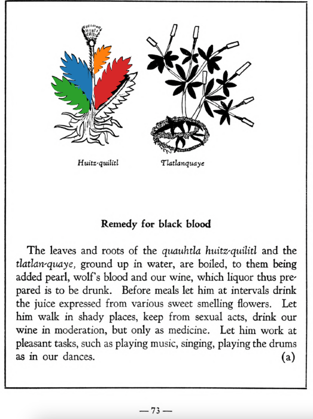

**Morphemes:**

- Huitz/needle or thorn
- Quahuitl/tree or wood
- Quilitl/edible green

## Subchapter 7m  

=== "English :flag_us:"
    **Abdominal chill.** This is removed by taking a drink made of the roots of the plants [copaliyac-xiuhtontli](Copaliyac-xiuhtontli.md), [tlanexti-xiuhtontli](Tlanextia xiuhtontli.md), [chichic-xihuitl](Chichic-xihuitl.md) and the [quauhtla huitz-quilitl](Quauhtla huitz-quilitl.md), with added Indian wine.  
    [https://archive.org/details/aztec-herbal-of-1552/page/55](https://archive.org/details/aztec-herbal-of-1552/page/55)  

=== "Español :flag_mx:"
    **Frialdad abdominal.** Esto se remueve tomando una bebida hecha de las raíces de las plantas [copaliyac-xiuhtontli](Copaliyac-xiuhtontli.md), [tlanexti-xiuhtontli](Tlanextia xiuhtontli.md), [chichic-xihuitl](Chichic-xihuitl.md) y del [quauhtla huitz-quilitl](Quauhtla huitz-quilitl.md), con vino indígena añadido.  

## Subchapter 9a  

=== "English :flag_us:"
    **Remedy for black blood.** The leaves and roots of the [quauhtla huitz-quilitl](Quauhtla huitz-quilitl.md) and the [tlatlan-quaye](Tlatlanquaye.md), ground up in water, are boiled, to them being added pearl, wolf’s blood and our wine, which liquor thus prepared is to be drunk. Before meals let him at intervals drink the juice expressed from various sweet smelling flowers. Let him walk in shady places, keep from sexual acts, drink our wine in moderation, but only as medicine. Let him work at pleasant tasks, such as playing music, singing, playing the drums as in our dances.  
    [https://archive.org/details/aztec-herbal-of-1552/page/73](https://archive.org/details/aztec-herbal-of-1552/page/73)  

=== "Español :flag_mx:"
    **Remedio para la sangre negra.** Las hojas y raíces del [quauhtla huitz-quilitl](Quauhtla huitz-quilitl.md) y del [tlatlan-quaye](Tlatlanquaye.md), molidas en agua, se hierven; se les añade perla, sangre de lobo y nuestro vino. Este licor así preparado debe beberse. Antes de las comidas, debe beber a intervalos el jugo exprimido de varias flores aromáticas. Que camine por lugares sombreados, se abstenga de actos sexuales, beba nuestro vino con moderación, pero solo como medicina. Que trabaje en tareas agradables, como tocar música, cantar, tocar tambores como en nuestras danzas.  

  
Leaf traces by: Kylie DeViller, Acadia University, Canada  
