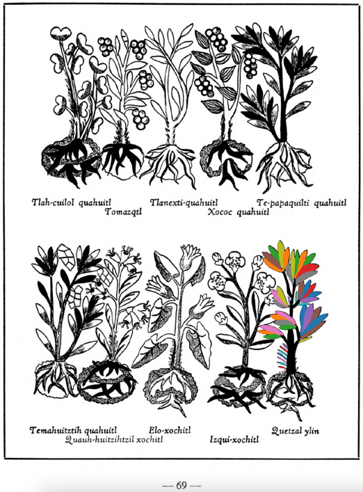
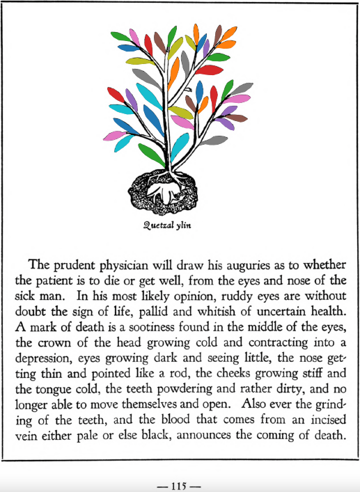

**Morphemes:**

- Quetzal/precious, feathered, or green

## Subchapter 7k  

=== "English :flag_us:"
    **Dysentery.** The following serve well against dysentery: leaves of the herb [tlacomatl](Tlaco-amatl.md), leaves of the [xa-xocotl](Xa-xocotl.md), almonds, laurel, almond husks, pine bark, the [quetzal-ylin](Quetzal-ylin.md), the [ylin](Ylin.md), [capul-xihuitl](Capul-xihuitl.md) and alectorium, deer’s horn burned to ashes, greens and grain ground up in hot water. The liquor is then to be taken into the rear parts by injection.  
    [https://archive.org/details/aztec-herbal-of-1552/page/53](https://archive.org/details/aztec-herbal-of-1552/page/53)  

=== "Español :flag_mx:"
    **Diarrea disenteriforme.** Contra la disentería sirven bien: hojas de la hierba [tlacomatl](Tlaco-amatl.md), hojas del [xa-xocotl](Xa-xocotl.md), almendras, laurel, cáscaras de almendra, corteza de pino, el [quetzal-ylin](Quetzal-ylin.md), el [ylin](Ylin.md), [capul-xihuitl](Capul-xihuitl.md) y alectorium, cuerno de venado quemado hasta cenizas, verduras y granos triturados en agua caliente. El licor se administra por las partes traseras mediante inyección.  

## Subchapter 7l  

=== "English :flag_us:"
    **For a rumbling in the abdomen.** For one whose intestines rumble because of some flux in the abdomen, let him take by means of an ear syringe (clyster oriculario), a liquor prepared from leaves of the [tlatlanquaye](Tlatlanquaye.md) herb, the bark of the [quetzal-ylin](Quetzal-ylin.md), [iztac-oco-xochitl](Iztac oco-xochitl.md) leaves, and the herbs [tlanexti-xiuhtontli](Tlanextia xiuhtontli.md), [elo-zacatl](Elo-zacatl.md), the tree [tlanextia-quahuitl](Tlanextia quahuitl.md), ground up in acidulous water with ashes, a little honey, salt, pepper, alectorium and finally [pizietl](Piciyetl.md) or tobacco.  
    [https://archive.org/details/aztec-herbal-of-1552/page/54](https://archive.org/details/aztec-herbal-of-1552/page/54)  

=== "Español :flag_mx:"
    **Para retortijones en el abdomen.** A quien se le revuelven las tripas por algún flujo abdominal, que se le administre con una jeringa auricular un licor preparado con hojas de la hierba [tlatlanquaye](Tlatlanquaye.md), corteza del [quetzal-ylin](Quetzal-ylin.md), hojas del [iztac-oco-xochitl](Iztac oco-xochitl.md), y las hierbas [tlanexti-xiuhtontli](Tlanextia xiuhtontli.md), [elo-zacatl](Elo-zacatl.md), el árbol [tlanextia-quahuitl](Tlanextia quahuitl.md), todo triturado en agua acidulada con cenizas, un poco de miel, sal, pimienta, alectorium y finalmente [pizietl](Piciyetl.md) o tabaco.  

## Subchapter 8l  

=== "English :flag_us:"
    **The trees and flowers for relieving the fatigue of those administering the government, and discharging public offices.** The bark of the tree [quetzal-ylin](Quetzal-ylin.md), the flowers [elo-xochitl](Elo-xochitl.md) and [izqui-xochitl](Izqui-xochitl.md), the almond with its fruit, which is the [tlapal-cacahuatl](Tlapol-cacahuatl.md), the flowers [cacalo-xochitl](Cacalo-xochitl.md), [huacal-xochitl](Huacal-xochitl.md), [meca-xochitl](Meca-xochitl.md), [huey-nacaztli](Huey-nacaztli.md), and all fine smelling summer flowers; leaves of the trees [a-ylin](A-illin.md), [oyametl](Oyametl.md), [ocotl](Ocotl.md), [a-xocotl](A-xocotl.md), [eca-patli](Eca-patli.md), [tlaco-izqui-xochitl](Tlaco-izqui-xochitl.md), [quauh-yyauhtli](Quauh-yyauhtli.md), [tomazquitl](Tomaz-quitl.md), [ahuatl](Ahuatl.md), [tepe-ylin](Tepe-ylin.md), [ayauh-quahuitl](Ayauh-quahuitl.md), and te-papaquilti quahuitl, flower bearing plants with their shrubbery, which you gather before the wind rises; these are expressed one by one in clear spring water, into new vessels or vases. This then stays for a day and a night, when the [huitz-quahuitl](Huitz-quahuitl.md) wood, with a red juice, is added as coloring. Also the blood of wild animals, namely the red ocelot, [cuetlachtli](cuetlachtli.md), [miztli](miztli.md), [ocotochtli](ocotochtli.md), white ocelot, [tlaco-ocelotl](tlaco-ocelotl.md), is sought for. With this and the above liquors the body is well anointed. Second, the precious stones [quetzal-iztli](quetzal-iztli.md), [eztetl](eztetl.md), [tlacal-huatzin](tlacal-huatzin.md), [tetlahuitl](tetlahuitl v2.md), red earth and the small stones in the stomachs of the birds [huexo-canauhtli](huexo-canauhtli.md), [hauctli](huactli.md) and [apopotli](apopotli.md) are cast into water in which they stay for a night in order that the healthful juice may be drawn out, with which the body is to be frequently bathed. Third, the brain and gall of these animals, the red ocelot, white ocelot, [cuetlachtli](cuetlachtli.md), [miztli](miztli.md), [ocotochtli](ocotochtli.md), [coyotl](coyotl.md), also the brain, gall and bladder of the white epatl, ground up; with these the body is moistened. These medicaments healthily give gladiatorial strength to the body, drive fatigue far off, and also cast out timidity and strengthen the human heart. As for the rest, let whoever wishes to follow through this reinvigoration of the body, eat other things also, but as of chief value the flesh of the white rabbit or white fox, either baked or boiled.  
    [https://archive.org/details/aztec-herbal-of-1552/page/70](https://archive.org/details/aztec-herbal-of-1552/page/70)  

=== "Español :flag_mx:"
    **Los árboles y flores para aliviar el cansancio de quienes gobiernan y desempeñan cargos públicos.** La corteza del árbol [quetzal-ylin](Quetzal-ylin.md), las flores [elo-xochitl](Elo-xochitl.md) e [izqui-xochitl](Izqui-xochitl.md), la almendra con su fruto llamado [tlapal-cacahuatl](Tlapol-cacahuatl.md), las flores [cacalo-xochitl](Cacalo-xochitl.md), [huacal-xochitl](Huacal-xochitl.md), [meca-xochitl](Meca-xochitl.md), [huey-nacaztli](Huey-nacaztli.md), y todas las flores veraniegas de buen aroma; hojas de los árboles [a-ylin](A-illin.md), [oyametl](Oyametl.md), [ocotl](Ocotl.md), [a-xocotl](A-xocotl.md), [eca-patli](Eca-patli.md), [tlaco-izqui-xochitl](Tlaco-izqui-xochitl.md), [quauh-yyauhtli](Quauh-yyauhtli.md), [tomazquitl](Tomaz-quitl.md), [ahuatl](Ahuatl.md), [tepe-ylin](Tepe-ylin.md), [ayauh-quahuitl](Ayauh-quahuitl.md) y te-papaquilti quahuitl, plantas con flores y su follaje, que se recogen antes de que sople el viento; todo esto se exprime uno por uno en agua clara de manantial, en recipientes nuevos. Esto se deja reposar un día y una noche, luego se añade la madera [huitz-quahuitl](Huitz-quahuitl.md) con jugo rojo como colorante. También se busca la sangre de animales salvajes: el ocelote rojo, [cuetlachtli](cuetlachtli.md), [miztli](miztli.md), [ocotochtli](ocotochtli.md), ocelote blanco, [tlaco-ocelotl](tlaco-ocelotl.md). Con esto y los licores anteriores se unta bien el cuerpo. En segundo lugar, se echan en agua las piedras preciosas [quetzal-iztli](quetzal-iztli.md), [eztetl](eztetl.md), [tlacal-huatzin](tlacal-huatzin.md), [tetlahuitl](tetlahuitl v2.md), tierra roja y las piedras pequeñas halladas en los estómagos de las aves [huexo-canauhtli](huexo-canauhtli.md), [hauctli](huactli.md) y [apopotli](apopotli.md), y se dejan allí una noche para que suelten su jugo saludable, con el cual debe bañarse frecuentemente el cuerpo. En tercer lugar, se trituran el cerebro y la bilis de estos animales: ocelote rojo, ocelote blanco, [cuetlachtli](cuetlachtli.md), [miztli](miztli.md), [ocotochtli](ocotochtli.md), [coyotl](coyotl.md), así como el cerebro, la bilis y la vejiga del epatl blanco; con esto se humedece el cuerpo. Estos remedios dan saludablemente fuerza gladiatoria al cuerpo, alejan el cansancio, expulsan la timidez y fortalecen el corazón humano. Además, quien desee seguir este fortalecimiento del cuerpo puede comer otras cosas también, pero como lo más valioso se considera la carne de conejo blanco o zorro blanco, ya sea asada o hervida.  

## Subchapter 9i  

=== "English :flag_us:"
    **Skin eruptions.** The patient should first have the part affected bathed with urine; then let a plaster be applied made from [tlaquilin](Tlaquilin.md) shoots, [tlatlanquaye](Tlatlanquaye.md), the [quetzal-ylin](Quetzal-ylin.md) tree, the bark and leaves of the [a-quahuitl](A-quahuitl.md) crushed in water.  
    [https://archive.org/details/aztec-herbal-of-1552/page/83](https://archive.org/details/aztec-herbal-of-1552/page/83)  

=== "Español :flag_mx:"
    **Erupciones cutáneas.** El paciente debe primero tener la parte afectada bañada con orina; luego se debe aplicar un emplasto hecho de brotes de [tlaquilin](Tlaquilin.md), [tlatlanquaye](Tlatlanquaye.md), el árbol [quetzal-ylin](Quetzal-ylin.md), la corteza y hojas del [a-quahuitl](A-quahuitl.md) triturados en agua.  

## Subchapter 9m  

=== "English :flag_us:"
    **Festered places with worms.** When you see a festered spot gathering worms, grind together the leaves of the [quetzal-mizquitl](Quetzal-misquitl.md), [cimatl](Cimatl.md), [tlal-cacapol](Tlal-cacapol.md) and bramble bushes; also the root of the [tlaquilin](Tlaquilin.md) and the bark of the [xilo-xochitl](Xilo-xochitl.md), and put into our best wine; apply the liquor to the affected spot morning and evening. It will also be well to apply a medicament from bramble bushes, oak bark and leaves of the [quetzal-ylin](Quetzal-ylin.md), [tlal-patli](Tlal-patli.md), [quauh-patli](Quauh-patli.md), and [tlatlanquaye](Tlatlanquaye.md), with the [tlal-ahuehuetl](Tlal-ahuehuetl.md) root, ground up in water with yolk of egg. Use this twice daily, morning and evening, that purulence may dry up.  
    [https://archive.org/details/aztec-herbal-of-1552/page/87](https://archive.org/details/aztec-herbal-of-1552/page/87)  

=== "Español :flag_mx:"
    **Llagas con gusanos.** Cuando se ve una llaga supurante con gusanos, se muelen juntas las hojas del [quetzal-mizquitl](Quetzal-misquitl.md), [cimatl](Cimatl.md), [tlal-cacapol](Tlal-cacapol.md) y arbustos de zarzamora; también la raíz del [tlaquilin](Tlaquilin.md) y la corteza del [xilo-xochitl](Xilo-xochitl.md), y se ponen en nuestro mejor vino; se aplica este licor en la parte afectada por la mañana y por la noche. También conviene aplicar un medicamento de zarzamora, corteza de roble y hojas del [quetzal-ylin](Quetzal-ylin.md), [tlal-patli](Tlal-patli.md), [quauh-patli](Quauh-patli.md) y [tlatlanquaye](Tlatlanquaye.md), con la raíz del [tlal-ahuehuetl](Tlal-ahuehuetl.md), molido en agua con yema de huevo. Se usa esto dos veces al día, mañana y noche, para que la supuración se seque.  

## Subchapter 13a  

=== "English :flag_us:"
    **Of certain signs of approaching death.** The prudent physician will draw his auguries as to whether the patient is to die or get well, from the eyes and nose of the sick man. In his most likely opinion, ruddy eyes are without doubt the sign of life, palid and whitish of uncertain health. A mark of death is a sootiness found in the middle of the eyes, the crown of the head growing cold and contracting into a depression, eyes growing dark and seeing little, the nose getting thin and pointed like a rod, the cheeks growing stiff and the tongue cold, the teeth powdering and rather dirty, and no longer able to move themselves and open. Also ever the grinding of the teeth, and the blood that comes from an incised vein either pale or else black, announces the coming of death. Also the growing pale, or blackening, and putting on one or another visage, and finally the babbling of words without meaning or order, in the way of parrots. A special prognostic in a woman is observed, namely if the buttocks, calves and sides are as if punctured with some very sharp thorn. In spite of this desperate state, it is still possible to instill into the dying man’s eyes a medicine made of the precious stones [tlacal-huatzin](tlacal-huatzin.md), [eztetl](eztetl.md), pearl and white pearl, with white earth ground together in water. You may anoint the chest with pine wood crushed in water, laurel and the plant [tonatiuh yxiuh](Tonatiuh yxiuh v1.md), which you gather in the summer and keep for the occasion. Also puncture with a sharpened wolf’s bone, or an eagle’s bone, or that of a lion that is either white or spotted black in color, differently marked or sprinkled; to the nostrils you will hang the heart of an eagle covered or wrapped in deerskin. At the extreme point, give a drink made of the precious stones the white pearl, the very green pearl, greenstone, whitish earth, the moss from woodland rocks, and [tlacal-huatzin](tlacal-huatzin.md), which you grind up. Also from cypress nuts, which glow redly. Then the tree [quetzal-ylin](Quetzal-ylin.md), the stones from the stomachs of the swift eagle, the quail, swallow, cock, diver-bird, [quechol-tototl](xiuh-quechol-tototl.md), [tlapal-tototl](tlapal-tototl.md), [noch-tototl](noch-tototl.md), [huitla-tototl](huitlalotl.md) and pigeon, which you shall grind up together. Then indeed when the fatal necessity is at hand, and we are at change of death, the blood pours over the heart in a flood and spreading through all the members, death is complete.  
    [https://archive.org/details/aztec-herbal-of-1552/page/115](https://archive.org/details/aztec-herbal-of-1552/page/115)  

=== "Español :flag_mx:"
    **De ciertos signos de la muerte inminente.** El médico prudente sacará sus augurios sobre si el enfermo ha de morir o sanar, observando los ojos y la nariz del paciente. En su opinión más probable, los ojos enrojecidos son sin duda señal de vida, los pálidos y blanquecinos de salud incierta. Un signo de muerte es la negrura en medio de los ojos, la coronilla enfriándose y hundiéndose, los ojos oscureciéndose y viendo poco, la nariz adelgazándose y puntiaguda como una vara, las mejillas endureciéndose y la lengua enfriándose, los dientes pulverizándose y bastante sucios, sin poder ya moverse ni abrirse. También el rechinar de dientes constantemente, y la sangre que fluye de una vena incisa, si es pálida o negra, anuncia la llegada de la muerte. También el palidecer o ennegrecer, y asumir uno u otro semblante, y finalmente el balbuceo de palabras sin sentido ni orden, al modo de los loros. Un pronóstico especial en la mujer se observa, a saber: si las nalgas, pantorrillas y costados están como si estuvieran punzados con alguna espina muy aguda. A pesar de este estado desesperado, todavía es posible instilar en los ojos del moribundo un remedio hecho con las piedras preciosas [tlacal-huatzin](tlacal-huatzin.md), [eztetl](eztetl.md), perla y perla blanca, con tierra blanca molida en agua. Se puede ungir el pecho con madera de pino triturada en agua, laurel y la planta [tonatiuh yxiuh](Tonatiuh yxiuh v1.md), que se recoge en verano y se guarda para la ocasión. También se le pincha con un hueso afilado de lobo, o de águila, o de león blanco o manchado de negro, marcados o salpicados de forma diferente; en las narices se colgará el corazón de un águila cubierto o envuelto en piel de venado. En el punto extremo, se le da de beber una infusión hecha de las piedras preciosas perla blanca, perla muy verde, piedra verde, tierra blanquecina, el musgo de las rocas del bosque y [tlacal-huatzin](tlacal-huatzin.md), todo molido. También de nueces de ciprés, que brillan rojizas. Luego el árbol [quetzal-ylin](Quetzal-ylin.md), las piedras de los estómagos del águila veloz, la codorniz, la golondrina, el gallo, el zambullidor, [quechol-tototl](xiuh-quechol-tototl.md), [tlapal-tototl](tlapal-tototl.md), [noch-tototl](noch-tototl.md), [huitla-tototl](huitlalotl.md) y paloma, que se han de moler juntos. Entonces, en verdad, cuando la necesidad fatal está presente y nos hallamos ante el cambio de la muerte, la sangre se derrama sobre el corazón en una inundación y, al extenderse por todos los miembros, la muerte se consuma.  

  
Leaf traces by: Kylie DeViller, Jodrey School of Computer Science, Acadia University, Canada  
  
Leaf traces by: Daniel H. Chitwood, Michigan State University, USA  
