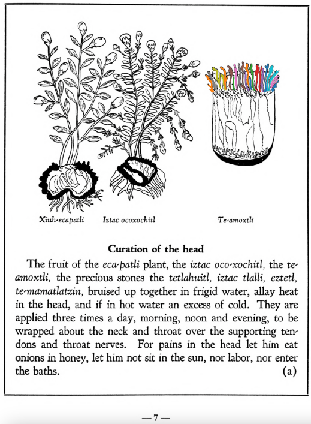
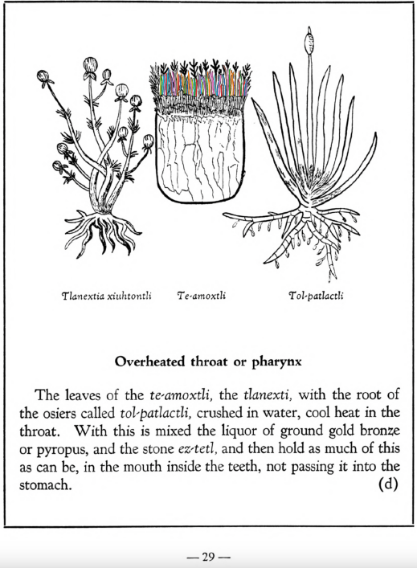

**Morphemes:**

- Amatl/paper
- Te/stone

## Subchapter 1a  

=== "English :flag_us:"
    **Curation of the head.** The fruit of the [eca-patli](Eca-patli.md) plant, the [iztac oco-xochitl](Iztac oco-xochitl.md), the [te-amoxtli](Te-amoxtli.md), the precious stones the [tetlahuitl](tetlahuitl v2.md), [iztac tlalli](iztac tlalli.md), [eztetl](eztetl.md), [te-mamatlatzin](te-mamatlatzin.md), bruised up together in frigid water, allay heat in the head, and if in hot water an excess of cold. They are applied three times a day, morning, noon and evening, to be wrapped about the neck and throat over the supporting tendons and throat nerves. For pains in the head let him eat onions in honey, let him not sit in the sun, nor labor, nor enter the baths.  
    [https://archive.org/details/aztec-herbal-of-1552/page/7](https://archive.org/details/aztec-herbal-of-1552/page/7)  

=== "Español :flag_mx:"
    **Curación de la cabeza.**  El fruto de la planta [eca-patli](Eca-patli.md), el [iztac oco-xochitl](Iztac oco-xochitl.md), el [te-amoxtli](Te-amoxtli.md), las piedras preciosas [tetlahuitl](tetlahuitl v2.md), [iztac tlalli](iztac tlalli.md), [eztetl](eztetl.md), [te-mamatlatzin](te-mamatlatzin.md), machacadas juntas en agua fría, calman el calor en la cabeza, y si se preparan en agua caliente, contrarrestan el exceso de frío. Se aplican tres veces al día, por la mañana, al mediodía y por la tarde, envueltas alrededor del cuello y la garganta sobre los tendones de sostén y los nervios del cuello. Para los dolores de cabeza, que coma cebollas con miel, que no se exponga al sol, ni realice esfuerzos, ni entre en los baños.  

## Subchapter 5d  

=== "English :flag_us:"
    **Overheated throat or pharynx.** The leaves of the [te-amoxtli](Te-amoxtli.md), the [tlanexti](Tlanextia xiuhtontli.md), with the root ofthe osiers called [tol-patlactli](Tol-patlactli.md), crushed in water, cool heat in the throat. With this is mixed the liquor of ground gold bronze or pyropus, and the stone [ez-tetl](eztetl.md), and then hold as much of this as can be, in the mouth inside the teeth, not passing it into the stomach.  
    [https://archive.org/details/aztec-herbal-of-1552/page/29](https://archive.org/details/aztec-herbal-of-1552/page/29)  

=== "Español :flag_mx:"
    **Garganta o faringe recalentada.** Las hojas del [te-amoxtli](Te-amoxtli.md), del [tlanexti](Tlanextia xiuhtontli.md), junto con la raíz de los sauces llamados [tol-patlactli](Tol-patlactli.md), trituradas en agua, enfrían el calor en la garganta. A esto se le añade el licor de bronce dorado molido o piropo, y la piedra [ez-tetl](eztetl.md); luego se sostiene todo cuanto se pueda dentro de la boca, entre los dientes, sin tragarlo.  

## Subchapter 5e  

=== "English :flag_us:"
    **Suppuration of roof of mouth and throat.** Suppuration of the roof of the mouth and throat is cured by the root of the [xal-tomatl](Xal-tomatl.md), crushed together with the [te-amoxtli](Te-amoxtli.md), white earth, small or sharp variegated stones that are gathered from a torrent, [a-camallo-tetl](a-camallo-tetl v2.md), with Indian spikes poorly ground, the flowers of the [huacal-xochitl](Huacal-xochitl.md) and [tlaco-izqui-xochitl](Tlaco-izqui-xochitl.md), of which the juice is well squeezed and promptly poured into the throat.  
    [https://archive.org/details/aztec-herbal-of-1552/page/30](https://archive.org/details/aztec-herbal-of-1552/page/30)  

=== "Español :flag_mx:"
    **Supuración del paladar y de la garganta.** La supuración del paladar y de la garganta se cura con la raíz del [xal-tomatl](Xal-tomatl.md), triturada junto con el [te-amoxtli](Te-amoxtli.md), tierra blanca, pequeñas o afiladas piedras multicolores recogidas de un torrente, [a-camallo-tetl](a-camallo-tetl v2.md), con espinas de la India mal molidas, las flores del [huacal-xochitl](Huacal-xochitl.md) y del [tlaco-izqui-xochitl](Tlaco-izqui-xochitl.md), cuyo jugo se exprime bien y se vierte de inmediato en la garganta.  

## Subchapter 8b  

=== "English :flag_us:"
    **The argemon or groin plant.** The plants xiuhtontli tlanen-popoloua and those that grow in a garden once burned over, the fruit [te-tzapotl](Te-tzapotl.md), brambles, [te-amoxtli](Te-amoxtli.md), the stone found in a swallow’s stomach, ground in swallow’s and mouse’s blood, and applied, allay pains of the groin and reduce swellings.  
    [https://archive.org/details/aztec-herbal-of-1552/page/58](https://archive.org/details/aztec-herbal-of-1552/page/58)  

=== "Español :flag_mx:"
    **La argemona o planta de la ingle.** Las plantas xiuhtontli tlanen-popoloua y aquellas que crecen en un jardín previamente quemado, el fruto [te-tzapotl](Te-tzapotl.md), zarzas, [te-amoxtli](Te-amoxtli.md), la piedra que se encuentra en el estómago de la golondrina, todo molido en sangre de golondrina y ratón, y aplicado, alivian los dolores de la ingle y reducen las hinchazones.  

## Subchapter 8g  

=== "English :flag_us:"
    **Pain in the knees.** When the knees pain one, anoint them with the liquor of the plants [coyo-xihuitl](Coyo-xihuitl.md), [tepe-chian](Tepe-chian.md), [xoxouhca-patli](xoxouhca-patli.md) macerated with the [te-amoxtli](Te-amoxtli.md) in swallow's blood.  
    [https://archive.org/details/aztec-herbal-of-1552/page/63](https://archive.org/details/aztec-herbal-of-1552/page/63)  

=== "Español :flag_mx:"
    **Dolor en las rodillas.** Cuando duelen las rodillas, se deben untar con el licor de las plantas [coyo-xihuitl](Coyo-xihuitl.md), [tepe-chian](Tepe-chian.md), [xoxouhca-patli](xoxouhca-patli.md) maceradas con el [te-amoxtli](Te-amoxtli.md) en sangre de golondrina.  

## Subchapter 9f  

=== "English :flag_us:"
    **Remedy for lesions of the body.** Lesions caused by rough treatment should be treated with a poultice made from [tlazo-teo-zacatl](Tlazol-teo-zacatl.md), [centzon-xochitl](Centzon-xochitl.md), [xiuh-tontli](Xiuhtontli.md), [a-xocotl](A-xocotl.md), [tlayapaloni](Tla-yapaloni.md), [xiuhtontli](Xiuhtontli.md), moss from some tree, cypress nuts, seeds of the nettle, and the tree [ayauh-quahuitl](Ayauh-quahuitl.md). Let the ill-treated one drink a broth carefully prepared from the root of the [coanenepilli](Coanenepilli.md), tlanextia xihuitl, [chicom-catl](Chicom-acatl.md), the flower of the [a-xocotl](A-xocotl.md) and [izqui-xochitl](Izqui-xochitl.md), [tetlahuital](tetlahuitl v2.md), [eztetl](eztetl.md), [te-amoxtli](Te-amoxtli.md), the blood of an aquatic bird, the [huexo-canauhtli](huexo-canauhtli.md), and some [tlatlanquaye](Tlatlanquaye.md) leaves, all of which are to be ground up in acidulous water.  
    [https://archive.org/details/aztec-herbal-of-1552/page/80](https://archive.org/details/aztec-herbal-of-1552/page/80)  

=== "Español :flag_mx:"
    **Remedio para lesiones del cuerpo.** Las lesiones causadas por trato rudo deben tratarse con una cataplasma hecha de [tlazo-teo-zacatl](Tlazol-teo-zacatl.md), [centzon-xochitl](Centzon-xochitl.md), [xiuh-tontli](Xiuhtontli.md), [a-xocotl](A-xocotl.md), [tlayapaloni](Tla-yapaloni.md), [xiuhtontli](Xiuhtontli.md), musgo de algún árbol, nueces de ciprés, semillas de ortiga y el árbol [ayauh-quahuitl](Ayauh-quahuitl.md). El maltratado debe beber un caldo preparado cuidadosamente de la raíz del [coanenepilli](Coanenepilli.md), tlanextia xihuitl, [chicom-catl](Chicom-acatl.md), la flor del [a-xocotl](A-xocotl.md) y del [izqui-xochitl](Izqui-xochitl.md), [tetlahuital](tetlahuitl v2.md), [eztetl](eztetl.md), [te-amoxtli](Te-amoxtli.md), la sangre de un ave acuática, el [huexo-canauhtli](huexo-canauhtli.md), y algunas hojas de [tlatlanquaye](Tlatlanquaye.md), todo molido en agua acidulada.  

## Subchapter 9p  

=== "English :flag_us:"
    **Inflammations.** An inflamed part of the body will be relieved by a liquor from the [nohpalli](Nopalli.md), [te-amoxtli](Te-amoxtli.md), [tetzmitl](Tetzmitl.md), [eca-patli](Eca-patli.md), [te-xiyotl](Te-xiyotl.md) and [huitz-quilitl](Huitz-quilitl.md), anointing the part thoroughly and rubbing it with honey and yolk of egg.  
    [https://archive.org/details/aztec-herbal-of-1552/page/90](https://archive.org/details/aztec-herbal-of-1552/page/90)  

=== "Español :flag_mx:"
    **Inflamaciones.** Una parte inflamada del cuerpo se alivia con un licor hecho de [nohpalli](Nopalli.md), [te-amoxtli](Te-amoxtli.md), [tetzmitl](Tetzmitl.md), [eca-patli](Eca-patli.md), [te-xiyotl](Te-xiyotl.md) y [huitz-quilitl](Huitz-quilitl.md), untando bien la zona y frotándola con miel y yema de huevo.  

## Subchapter 9q  

=== "English :flag_us:"
    **Those struck by lightning.** Let one struck by a thunderbolt drink a potion well prepared from leaves of trees, namely the [ayauh-quahuitl](Ayauh-quahuitl.md), [tepaquilti quahuitl](tepaquilti quahuitl.md), very green cypress, the bush [iztauh-yatl](Iztauyattl.md), the herbs [quauh-yyauhtli](Quauh-yyauhtli.md) and [te-amoxtli](Te-amoxtli.md). But however the drink is to be given, let it be heated.  Let the body also be anointed with a plaster made of the herbs [papalo-quilitl](Papalo-quilitl.md), [tlal-ecapatli](Tlal-ecapatli.md), [quauh-yyauhtli](Quauh-yyauhtli.md), [tlatlanquaye](Tlatlanquaye.md), huitbitzil xochitil, [iztac-oco-xochitl](Iztac oco-xochitl.md), and in addition all the plants upon which the lightning struck. A few days later lethim drink water into which white frankincense is thrown. The water is boiled with white and whitish incense, with the burned bones of a fox added. Also mix some Indian wine with the above. Afterwards you will instill into the nostrils a medicine made of white pearl, the root [tlatlacotic](Tlatlacotic.md), and all plants growing in a garden that has been burned over. Let also be suffumigated by white incense thrown upon the coals, the wax ointment we call [xochi-oco-tzotl](xochi-ocotzotl.md), and the good odor of the herb [quauh-yyauhtli](Quauh-yyauhtli.md).  
    [https://archive.org/details/aztec-herbal-of-1552/page/91](https://archive.org/details/aztec-herbal-of-1552/page/91)  

=== "Español :flag_mx:"
    **Golpeados por un rayo.** Quien haya sido golpeado por un rayo debe beber una poción bien preparada con hojas de árboles, a saber: [ayauh-quahuitl](Ayauh-quahuitl.md), [tepaquilti quahuitl](tepaquilti quahuitl.md), ciprés muy verde, el arbusto [iztauh-yatl](Iztauyattl.md), las hierbas [quauh-yyauhtli](Quauh-yyauhtli.md) y [te-amoxtli](Te-amoxtli.md). Pero sea como sea que se le dé a beber, debe calentarse. También se unta el cuerpo con un emplasto hecho de las hierbas [papalo-quilitl](Papalo-quilitl.md), [tlal-ecapatli](Tlal-ecapatli.md), [quauh-yyauhtli](Quauh-yyauhtli.md), [tlatlanquaye](Tlatlanquaye.md), huitbitzil xochitil, [iztac-oco-xochitl](Iztac oco-xochitl.md), y además todas las plantas sobre las que cayó el rayo. Unos días después debe beber agua en la que se ha arrojado copal blanco. El agua se hierve con incienso blanco y blanquecino, con huesos quemados de zorro añadidos. También se mezcla algo de vino indígena con lo anterior. Después se le instila en las narices un medicamento hecho de perla blanca, la raíz [tlatlacotic](Tlatlacotic.md), y todas las plantas que crecen en un jardín quemado. También debe ser sahumado con copal blanco sobre las brasas, el ungüento de cera que llamamos [xochi-oco-tzotl](xochi-ocotzotl.md), y el buen aroma de la hierba [quauh-yyauhtli](Quauh-yyauhtli.md).  

## Subchapter 12b  

=== "English :flag_us:"
    **When an infant because of some pain refuses the breast.** When the infant is so affected that it spews out the milk and will not take the breast into his mouth, give him a drink made of the herb called called [te-amoxtli](Te-amoxtli.md), quail’s blood set in the sun, and its hairs somewhat restored, which you will incinerate. Let him have a poultice carefully prepared from a weasel’s brain and a scorched human bone, drawing out the acid water.  
    [https://archive.org/details/aztec-herbal-of-1552/page/114](https://archive.org/details/aztec-herbal-of-1552/page/114)  

=== "Español :flag_mx:"
    **Cuando un infante, por algún dolor, rechaza el pecho.** Cuando el infante está tan afectado que vomita la leche y no quiere tomar el pecho, se le da de beber una infusión hecha con la hierba llamada [te-amoxtli](Te-amoxtli.md), sangre de codorniz puesta al sol, y sus pelos algo restaurados, los cuales deberás incinerar. Que se le aplique una cataplasma cuidadosamente preparada de cerebro de comadreja y un hueso humano chamuscado, extrayendo el agua ácida.  

  
Leaf traces by: Dan Chitwood, Michigan State University, USA  
  
Leaf traces by: Dan Chitwood, Michigan State University, USA  
