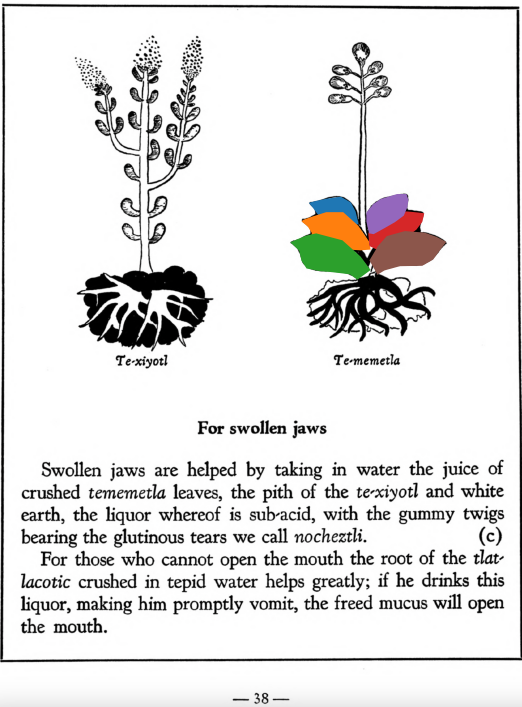

**Variants:**

- tememetla

**Morphemes:**

- Te/stone

## Subchapter 6c  

=== "English :flag_us:"
    **For swollen jaws.** Swollen jaws are helped by taking in water the juice of crushed [tememetla](Te-memetla.md) leaves, the pith of the [te-xiyotl](Te-xiyotl.md) and white earth, the liquor whereof is sub-acid, with the gummy twigs bearing the glutinous tears we call [nocheztli](Nocheztli.md). For those who cannot open the mouth the root of the [tlatlacotic](Tlatlacotic.md) crushed in tepid water helps greatly; if he drinks this liquor, making him promptly vomit, the freed mucus will open the mouth.  
    [https://archive.org/details/aztec-herbal-of-1552/page/38](https://archive.org/details/aztec-herbal-of-1552/page/38)  

=== "Español :flag_mx:"
    **Para las mandíbulas hinchadas.** Las mandíbulas hinchadas se alivian tomando en agua el jugo de hojas machacadas de [tememetla](Te-memetla.md), la médula del [te-xiyotl](Te-xiyotl.md) y tierra blanca, cuyo licor es subácido, junto con las ramas gomosas que dan las lágrimas pegajosas que llamamos [nocheztli](Nocheztli.md). Para quienes no pueden abrir la boca, ayuda mucho la raíz del [tlatlacotic](Tlatlacotic.md) triturada en agua tibia; si bebe este licor y vomita de inmediato, el moco liberado abrirá la boca.  

  
Leaf traces by: Jimena Jazmin Hurtado Olvera, Laboratory of Agrigenomic Sciences, ENES Unidad León, México  
