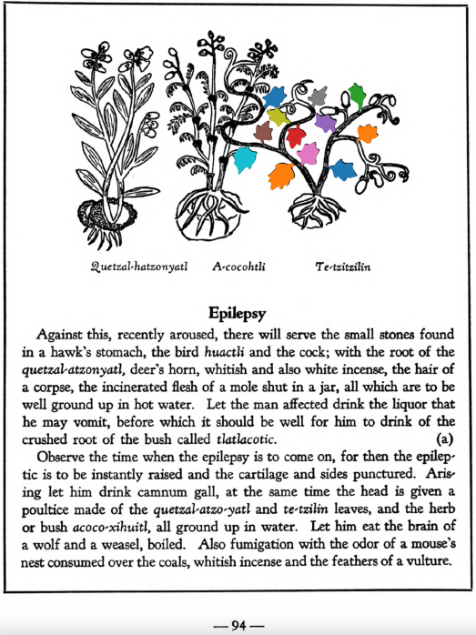

**Variants:**

- te-tzilin

**Morphemes:**

- Te/stone

## Subchapter 10a  

=== "English :flag_us:"
    **Epilepsy.** Against this, recently aroused, there will serve the small stones found in a hawk’s stomach, the bird [huactli](huactli.md) and the cock; with the root of the [quetzal-atzonyatl](Quetzal-atzonyatl.md), deer’s horn, whitish and also white incense, the hair of a corpse, the incinerated flesh of a mole shut in a jar, all which are to be well ground up in hot water. Let the man affected drink the liquor that he may vomit, before which it should be well for him to drink of the crushed root of the bush called [tlatlacotic](Tlatlacotic.md). Observe the time when the epilepsy is to come on, for then the epileptic is to be instantly raised and the cartilage and sides punctured. Arising let him drink camnum gall, at the same time the head is given a poultice made of the [quetzal-atzo-yatl](Quetzal-atzonyatl.md) and [te-tzilin](Te-tzitzilin.md) leaves, and the herb or bush [acoco-xihuitl](Acoco-xihuitl.md), all ground up in water. Let him eat the brain of a wolf and a weasel, boiled. Also fumigation with the odor of a mouse’s nest consumed over the coals, whitish incense and the feathers of a vulture.  
    [https://archive.org/details/aztec-herbal-of-1552/page/94](https://archive.org/details/aztec-herbal-of-1552/page/94)  

=== "Español :flag_mx:"
    **Epilepsia.** Contra esto, cuando se ha presentado recientemente, servirán las piedrecillas que se hallan en el estómago de un halcón, el ave [huactli](huactli.md) y el gallo; con la raíz del [quetzal-atzonyatl](Quetzal-atzonyatl.md), cuerno de venado, incienso blanquecino y también blanco, el cabello de un cadáver, la carne incinerada de un topo encerrada en un frasco, todo lo cual debe molerse bien en agua caliente. Que el afectado beba el licor para que vomite, antes de lo cual le conviene beber la raíz machacada del arbusto llamado [tlatlacotic](Tlatlacotic.md). Observar el momento en que se va a presentar la epilepsia, pues en ese instante se debe levantar al epiléptico de inmediato y punzarle el cartílago y los costados. Al levantarse debe beber hiel de camnum, al mismo tiempo que se le aplica en la cabeza un emplasto hecho con hojas de [quetzal-atzo-yatl](Quetzal-atzonyatl.md) y [te-tzilin](Te-tzitzilin.md), y con la hierba o arbusto [acoco-xihuitl](Acoco-xihuitl.md), todo molido en agua. Que coma el cerebro de un lobo y de una comadreja, hervidos. También se le hace una fumigación con el olor de un nido de ratón quemado sobre las brasas, incienso blanquecino y plumas de buitre.  

  
Leaf traces by: Zoë Migicovsky, Acadia University, Canada  
