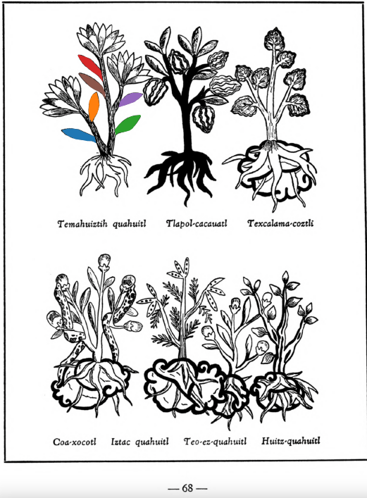
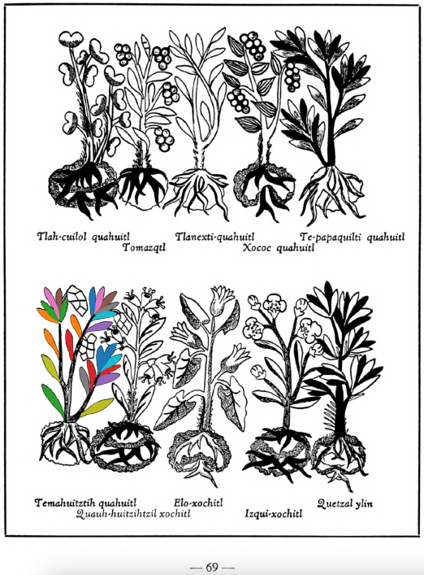

**Morphemes:**

- Quahuitl/tree or wood

  
Leaf traces by: Mariana Jaired Ruíz Amaro, Laboratory of Agrigenomic Sciences, ENES Unidad León, México  
  
Leaf traces by: Kylie DeViller, Jodrey School of Computer Science, Acadia University, Canada  
