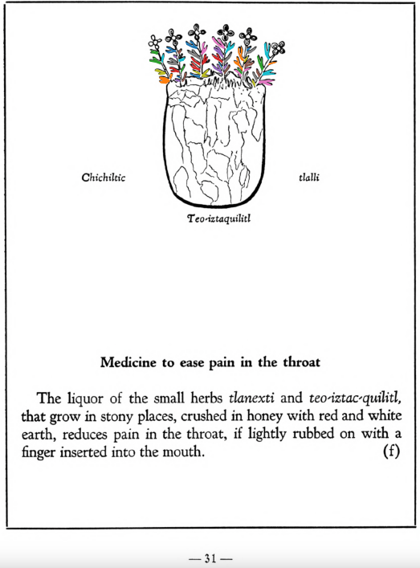
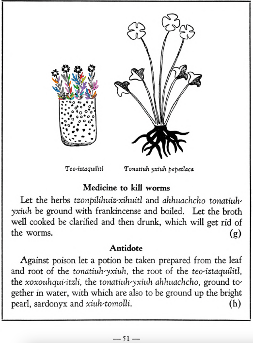

**Variants:**

- teo-iztac-quilitl
- teo-iztacuilitl

**Morphemes:**

- Iztac/white
- Quilitl/edible green
- Teo/divine

## Subchapter 5f  

=== "English :flag_us:"
    **Medicine to ease pain in the throat.** The liquor of the small herbs [tlanexti](Tlanextia xiuhtontli.md) and [teo-iztac-quilitl](Teo-iztaquilitl.md), that grow in stony places, crushed in honey with red and white earth, reduces pain in the throat, if lightly rubbed on with a finger inserted into the mouth.  
    [https://archive.org/details/aztec-herbal-of-1552/page/31](https://archive.org/details/aztec-herbal-of-1552/page/31)  

=== "Español :flag_mx:"
    **Medicina para aliviar el dolor de garganta.** El licor de las pequeñas hierbas [tlanexti](Tlanextia xiuhtontli.md) y [teo-iztac-quilitl](Teo-iztaquilitl.md), que crecen en lugares pedregosos, trituradas con miel, tierra roja y blanca, alivia el dolor de garganta si se frota suavemente con un dedo introducido en la boca.  

## Subchapter 7b  

=== "English :flag_us:"
    **For pain in the chest.** Pain in the chest is relieved by the plants [tetlahuitl](Tetlahuitl v1.md) and [teo-iztaquilitl](Teo-iztaquilitl.md) growing on a rock, together with the stone [tlacahuatzin](tlacal-huatzin.md), and red and white earth triturated in water; the skin of a lion is also to be burned and its broth drunk; the chest is to be rubbed with the juice expressed from the herb [tzitzicton](Tzitzicton.md), [tlatlaolton](Tlatlaolton.md), [ayauhtli](Ayauhtli.md), cypress seeds or nuts, and the [itzcuinpatli](Itzquin-patli.md) with the [huacal-xochitl](Huacal-xochitl.md) and [papalo-quilitl](Papalo-quilitl.md).  
    [https://archive.org/details/aztec-herbal-of-1552/page/46](https://archive.org/details/aztec-herbal-of-1552/page/46)  

=== "Español :flag_mx:"
    **Para dolor en el pecho.** El dolor en el pecho se alivia con las plantas [tetlahuitl](Tetlahuitl v1.md) y [teo-iztaquilitl](Teo-iztaquilitl.md) que crecen sobre la roca, junto con la piedra [tlacahuatzin](tlacal-huatzin.md), tierra roja y blanca trituradas en agua; también se debe quemar la piel de león y beber su caldo; se debe frotar el pecho con el jugo exprimido de la hierba [tzitzicton](Tzitzicton.md), [tlatlaolton](Tlatlaolton.md), [ayauhtli](Ayauhtli.md), semillas de ciprés o nueces, y el [itzcuinpatli](Itzquin-patli.md) con el [huacal-xochitl](Huacal-xochitl.md) y el [papalo-quilitl](Papalo-quilitl.md).  

## Subchapter 7h  

=== "English :flag_us:"
    **Antidote.** Against poison let a potion be taken prepared from the leaf and root of the [tonatiuh-yxiuh](Tonatiuh yxiuh v2.md), the root of the [teo-iztaquilitl](Teo-iztaquilitl.md), the [xoxouhqui-itzli](xoxouhqui-itzli.md), the [tonatiuh-yxiuh](Tonatiuh yxiuh v2.md) ahhuachcho, ground together in water, with which are also to be ground up the bright pearl, sardonyx and [xiuh-tomolli](xiuh-tomolli.md).  
    [https://archive.org/details/aztec-herbal-of-1552/page/51](https://archive.org/details/aztec-herbal-of-1552/page/51)  

=== "Español :flag_mx:"
    **Antídoto.** Contra el veneno se debe tomar una poción preparada con la hoja y la raíz del [tonatiuh-yxiuh](Tonatiuh yxiuh v2.md), la raíz del [teo-iztaquilitl](Teo-iztaquilitl.md), el [xoxouhqui-itzli](xoxouhqui-itzli.md), el [tonatiuh-yxiuh](Tonatiuh yxiuh v2.md) ahhuachcho, todo triturado en agua, junto con perla brillante, sardónice y [xiuh-tomolli](xiuh-tomolli.md).  

## Subchapter 9b  

=== "English :flag_us:"
    **Fevers.** The face in marking fevers has various changes, at times flushed, at times darkened, again blanched. He also spits blood, the body jerks and turns hither and thither, he sees little. At times bitterness, now burning, now sweetness of a kind fills the mouth, or rather palate. One who is such certain has his stomach corrupted. Although the urine is whitish, unless you avert the danger quickly the medicine will be prepared too late. Wherefore you will help him wonderfully if you macerate the plants [centzon-xochitl](Centzon-xochitl.md), [teo-iztacuilitl](Teo-iztaquilitl.md), [a-quiztli](Ahquiztli.md), tlanextia xihuitl, cuauhtla huita-quilitl, [tonatiuh yxiuh](Tonatiuh yxiuh v1.md), [tlazolco-zacatl](Tlazol-teo-zacatl.md), [mamaxtla-nelhuatl](Mamaxtla-nelhuatl.md), [oco-xochitl](Iztac oco-xochitl.md), [zaca-matlalin](Zaca-matlalin.md), the bush [tlanextia quahuitl](Tlanextia quahuitl.md), the stones you find in the stomachs of these birds: the [huitlalotl](huitlalotl.md), [huactli](huactli.md), [aztatl](aztatl.md), [apopotli](apopotli.md), [tlacahuilotl](tlacahuilotl.md), [huexo-canauhtli](huexo-canauhtli.md), [xiuh-quechol-tototl](xiuh-quechol-tototl.md), [tototl](tototl.md), [tlpal-tototl](tlapal-tototl.md), [noch-tototl](noch-tototl.md), [acatzanatl](acatzanatl.md), [zolin](zolin.md); the precious stones, fine green pearl, greenstone, sardonyx and [xiuh-tomolli](xiuh-tomolli.md), with burned human bone, from all which a liquor is to be heated quickly and then drunk. This potion being prepared, the stone [texalli](texalli.md) is ground in water, and a part of the liquor poured on his head, his feet bathed with a part, and the throat moistened with part. Also let him drink some. Then these plants are to be crushed in bitter water, the [xiuh-ecapatli](Eca-patli.md), [tetzmitl](Tetzmitl.md), [oco-xochitl](Iztac oco-xochitl.md), [centzon-xochitl](Centzon-xochitl.md), [tepe-chian](Tepe-chian.md), [tzom-pachtin](Tzon-pachtzin.md), [iztac-oco-xochitl](Iztac oco-xochitl.md), [tonatiuh yxiuh](Tonatiuh yxiuh v1.md), all of which are to be gathered in the fervent heat of the sun; then adding the willow and laurel and human bone, he is to be wet with their liquor. With this the tooth of a corpse is placed on the crown of the head. The plants [teco-xochiti-xihuitl](teco-xochiti-xihuitl.md) and [tlazol-patli](Tlazol-patli.md) are crushed in woman’s milk, and with this the occuput and nostrils are to be anointed; after all this is done, take heed that he smell a flower of some kind, and sleep during the day.  
    [https://archive.org/details/aztec-herbal-of-1552/page/75](https://archive.org/details/aztec-herbal-of-1552/page/75)  

=== "Español :flag_mx:"
    **Fiebres.** El rostro en quienes presentan fiebre cambia de muchas formas: a veces enrojecido, otras veces oscuro, otras pálido. También escupe sangre, el cuerpo da sacudidas y se retuerce, ve poco. A veces se llena la boca, o más bien el paladar, de amargor, ardor o un tipo de dulzura. Ciertamente, quien sufre esto tiene el estómago corrompido. Aunque la orina sea blanquecina, si no se evita el peligro rápidamente, la medicina se preparará demasiado tarde. Por eso lo ayudarás maravillosamente si maceras las plantas [centzon-xochitl](Centzon-xochitl.md), [teo-iztacuilitl](Teo-iztaquilitl.md), [a-quiztli](Ahquiztli.md), tlanextia xihuitl, cuauhtla huita-quilitl, [tonatiuh yxiuh](Tonatiuh yxiuh v1.md), [tlazolco-zacatl](Tlazol-teo-zacatl.md), [mamaxtla-nelhuatl](Mamaxtla-nelhuatl.md), [oco-xochitl](Iztac oco-xochitl.md), [zaca-matlalin](Zaca-matlalin.md), el arbusto [tlanextia quahuitl](Tlanextia quahuitl.md), las piedras que se encuentran en los estómagos de estas aves: [huitlalotl](huitlalotl.md), [huactli](huactli.md), [aztatl](aztatl.md), [apopotli](apopotli.md), [tlacahuilotl](tlacahuilotl.md), [huexo-canauhtli](huexo-canauhtli.md), [xiuh-quechol-tototl](xiuh-quechol-tototl.md), [tototl](tototl.md), [tlpal-tototl](tlapal-tototl.md), [noch-tototl](noch-tototl.md), [acatzanatl](acatzanatl.md), [zolin](zolin.md); las piedras preciosas como perla verde fina, piedra verde, sardónice y [xiuh-tomolli](xiuh-tomolli.md), junto con hueso humano quemado, de todo lo cual se calienta rápidamente un licor que luego debe beberse. Preparado este brebaje, se muele la piedra [texalli](texalli.md) en agua, y se vierte parte del licor sobre su cabeza, se le bañan los pies con otra parte, y se le humedece la garganta con otra porción. También debe beber un poco. Luego deben machacarse en agua amarga estas plantas: [xiuh-ecapatli](Eca-patli.md), [tetzmitl](Tetzmitl.md), [oco-xochitl](Iztac oco-xochitl.md), [centzon-xochitl](Centzon-xochitl.md), [tepe-chian](Tepe-chian.md), [tzom-pachtin](Tzon-pachtzin.md), [iztac-oco-xochitl](Iztac oco-xochitl.md), [tonatiuh yxiuh](Tonatiuh yxiuh v1.md), todas recolectadas bajo el calor intenso del sol. Añadiendo sauce, laurel y hueso humano, se moja con este licor. Con esto se coloca un diente de cadáver en la coronilla. Las plantas [teco-xochiti-xihuitl](teco-xochiti-xihuitl.md) y [tlazol-patli](Tlazol-patli.md) se trituran en leche de mujer, y con esto se ungen el occipucio y las fosas nasales. Después de todo esto, cuídese que huela alguna flor y duerma durante el día.  

## Subchapter 9e  

=== "English :flag_us:"
    **Excessive heat.** The body when overheated is relieved by the ground roots of the [huitz-quilitl](Huitz-quilitl.md), [xal-tomatl](Xal-tomatl.md), [tlaca-camotli](Tlaca-camotli.md), [teo-iztaquilitl](Teo-iztaquilitl.md), the stone a-camollotetl, the [eztetl](eztetl.md), [tlacal-huatzin](tlacal-huatzin.md), red earth, white earth, and the stones found in the stomachs of a cock and the [noch-totl](noch-tototl.md), with sharp stones, all then put in water. This is drunk and the abdomen purged with a clyster. A potion is also prepared from [tzayanal-quilitl](Tzayanal-quilitl.md) roots, the [acacapac-quilitl](Aca-capac-quilitl.md), [tol-patlctli](Tol-patlactli.md), the bushes [tetzmitl](Tetzmitl.md), [iztauhyauh](Iztauyattl.md), [huitz-quilitl](Huitz-quilitl.md), with added salt. The body is anointed with the latex squeezed from the [acapac-quilitl](Aca-capac-quilitl.md), [coyo-xihuitl](Coyo-xihuitl.md), [tlal-ecapatli](Tlal-ecapatli.md), [tonatiuh-yxiuh](Tonatiuh yxiuh v1.md), [iztac-oco-xochitl](Iztac oco-xochitl.md), [centzon-oco-xochitl](Centzon-oco-xochitl.md), which are herbs; also using the leaves of the laurel, the bush [tetzmitl](Tetzmitl.md), and the fruit trees [xa-xocotl](Xa-xocotl.md), the plant [cohua-xochitl](Cohua-xochitl.md), leaves of the pine. This medicine is then divided, some poured on the head, some that is quite thick is applied as ointment on the body. If the heat rises, take the blood of the [huitzitzilin](huitzitzilin.md), the gall of the [huexo-canauhtli](huexo-canauhtli.md), the viscera of a quail, bladder of the [cocotli](cocotli.md), skin of the [pezotli](pezotli.md), burned together. These and the above are to be mixed together.  
    [https://archive.org/details/aztec-herbal-of-1552/page/79](https://archive.org/details/aztec-herbal-of-1552/page/79)  

=== "Español :flag_mx:"
    **Calor excesivo.** El cuerpo cuando está sobrecalentado se alivia con las raíces molidas del [huitz-quilitl](Huitz-quilitl.md), [xal-tomatl](Xal-tomatl.md), [tlaca-camotli](Tlaca-camotli.md), [teo-iztaquilitl](Teo-iztaquilitl.md), la piedra a-camollotetl, el [eztetl](eztetl.md), [tlacal-huatzin](tlacal-huatzin.md), tierra roja, tierra blanca, y las piedras encontradas en los estómagos de un gallo y del [noch-totl](noch-tototl.md), con piedras filosas, todo esto se pone en agua. Se bebe esta preparación y el abdomen se purga con un enema. También se prepara una poción con raíces de [tzayanal-quilitl](Tzayanal-quilitl.md), el [acacapac-quilitl](Aca-capac-quilitl.md), [tol-patlctli](Tol-patlactli.md), los arbustos [tetzmitl](Tetzmitl.md), [iztauhyauh](Iztauyattl.md), [huitz-quilitl](Huitz-quilitl.md), con sal añadida. El cuerpo se unta con el látex exprimido del [acapac-quilitl](Aca-capac-quilitl.md), [coyo-xihuitl](Coyo-xihuitl.md), [tlal-ecapatli](Tlal-ecapatli.md), [tonatiuh-yxiuh](Tonatiuh yxiuh v1.md), [iztac-oco-xochitl](Iztac oco-xochitl.md), [centzon-oco-xochitl](Centzon-oco-xochitl.md), que son hierbas; también se usan las hojas de laurel, el arbusto [tetzmitl](Tetzmitl.md), y los árboles frutales [xa-xocotl](Xa-xocotl.md), la planta [cohua-xochitl](Cohua-xochitl.md), hojas de pino. Esta medicina se divide, una parte se vierte en la cabeza, otra más espesa se aplica como ungüento en el cuerpo. Si el calor aumenta, se toma la sangre del [huitzitzilin](huitzitzilin.md), la bilis del [huexo-canauhtli](huexo-canauhtli.md), las vísceras de una codorniz, la vejiga del [cocotli](cocotli.md), la piel del [pezotli](pezotli.md), todo quemado junto. Estos y los anteriores se mezclan.  

  
Leaf traces by: Daniel H. Chitwood, Michigan State University, USA  
  
Leaf traces by: J. Noé García-Chávez, Laboratory of Agrigenomic Sciences, ENES Unidad León, México  
