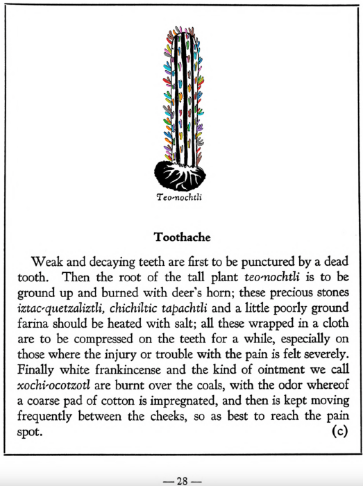

**Morphemes:**

- Nochtli/prickly pear
- Teo/divine

## Subchapter 5c  

=== "English :flag_us:"
    **Toothache.** Weak and decaying teeth are first to be punctured by a dead tooth. Then the root of the tall plant [teo-nochtli](Teo-nochtli.md) is to be ground up and burned with deer’s horn; these precious stones [iztac-quetzaliztli](iztac-quetzaliztli.md), [chichiltic tapachtli](chichiltic tapachtli.md) and a little poorly ground farina should be heated with salt; all these wrapped in a cloth are to be compressed on the teeth for a while, especially on those where the injury or trouble with the pain is felt severely. Finally white frankincense and the kind of ointment we call [xochi-ocotzotl](xochi-ocotzotl.md) are burnt over the coals, with the odor whereof a coarse pad of cotton is impregnated, and then is kept moving frequently between the cheeks, so as best to reach the pain spot.  
    [https://archive.org/details/aztec-herbal-of-1552/page/28](https://archive.org/details/aztec-herbal-of-1552/page/28)  

=== "Español :flag_mx:"
    **Dolor de muelas.** Los dientes débiles y en descomposición deben ser perforados primero por un diente muerto. Luego, la raíz de la alta planta [teo-nochtli](Teo-nochtli.md) debe ser molida y quemada con cuerno de venado; estas piedras preciosas [iztac-quetzaliztli](iztac-quetzaliztli.md), [chichiltic tapachtli](chichiltic tapachtli.md) y un poco de harina mal molida se calientan con sal; todo esto, envuelto en un paño, se comprime sobre los dientes por un tiempo, especialmente donde se siente intensamente el dolor o la lesión. Finalmente, se queman sobre brasas incienso blanco y el tipo de ungüento que llamamos [xochi-ocotzotl](xochi-ocotzotl.md); con el olor que desprenden se impregna un tampón grueso de algodón, que luego se mueve frecuentemente entre las mejillas para alcanzar mejor el punto dolorido.  

  
Leaf traces by: Dan Chitwood, Michigan State University, USA  
