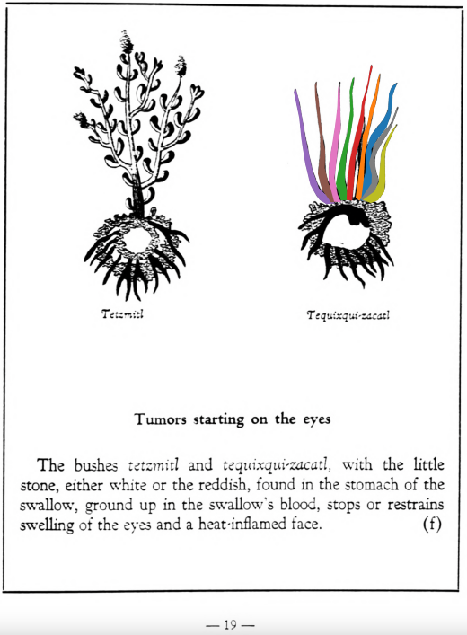

Variants: tequixqui-zacatl  

## Subchapter 2f  
**Tumors starting on the eyes.** The bushes [tetzmitl](Tetzmitl.md) and [tequixqui-zacatl](Tequixqui-zacatl.md), with the little stone, either white or the reddish, found in the stomach of the swallow, ground up in the swallow’s blood, stops or restrains swelling of the eyes and a heat-inflamed face.  
[https://archive.org/details/aztec-herbal-of-1552/page/19](https://archive.org/details/aztec-herbal-of-1552/page/19)  

  
Leaf traces by: Dan Chitwood, Michigan State University, USA  
